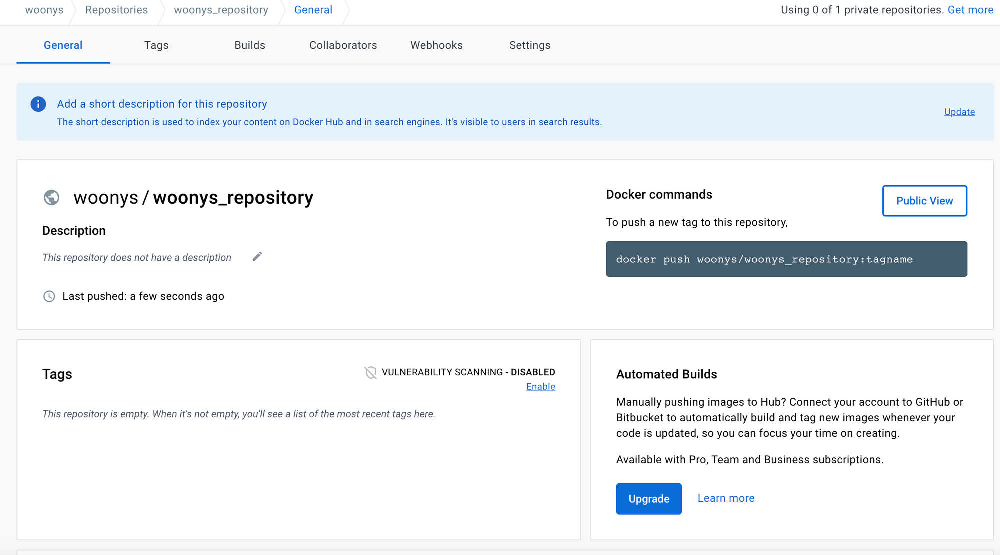

# Ch.1 클라우드 컴퓨팅

## 1.1 클라우드 컴퓨팅 개요

- 클라우드: 사용자가 언제든지 인터넷, 모바일 등을 통해 IT 서비스를 제공받을 수 있도록 하는 컴퓨팅 기술
- 애자일 방법론을 활용한 민첩한 서비스 도입과 탄력적인 확장/축소, 자동화 서비스 유지관리 등으로 **1) 운영 비용은 낮추고 2) 비즈니스 요구사항 변화를 빠르게 적용할 수 있는 환경을 제공**

### 1.1.1 클라우드 컴퓨팅이란?

<aside>
💡 인터넷 기술을 이용해 다수의 사용자에게 하나의 서비스로서 방대한 IT 능력을 제공하는 컴퓨팅 방식

사실상 사용하는 만큼 요금을 내는 방식 → IT 서비스 각 요소를 유틸리티로 인식한다!

</aside>

**클라우드 컴퓨팅 = 그리드 컴퓨팅 + 유틸리티 컴퓨팅**

- 그리드 컴퓨팅: 가상 네트워크를 이용해 분산된 컴퓨팅 자원을 공유하도록 하는 기술 방식
- 유틸리티 컴퓨팅: 다양한 컴퓨팅 자원에 대한 사용량에 따라 요금을 부과하는 종량제 방식의 기술 기반

**클라우드 컴퓨팅 특징**

- **주문형 셀프 서비스** - 원하는 시점에 바로 서비스 사용
- **광대역 네트워크 접근** - 광대역 네트워크 사용해 빠르게 접속
- **신속한 탄력성과 확장성** - Auto scaling 기능으로 신속한 확장/축소 조정
- **자원의 공동 관리** - 자원을 풀로 관리 → 탄력적으로 동적 할당
- **측정 가능한 서비스** - 자원 사용량을 실시간으로 수집해 요금 산정

### 1.1.2 클라우드 컴퓨팅 구조


- 클라우드 서비스 관련 계층
    - **클라우드 서비스 계층** - 클라우드 구성 요소가 서비스로서 제공되는 형태 → IaaS, PaaS, SaaS
    - **클라우드 서비스 관리 계층** - 물리적 시스템 계층에서 제공되는 자원에 대한 전반적인 라이프사이클 관리와 모니터링 지원

---

- 자원 활용 관련 계층
    - **프로비저닝 계층** - 프로비저닝(사용자의 요구에 맞게 시스템 자원을 할당, 배치, 배포해 두었다가 필요 시 시스템을 즉시 사용할 수 있는 상태로 미리 준비해 두는 것을 의미) ****→ 사용자 요구 신속히 충족
    - **가상화 계층** - 물리적 시스템 계층을 기반으로 가상화 → 민첩성 제공
    - **물리적 시스템 계층** - 서버 내 스토리지, 네트워크 등의 물리적 요소

## 1.2 컨테이너 기술과 도커

### 1.2.1 가상머신과 컨테이너

- 가상화: 하드웨어 기능을 시뮬레이션하여 서버, 스토리지, 네트워크 등 IT 서비스를 생성하는 소프트웨어 아키텍쳐 기술
- 최근 가상화 기술 트렌드
    - 하이퍼바이저를 이용한 가상 머신 - 호스트 운영체제 위에 가상화 소프트웨어 이용해 여러 게스트 OS를 구동
        - VMWare 등
        - 가상머신은 하드웨어 가상화에 해당함. → 각 게스트 OS는 운영체제로부터 독립 자원을 할당받음
    - 컨테이너를 이용한 도커 방식 - 물리적 공간 격리가 아닌 프로세스 격리해 경량의 이미지를 실행하는 컨테이너 기술
        - 컨테이너 기술: 리눅스 기술인 리눅스 컨테이너에서 출발(chroot, 네임스페이스, cgroup)
- 컨테이너 가상화는 프로세스 가상화 → 호스트 운영체제의 커널을 공유하고 그 위에 실행 파일 및 라이브러리, 기타 구성 파일 등을 이미지로 빌드(image build)해 패키지로 배포(image run)하는 방식

### 1.2.2 도커

<aside>
💡 컨테이너는 최신 기술이 아니다. 도커는 기존 리눅스 컨테이너(LXC) 기술을 차용해 컨테이너 생성 및 배포를 위한 가상화 솔루션의 표준화로 자리 잡았다.

</aside>

**컨테이너**

- 코드와 모든 종속성을 패키지화하는 표준 소프트웨어 단위 → 애플리케이션이 한 컴퓨팅 환경에서 다른 컴퓨팅 환경으로 빠르고 안정적으로 실행되도록 한다.

**도커 컨테이너 이미지**

- 애플리케이션이 실행하는데 필요한 모든 것(코드, 런타임, 라이브러리 등)을 포함하는 경량의 독립형 실행 가능 소프트웨어 패키지
- 도커 컨테이너 이미지는 [도커 허브(링크)](https://hub.docker.com/)로부터 내려받거나 Dockerfile을 통해 생성해 도커 엔진을 이용해 실행하면 컨테이너 서비스가 된다.

**도커의 주요 기능**

1. **LXC(리눅스 컨테이너)를 이용한 컨테이너 구동**
    - 이미지 전송, 스토리지에서 컨테이너 실행 및 감독, 네트워크 연결 등 호스트 시스템 전체 컨테이너 라이프사이클 관리
2. **통합 빌드킷(Buildkit)**
    - 빌드킷 → 도커 파일의 설정 정보를 이용해 도커 이미지를 빌드하는 오픈소스 도구
3. **도커 CLI 기반**
    - CLI를 기반으로 도커 명령 수행

**도커 사용을 위한 구성 요소**

1. **도커 엔진**
    1. 컨테이너, 이미지를 관리
2. **도커 허브**
    - 컨테이너 서비스에 필요한 이미지 배포를 지원

도커 컨테이너 기술은 PaaS 서비스를 가능하게 하는 소프트웨어 개발환경을 제공.

- 단, 컨테이너 서비스에 대한 자동화 관리, 트래픽 라우팅, 로드 밸런싱 등을 쉽게 하려면 오케스트레이션(ex. 쿠버네티스) 기능이 추가로 요구된다.

그밖의 도커 구성 요소

- Docker Engine: 도커를 이용한 애플리케이션 실행 환경 제공을 위한 핵심 요소
- Docker Hub: 전세계 도커 사용자들과 함께 도커 컨테이너 이미지를 공유하는 클라우드 서비스
- Docker-compose: 의존성 있는 독립된 컨테이너에 대한 구성 정보를 YAML 코드로 작성해 일원화된 애플리케이션 관리를 가능하게 하는 도구
- Docker Kitematic: 컨테이너를 이용한 작업을 수행할 수 있는 GUI 제공
- Docker Registry: 도커 허브 사이트를 통해 공개된 레지스트리, 사내에 도커 컨테이너 이미지를 push/pull 할 수 있는 독립된 레지스트리 구축 시 사용
- Docker machine: 가상머신 프로그램 및 AWS EC2, MS Azure 환경에 도커 실행 환경을 생성하기 위한 도구
- Docker Swarm: 여러 도커 호스트를 클러스터로 구축해 관리하는 도커 오케스트레이션 도구

### 1.2.3 도커 맛보기: PWD

1. [도커 허브](https://hub.docker.com/) 사이트에 접속해 본인 계정 만들기
2. 본인 계정에 저장소를 만든다.




3. [도커 튜토리얼 사이트](https://www.docker.com/101-tutorial/)에 접속한다.
4. 도커 튜토리얼의 Play with Docker 설명에 있는 [1번 URL](https://labs.play-with-docker.com/) 클릭한다. 화면 중앙에 [LOGIN]이 나오는데, 접속하면 [Start]로 뜬다.


5. 사이트에 접속하면 playground에 [ADD NEW INSTANCE]를 이용해 가상의 도커 터미널이 제공된다. 세션당 연습할 수 있는 제한 시간은 4시간이다.

6. PWD가 제공하는 작업 환경에서 간단히 도커를 갖고 놀아보자.
7. CentOS 7 버전이 필요한 상황을 가정한다. 아래와 같이 제공되는 터미널 환경에서 따라해본다.

```
docker image ls: 현재 환경에 이미지가 있는지 조회하는 명령어
docker ps: 현재 환경에 띄워져 있는 컨테이너가 있는지 조회하는 명령어
```