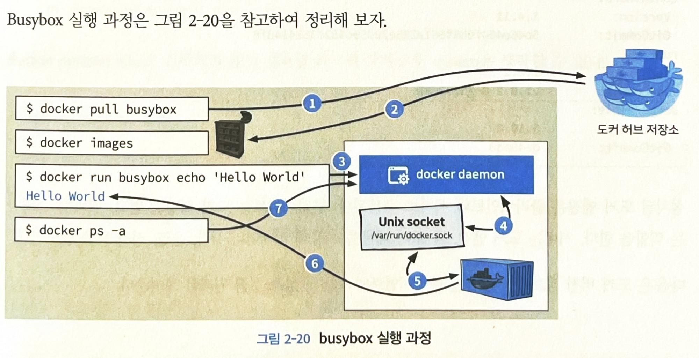

## 2.1 도커 엔진

- 도커는 기존 리눅스 컨테이너 기술을 이용해 애플리케이션을 컨테이너로서 사용할 수 있게 만들었다.
- 버전 정보를 확인해 보면 Go 언어로 구성된 것을 확인할 수 있다.(`docker version`)

### **컨테이너 가상화 기술의 변천사**

- Ref: [https://kangwoo.kr/2020/07/26/도커-구조/](https://kangwoo.kr/2020/07/26/%EB%8F%84%EC%BB%A4-%EA%B5%AC%EC%A1%B0/)
- 초기 도커: 리눅스 컨테이너 기술인 LXC를 기반으로 하는 컨테이너
    - 리눅스의 특수 기능인 LXC를 이용하면 실행 환경을 격리할 수 있다.
  
    - 하나의 OS에서 커널을 공유하고 각각의 실행 환경이 하나의 프로세스처럼 움직이므로 이전의 하이퍼바이저처럼 각 실행환경 별로 독자적인 OS를 가질 필요가 없어 훨씬 가벼움.
    - 리눅스 기술인 chroot 기능을 이용해 프로세스를 격리 
      > 💡 “혁신은 없었다” 애플의 신제품이 나올 때마다 들리는 이야기입니다만, 컨테이너야 말로 **“혁신은 없었던 신기술”** 중에 하나입니다.([링크](https://www.44bits.io/ko/post/change-root-directory-by-using-chroot))
      - `chroot`: 디렉토리에서 프로세스가 실행되는 루트를 변경한다.
      
      - chroot로 실행한 프로세스 K: /A를 새로운 루트로 사용한다.

- 0.9.0 버전부터는 libcontainer OCI를 이용
    - [libcontainer?](https://github.com/opencontainers/runc/tree/main/libcontainer)
      >  💡 **Libcontainer is pure Go library which we developed to access the kernel’s container APIs directly, without any other dependencies.** It provides a native Go implementation for creating containers with namespaces, cgroups, capabilities, and filesystem access controls. → 리눅스에 의존하던 기존 LXC와 달리 순수 Go 언어로 구현된 컨테이너 기술(의존성 낮춤)

    - [Why libcontainer instead of LXC?](https://www.docker.com/blog/docker-0-9-introducing-execution-drivers-and-libcontainer/)(도커 공식 블로그)
        - LXC → 리눅스에 의존되어 있었음. LXC의 경우 리눅스 커널 containment 기능을 위한 userspace interface를 제공했다.
        - 반면 libcontainer의 경우, 훨씬 더 넓은 범위의 격리 기술을 제공하는 추상화임.
        - libcontainer가 LXC에 비해 더 나은 이점은
          >  💡 Thanks to libcontainer, Docker out of the box can now manipulate namespaces, control groups, capabilities, apparmor profiles, network interfaces and firewalling rules – all in a consistent and predictable way, and without depending on LXC or any other userland package.
          **This drastically reduces the number of moving parts, and insulates Docker from the side-effects introduced across versions and distributions of LXC.(**[공식 블로그](https://www.docker.com/blog/docker-0-9-introducing-execution-drivers-and-libcontainer/)**)**

            1. lib는 커널의 컨테이너 API를 직접 접근할 수 있도록 만들어짐으로써 의존성을 없앴다는 점이다.
                - libcontainer 라이브러리로, 도커는 namespace, control groups(cgroup), capabilities, 방화벽 규칙 등을 LXC나 다른 외부 패키지에 의존하지 않고 제어할 수 있게 됐다.
                - libcontainer로 인해 의존성이 줄어들었고, 이는 더 안정적이고 효율적이게 됐다.
            2. Libcontainer의 경우 재사용성이 좋고 LXC에 비해 다른 벤더(CoreOS 등)에 적용하기가 더 쉽다.

            

- 1.11.0 이후 버전부터는 [runC OCI](https://github.com/opencontainers/runc)([공식문서 링크](https://github.com/opencontainers/runc))를 이용
    - runC(libcontainer 의 리팩토링 구현체):
        - libcontainer는 Go 라이브러리라면,
        - runc는 OCI 런타임 표준을 준수하는 컨테이너를 생성 및 실행하기 위한 CLI 툴 → libcontainer를 사용하며 원래는 도커를 위해 개발되었으나 OCI 표준으로 자리 잡으면서 도커에서 독립
        - `runc`는  `libcontainer`의 `client wrapper`로 Go 언어로 개발되었으며, 현재 Docker에서 저수준 컨테이너 런타임으로 사용되고 있음.
      
    - Background([도커 공식 블로그 글](https://www.docker.com/blog/runc/))
      - 도커가 발전함에 따라 그에 따른 보일러플레이트 코드 & 의존성이 많았다(Linux, Go, LXC, …)
          - 전체 코드의 50% 이상이 infrastructure plumbing
      - 최대한 코드를 재사용할 수 있는 방안 모색
      - runC is a lightweight, portable container runtime. It includes all of the plumbing code used by Docker to interact with system features related to containers. It is designed with the following principles in mind:
          - Designed for security.
          - Usable at large scale, in production, today.
          - No dependency on the rest of the Docker platform: just the container runtime and nothing else.

## macOS용 도커 엔진 설치 → Docker Desktop 설치하면 됨!

## 2.4 도커 확인

### 2.4.1 도커 컨테이너 서비스

- `Hello world` 찍기 with busybox
  
  - busybox: 도커에서 제공하는 busybox는 하나의 실행 파일로 여러 유닉스/리눅스 유틸리티를 제공하는 소프트웨어
  > docker ps -a 명령은 실행된 모든 (실행 중인, 실행 종료된) 컨테이너 정보를 제공한다. 리눅스 명령어인 ps(process status)와 같은 맥락으로 사용된다. 결국, 도커 컨테이너는 ‘프로세스 가상화’라는 의미를 되새긴다.
  > busybox를 실행하면 sh(셸)을 이용해 지정한 명령을 실행하는데, 처음 실행한 명령에서는 busybox 뒤에 명령을 기재하지 않았기 때문에 실행되자마자 바로 종료된다.
  > 도커 컨테이너는 우분투 리눅스 운영체제를 이용한다. 도커 가상화는 호스트의 커널을 공유해서 사용하기 때문. 작은 용량이 가능한 이유는 도커 컨테이너가 호스트 커널을 공유해서 재사용하고(따로 OS가 필요 X) 가동에 필요한 도구만 일부 탑재한 ‘격리된 경량의 리눅스 프로세스’기 때문이다.
  

- 출력된 ‘Hello World’는 어디서 출력되었을까?
    - 호스트로 사용 중인 Ubuntu?
    - Busybox 컨테이너 내부? ( ✅  ) ⇒  호스트가 아닌 컨테이너 서비스를 통해 명령 수행!
- Busybox 실행 과정
    - `docker pull busybox`: 도커 허브 레지스트리에서 제공하는 busybox 이미지 다운로드
    - `docker ps -a` : 실행 중이거나 실행 종료된 모든 컨테이너 정보 제공
    - `docker images`: 이미지를 조회 → 앞서 다운로드한 busybox 이미지를 확인
    - `docker run busybox echo ‘Hello World’` : 셸에 echo 명령을 이용해 ‘Hello World’ 출력
  

### 2.4.2 도커 정보 확인

- 설치된 도커 엔진은 클라이언트와 서버로 구분
- 클라이언트: 도커 명령을 받고 결과를 출력
- 서버: 도커 엔진(도커 데몬)을 이용해 컨테이너 시작, 운영, 정지 등을 담당
- 클라-서버 상호 실행 원리

  1. 클라는 도커 명령을 수행하는 명령줄 제공
  2. 수행된 도커 명령은 서버의 도커 데몬으로 전달
  3. 도커 데몬은 docker.socket이 보유한 도커 API를 이용해 컨테이너 생성
  4. 수행된 컨테이너에 포함된 서비스 결과를 클라에 전달
  
- `docker info`: 시스템에 설치된 도커 구성 정보 확인 가능
  
  - 커널 정보, 현재 컨테이너 수 및 이미지 수 출력
  - 사용 중인 스토리지 드라이버에 따른 풀 이름
  - 데이터 파일, 메타 데이터 파일, 사용된 데이터 공간, 총 데이터 공간, …
- `docker system df`: 도커 시스템이 사용하는 디스크 사용량에 대한 현재 상태 조회
  