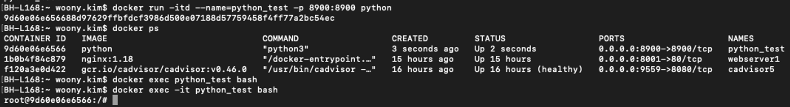
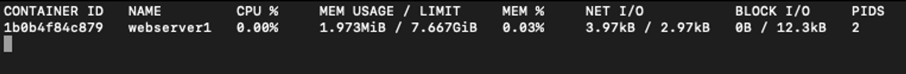
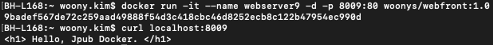

## 3.1 컨테이너 서비스

### 3.1.1 컨테이너 서비스란?

- 컨테이너의 사전적 의미: 어떤 사물을 격리할 수 있는 공간

  → 우리가 서비스하고자 하는 애플리케이션 코드, 프로세스를 격리한다는 의미로서 컨테이너라는 워딩을 활용!

- 애플리케이션 개발 환경이 컨테이너 서비스 환경으로 전환된 이유?
    - Pain point: 가변적 인프라 환경으로 인한 일관성 없는 환경 제공 때문!
        - 개발, 테스트, 배포, 운영의 컴퓨팅 환경 차이로 인한 시행착오 & 다양한 오류 해결에 너무 많은 시간을 쏟는다..!
- 컨테이너 서비스: 논리적 패키징 매커니즘 제공
    - 애플리케이션에 필요한 바이너리, 라이브러리 및 구성 팡리 등을 패키지로 묶어 배포

### 3.1.2 왜 도커 컨테이너 서비스일까?

- 도커를 이용한 컨테이너 애플리케이션 서비스 개발 과정
    1. 애플리케이션 코드 개발
        - 특정 서비스 구동을 위한 애플리케이션 코드 및 웹 화면 구성 등을 위한 코드 개발
    2. 베이스 이미지를 이용한 Dockerfile 작성
        - 개발에 필요한 인프라 구성 요소를 Dockerfile에 작성.
        - 도커 허브를 통해 베이스 이미지를 다운로드하고 다양한 구동 명령어와 1에서 작성한 애플리케이션 코드, 라이브러리 등을 Dockerfile에 포함시킨다.
    3. Dockerfile build를 통한 새로운 이미지 생성
        - docker build 명령을 통해 작성한 Dockerfile을 실행. 각 단계별로 실행되는 로그를 화면에서 확인하며 이때 오류 발생 내용도 확인.
    4. 컨테이너 실행
        1. 생성된 이미지를 이용한 컨테이너 생성
            - 도커 명령어 docker images를 통해 생성된 이미지를 확인하고 이미지를 통한 컨테이너를 구동(`docker run`)한다.
        2. 도커 컴포즈를 이용한 다중 컨테이너 실행
            - 도커 실행 옵션을 미리 작성한 docker-compose.yml을 통해 다중 컨테이너간 실행 순서, 네트워크, 의존성 등을 통합 관리할 수 있고 마이크로서비스 개발에 활용.
    5. 서비스 테스트
        1. 컨테이너 애플리케이션 서비스 테스트
            - ex) Nginx를 이용한 웹 애플리케이션 컨테이너 서비스였다면 연결하는 IP와 포트 번호를 이용해 웹 브라우저를 이용한 페이지 연결 확인
        2. 마이크로서비스 테스트
            - 해당 서비스에 대한 테스트 진행
    6. 로컬 및 원격 저장소에 이미지 저장(push)
        - 로컬 및 원격에 있는 이미지 저장소에 생성한 이미지를 저장해 다른 팀 간의 공유 및 지속적인 이미지 관리 수행
    7. 깃허브 등을 활용한  Dockerfile 관리
        - Dockerfile 코드를 깃허브 사이트에 저장 및 관리할 수 있고, 도커 허브 사이트와 연동하게 되면 자동화된 빌드 기능을 이용한 이미지 생성도 가능
    8. 동일 환경에서의 지속적 애플리케이션 개발 수행
        - 1~7 과정을 통해 업무용 애플리케이션 이미지를 지속적으로 개발, 운영 및 관리할 수 있음.
- 도커 작동에서 눈여겨볼 것: 컨테이너 동작에 필요한 모든 내용을 사전에 코드로 작성해 자동화 → IaC

## 3.2 도커 명령어 활용

### 3.2.1 도커 이미지 명령어

- 도커 컨테이너: 도커 허브에서 제공하는 이미지를 기반으로 실행
- 도커 이미지: 도커의 핵심 기술 → 코드로 개발된 컨테이너 내부 환경 정보(바이너리, 라이브러리, 각종 도구 등)를 고스란히 복제해서 사용 가능
- 도커 컨테이너로 사용할 도커 이미지: docker search를 통해 조회 → 도커 허브 & 개인 사용자들이 공개한 관련 이미지 서치 가능
- 로컬 서버 & 데스크톱에 도커 이미지 저장하려면
    - Dockerfile을 통해 새로운 이미지를 생성: docker build
        - Dockerfile로 생성한 이미지는 도커 허브에 업로드 가능(docker push)
    - 도커 허브로부터 이미지를 내려받기: docker pull

**도커 이미지 내려받기**

- 도커 허브 레지스트리로부터 도커 이미지를 내려받거나 레지스트리에 업로드하는 과정을 수행하기 위해 아래의 명령 사용
    - docker pull: 도커 허브 레지스트리에서 로컬로 도커 이미지 내려받기
        - docker pull 명령을 이용할 때 옵션 & 태그 등으로 세부 사항 지정 가능

          **`실습: debian 다운로드`**

          

            ```bash
            docker [image] pull [OPTIONS] name[:TAG | @IMAGE_DIGEST]
            
            1. Using default tag: latest
            2. latest: Pulling from library/debian
            3. 90fe46dd8199: Pull complete
            4. Digest: sha256: 281p2asdfnj123hiuhskjdf
            5. Status: Downloaded newer image for debian:latest
            6. docker.io/
            ```

            1. 태그: 이미지 뒤에 태그를 따로 명시하지 않으면 최신 버전(latest)으로 다운받는다. 특정 버전을 지정하면 latest 대신 지정한 버전명이 포함된다.
            2. 라이브러리: 도커 허브가 이미지를 저장하고 있는 네임스페이스로 제공
            3. 도커 허브에서 제공된 이미지의 분산 해시 값 표시. 다운로드한 이미지는 여러 계층으로 만들어지는데 그중 이미지 핵심 정보를 바이너리 형태의 정보로 제공
            4. 다이제스트값: 원격 도커 레지스트리(도커 허브)에서 관리하는 이미지의 고유 식별값
            5. 다운로드 완료
            6. docker.io: 도커 허브 이미지 저장소 주소
        - 다운로드한 이미지 정보는 docker image ls를 통해 조회 가능
    - docker push: 로컬에 있는 도커 이미지를 도커 허브 레지스트리에 업로드
    - docker login: 업로드를 하기 전 도커 허브 계정으로 로그인 수행하기
    - docker logout: 도커 허브에서 로그아웃하기

**도커 이미지 세부 정보 조회**

- 도커 오브젝트에 대한 세부 정보 조회를 위해 docker image inspect, docker image history, 물리적으로 호스트 운영체제에 저장된 영역을 이용하기 등이 있다.
    1. `docker inspect`: JSON 언어 형태로 정보 출력 → 포맷 옵션을 이용해 원하는 정보만 출력 가능

        ```bash
        docker image inspect [OPTIONS] IMAGE [IMAGE...]
        ```

        - **`실습: 아파치 웹 서비스를 할 수 있는 httpd 도커 이미지 다운로드`**
            1. `docker search httpd`: 수행 전 hub.docker.com에 가입한 본인 계정으로 docker login을 먼저 수행하고 조회(docker login 이후 docker search 사용)

               

            2. `docker pull httpd(:latest)`: httpd 최신 버전으로 다운로드

               

            3. `docker images`: 다운로드한 이미지 조회

               

            4. `docker image inspect httpd`: 다운로드한 이미지 세부 정보 조회 → JSON 데이터 출력

               

    2. `docker image history` : 이 명령으로 현재 이미지 구성을 위해 사용된 레이블 정보와 각 레이어의 수행 명령, 크기 등을 조회 가능

        ```bash
        docker image history [OPTIONS] IMAGE
        ```

       

        - CREATED BY: 특정 이미지를 구성하기 위해 사용된 명령과 환경설정 정보 등 확인 가능
        - CMD, EXPOSE, ENV, WORKDIR 명령 등으로 베이스 이미지에 필요한 설정 정보를 결합해 새로운 이미지를 만들게 된다.
- 도커 유니언 파일 시스템
  1. 도커 이미지 구조의 기본 운영체제 레이어 쌓기
  2. 운영체제 베이스 이미지 위에 아파치 웹 서버를 설치한 레이어를 올린다.
  3. 아파치 웹서비스에 필요한 리소스 정보 및 환경 정보가 포함된 레이어를 올린다.
  4. 도커 이미지를 실행하면 여러 개의 컨테이너를 구동할 수 있다.
- 왜 이런 구조 사용? → 재사용성을 높여서 효율화!

### 도커 이미지 태그 설정과 도커 로그인 & 로그아웃

- 도커 태그: 원본 이미지에 참조 이미지 이름을 붙이는 명령어.
- 실습: 도커 허브 업로드용 태그 지정: `docker image tag httpd:latest [본인 아이디]/httpd:3.0`

- 본인이 베이스 이미지에 특정 애플리케이션을 서비스와 코드 등을 포함해 컨테이너로 실행한 경우, docker commit 명령으로 컨테이너를 이미지로 저장할 수 있다.
- 이 이미지를 본인 도커 허브 저장소에 업로드해 지속적으로 활용할 수도 있고, 팀 간 이미지 공유도 할 수 있다.
- 생성한 이미지를 업로드하려면 `docker login` 명령을 통해 호스트에서의 접속이 이뤄져야 한다.

## 3.2.2 도커 컨테이너 명령어

- 이미지는 읽기 전용의 불변 값으로 만들어진다. 이러한 이미지를 바탕으로 도커 엔진은 컨테이너를 생성한다.
- 도커 이미지는 컨테이너 동작과 관련된 콘텐츠를 제공하고 이를 바탕으로 컨테이너의 동작이 이뤄진다. 따라서 컨테이너 명령 대부분이 서비스 실행 및 운영과 관련

### 컨테이너는 프로세스다

- 도커 컨테이너: 도커 이미지를 기반으로 만들어지는 스냅샷
- 스냅샷: 읽기 전용의 도커 이미지 레이어를 복제한 것. 이 위에 읽고 쓰기가 가능한 컨테이너 레이어를 결합하면 컨테이너가 된다.
- 컴퓨터 애플리케이션 동작: 프로세스를 통해 이뤄진다.
- 컨테이너는 프로세스 격리 기술의 표준으로 정의된 OCI로 컨테이너 포맷과 런타임에 대한 개방형 업계 표준을 만들기 위한 목적으로 구성된 오픈 프로젝트
- docker run을 사용하면 컨테이너 동작 → 가상의 격리 환경에 독립된 프로세스가 동작

### 컨테이너 실행: docker run

- 컨테이너 제어 실습
    - ubuntu 14.04 버전 다운로드(`docker pull ubuntu:14.04`)

      

    - pull받은 ubuntu에 이름 붙이기(`docker image tag ubuntu:14.04 container-test1`) → 따로 버전 지정하지 않았기 때문에 latest 버전으로 생성

      

> docker run = docker [pull] + create + start + [command]

- docker run 특징:
    - 호스트 서버에 이미지가 없더라도 로컬에 존재하지 않는 이미지를 도커 허브에서 자동 다운로드(`pull`)
    - 마지막에 해당 컨테이너에 실행할 명령 입력 시 컨테이너 동작과 함께 처리
- **docker run에서 자주 사용하는 옵션**
    - `-i` : 대화식 모드(interactive mode) 열기: Docker가 컨테이너의 표준입력과 사용자 터미널을 붙여주는(연결해주는) 옵션.
        - 이걸 쓰면 우리 터미널에서 커맨드를 입력했을 때 해당 커맨드를 컨테이너 내부 CLI로 전달해주고 거기서 출력된 결과물을 우리 터미널로 끄집어내서 보여준다.
        - 하지만 `-i` 옵션만 쓰게 되면 컨테이너 내부 셸과는 상호작용할 수 없음.
       
      - 우리가 인풋은 넣고 싶은데 해당 셸 프롬프트의 아웃풋을 보고 싶지는 않을 때 이것을 쓰면 된다.
    - `-t` : tty(컨테이너 내부 터미널을 뜻함)
        - t 옵션만 쓰면 해당 컨테이너에 터미널을 할당해주지만 우리 터미널과 컨테이너의 표준 입력 사이가 붙어있지 않음. 즉, 해당 컨테이너의 커맨드 라인과 상호작용할 수 없음.
        - 즉, 터미널은 떠 있지만, 해당 터미널을 통해 명령어를 전달할 수도 없고 마찬가지로 어떤 결과물도 확인할 수 없다.
        - 
    - `-it`: 해당 컨테이너에 터미널을 할당하고 & 우리 터미널과 그쪽 터미널 사이를 연결(attach)함으로써 명령어 전달 및 아웃풋 출력 가능
        
    - `-d` : 백그라운드에서 컨테이너 실행 후 컨테이너 id 등록
      - 일반적으로 docker run에 명령어 따로 붙이지 않고 -d 옵션만 붙이면 실행할 게 없어서 해당 프로그램 종료된다.
      - `docker run -d --name=python_test -p 8900:8900 python` 이후 `docker ps` 로 현재 실행 중인 프로세스 확인 → python 종료되어 있음
      
    - `-itd` : container 백그라운드에서 실행한 뒤 표준 입력 명령 수행 → input 받을 수 있는 상태로 계속 대기(컨테이너 종료되지 않음)
      
      

### 실습 3-1: SQL 테스트를 위한 개발 팀의 데이터베이스 요청으로 MySQL 5.7 컨테이너 실행

- 1. `docker pull --platform linux/amd64 mysql:5.7`
    - 어라? 근데 우리는 맥북 쓰고 있으니까 arm64 버전으로 받아야 하는 거 아님?
        1. arm64용 5.7버전이 없다… → [도커 허브 내 official image에는 8버전만 존재](https://hub.docker.com/_/mysql)
        2. 하지만 우리에게는 QEMU가 있다! → [공식 문서 참조](https://www.notion.so/Ch-3-fec8591268d340519b152d095068fbe2)

           You can build multi-platform images using three different strategies that are supported by Buildx and Dockerfiles:

            1. **Using the QEMU emulation support in the kernel(Docker desktop을 쓸 경우 여기에 해당)**
            2. Building on multiple native nodes using the same builder instance
            3. Using a stage in Dockerfile to cross-compile to different architectures

        >        💡 When you run a container with the **`linux/amd64`** platform on an Apple M1 silicon mac, the Docker engine uses a technology called "Emulation" to translate the x86_64 instructions (used by the **`linux/amd64`** platform) to the ARM64 instructions (used by the Apple M1 silicon mac).
        >
        >      Docker Desktop for Mac, which is the version of Docker that runs on Apple M1 silicon macs, includes an emulation layer called "QEMU" that allows you to run containers built for the **`linux/amd64`** platform on an Apple M1 silicon mac. This emulation layer works by translating the x86_64 instructions to ARM64 instructions in real-time.
        >
        >      This emulation layer adds some overhead and can result in slower performance compared to running native ARM64 containers. However, for many applications, the performance impact is minimal and the benefits of running containers in a consistent environment across different platforms outweigh the performance cost.
        >
        >      To run a container with the **`linux/amd64`** platform on an Apple M1 silicon mac, you can use the **`--platform`** flag with the **`docker run`** command. For example, to run the **`hello-world`** image with the **`linux/amd64`** platform, you can run:
        >
        >        ```
        >        docker run --platform linux/amd64 hello-world
        >        ```
        >
        >      This will pull the **`hello-world`** image with the **`linux/amd64`** platform and run it on your Apple M1 silicon mac using QEMU emulation.
        >
        >      Note that not all images may work with emulation, as some images may have dependencies that are only available for a specific platform. It's always a good idea to check the compatibility of an image before running it on a different platform.

2. 이미지 조회: `docker images | grep mysql`
   
3. 컨테이너 실행: 이름 따로 지정해서 run
    - `docker run --name some-mysql -e MYSQL_ROOT_PASSWORD=my-secret-pw -d mysql:5.7`
      - 컨테이너 내부 접속 후 `/etc/init.d/mysql start` → 레거시 방식! 따라서 위와 같이 접속 후 exec 명령어로 내부로 진입한다.
4. 컨테이너 OS 확인: docker exec 명령어로 내부 접근
   - `docker exec -it {container ID} bash` 명령어를 통해 컨테이너 내부로 접근
   - `cat /etc/os-release` 명령어로 OS 확인
   
   - `mysql -u root -p`: MySQL 실행하기
   - 컨테이너 종료하지 않고 터미널 빠져 나오려면 ctrl 누른 상태로 P 누르고 Q 누르기
5. 컨테이너 내부 IP 확인: `docker inspect some-mysql | grep IPAddress`
   

### 실습 3-2: 컨테이너 모니터링 도구 cAdvisor 컨테이너 실행

- 서비스 운영 하면서 필요한 시스템 Metric(CPU/메모리 사용률, 네트워크 트래픽 등)을 모니터링하면서 특이사항이 있을 때 대응하기 위해 모니터링 수행
- 그러나 컨테이너라는 환경 하에서는 기존 모니터링 도구로는 container 모니터링 진행이 어렵다
- 이러한 문제점을 해결하고 컨테이너를 모니터링하기 위한 도구로 구글에서 제공하는 cAdvisor(Container Advisor)를 많이 사용함
> 주의: 기존 google/cadvisor로는 docker 실행에 에러 발생!
> → 버전(latest → 0.46.0) &이미지 이름(google → gcr.io) 변경해야 된다. 
> ref([link](https://github.com/google/cadvisor/issues/3073))

```bash
docker run \
> --volume=/:/rootfs:ro \
> --volume=/var/run:/var/run:rw \
> --volume=/sys:/sys:ro \
> --volume=/var/lib/docker/:/var/lib/docker:ro \
> --publish=9559:8080 \
> --detach=true \
> --name=cadvisor \
> gcr.io/cadvisor:v0.46.0
```

- `http://localhost:9559/` 접속
- 
- 아무 이미지나 run한 뒤 (ex - nginx) 사이트 아래 쭉 내려가면 /docker 보이는데 클릭
- 
- 그러면 해당 컨테이너 id  & CPU 사용량 등 확인 가능
- 

### 3-3 웹서비스 실행을 위한 nginx 컨테이너 실행

- `docker pull nginx:1.18`
- `docker images` → nginx 이미지 확인
- `docker run —name webserver1 -d -p 8001:80 nginx:1.18`
    - —name: 컨테이너 이름 지정
    - -d: 컨테이너를 백그라운들에서 실행하고 컨테이너 id를 출력
    - -p: 컨테이너의 80번 포트를 host 포트 8001로 오픈
        - 앞 번호: 호스트 포트
        - 뒷 번호: 내부 컨테이너 포트
- `sudo lsof -i :8001` : 현재 8001번 포트 상태 확인(PID, User, …) 
  
- localhost:8001 접속
  
- `docker stats webserver1`: 컨테이너의 리소스 사용량 실시간 확인
  
- `docker logs -f webserver1` : nginx 컨테이너 접근 로그 확인
    
  - 로그 켠 상태로 nginx 페이지 접속해서 새로고침 → 
- `curl localhost:8001`: 프로토콜들을 이용해 URL 로 데이터를 전송하여 서버에 데이터를 보내거나 가져올때 사용하기 위한 CLI 도구
```html
<!DOCTYPE html>
<html>
<head>
<title>Welcome to nginx!</title>
<style>
    body {
        width: 35em;
        margin: 0 auto;
        font-family: Tahoma, Verdana, Arial, sans-serif;
    }
</style>
</head>
<body>
<h1>Welcome to nginx!</h1>
<p>If you see this page, the nginx web server is successfully installed and
working. Further configuration is required.</p>

<p>For online documentation and support please refer to
<a href="http://nginx.org/">nginx.org</a>.<br/>
Commercial support is available at
<a href="http://nginx.com/">nginx.com</a>.</p>

<p><em>Thank you for using nginx.</em></p>
</body>
</html>
BH-L168:~ woony.kim$ docker stop webserver1
webserver1
BH-L168:~ woony.kim$ docker start webserver1
webserver1
BH-L168:~ woony.kim$ curl localhost:8001
<!DOCTYPE html>
<html>
<head>
<title>Welcome to nginx!</title>
<style>
    body {
        width: 35em;
        margin: 0 auto;
        font-family: Tahoma, Verdana, Arial, sans-serif;
    }
</style>
</head>
<body>
<h1>Welcome to nginx!</h1>
<p>If you see this page, the nginx web server is successfully installed and
working. Further configuration is required.</p>

<p>For online documentation and support please refer to
<a href="http://nginx.org/">nginx.org</a>.<br/>
Commercial support is available at
<a href="http://nginx.com/">nginx.com</a>.</p>

<p><em>Thank you for using nginx.</em></p>
</body>
</html>
```
- `vi index.html`: index 파일 새로 생성
```shell
# index.html
<h1> Hello, Jpub Docker. </h1>
```
- docker 컨테이너 내부로  index.html 파일 이동: `docker cp index.html webserver1:/usr/share/nginx/html/index.html`
- 사이트 새로고침하면 변경된 것을 확인 가능
    
- `docker restart` : 컨테이너 재시작 - 기존 컨테이너 프로세스를 정지하고 새 컨테이너 프로세스를 시작. 따라서 컨테이너 동작에는 영향을 주지 않고 호스트의 PID만 변경된다.
### 실습 3-4: 파이썬 프로그래밍 환경을 컨테이너로 제공

- 샘플 코드 작성

```python
from random import shuffle
from time import sleep

gamenum = input('로또 게임 횟수를 입력하세요: ')
for i in range(int(gamenum)):
    balls = [x+1 for x in range(45)]
    ret = []
    for j in range(6):
        shuffle(balls)       # balls를 무작위로 섞고
        number = balls.pop() # balls의 가장 마지막 숫자를 추출한 뒤 제거
        ret.append(number)   # 추출된 숫자를 ret에 추가
    ret.sort()
    print('로또번호[%d]: ' %(i+1), end='')
    print(ret)
    sleep(1)
```

- 파이썬 컨테이너 실행 후 py_lotto.py 샘플 코드 복사
    - `docker run -itd —name=python_test -p 8900:8900 python`
        - (복습) -d 옵션: 컨테이너를 백그라운드에서 실행하고 컨테이너 id를 출력

          

    - `docker cp py_lotto.py python_test:/` : 작성한 py 파일을 도커 컨테이너 내부로 전달
- 컨테이너 확인: `docker exec -it python_test bash`
- 외부에서 파이썬 컨테이너 코드 실행
    - exec: 도커 컨테이너에 명령 전달(running 상태인 컨테이너에서만 가능한 명령어)

  
- *컨테이너 내부에 소스 코드, 구성 정보(.conf) 등을 변경하는 경우 `docker cp(COPY)` 명령어가 유용하다. (뒤에 Dockerfile 명령어 관련해서 배울 예정)
- 컨테이너 내부 파일을 수정해야 한다면 컨테이너 내부에 편집기를 설치하거나 할 필요가 없음.

### 실습 3-5. node.js 테스트 환경을 위한 컨테이너 실행

- vi nodejs_test.js

    ```python
    const http = require('http');
    const content = function(req, resp) {
      resp.end("Good morning Korea~!" + "\n");
      resp.writeHead(200);
    }
    const web = http.createServer(content);
    web.listen(8002);
    ```

- `node nodejs_test.js` : fail
    
- `docker pull node`
- `docker cp nodejs_test.js nodejs_test:/nodejs_test.js`
- `docker exec -it nodejs_test node /nodejs_test.js`
    


- `docker rename`: 컨테이너 이름 변경하고 싶을 때


- `docker commit`: 앞에서 생성한 컨테이너 노드 프로그램 환경과 저장한 소스코드 그대로 새로운 이미지 생성
- `curl localhost:8008`
    - code

        ```html
        <!DOCTYPE html>
        <html>
        <head>
        <title>Welcome to nginx!</title>
        <style>
        html { color-scheme: light dark; }
        body { width: 35em; margin: 0 auto;
        font-family: Tahoma, Verdana, Arial, sans-serif; }
        </style>
        </head>
        <body>
        <h1>Welcome to nginx!</h1>
        <p>If you see this page, the nginx web server is successfully installed and
        working. Further configuration is required.</p>
        
        <p>For online documentation and support please refer to
        <a href="http://nginx.org/">nginx.org</a>.<br/>
        Commercial support is available at
        <a href="http://nginx.com/">nginx.com</a>.</p>
        
        <p><em>Thank you for using nginx.</em></p>
        </body>
        </html>
        ```

- `docker cp index.html webserver8:/usr/share/nginx/html/index.html`
    - 기존에 만들어뒀던 `index.html` 을 옮긴다.
- `docker diff webserver8`: 변경 소스 확인
    - index.html 변경된 것을 확인 가능

      
- `docker commit -a "jpub" webserver8 webfront:1.0`
  - docker commit으로 이미지 생성 (-a: 생성자 이니셜)

    

- docker login 후 이미지 push
    - `docker login`
    - docker tag webfront:1.0 [본인ID]/webfront:1.0
    - docker push [본인ID]/webfront:1.0

  

    - 푸시한 이미지 내려받아서 컨테이너로 잘 동작하는지 체크

  

    - [hub.docker.com](http://hub.docker.com) 사이트 확인

  

## 3.2.3 도커 볼륨 활용


> 💡 Docker Volumes are the preferred mechanism for persisting data generated by and used by Docker containers([docs](https://docs.docker.com/storage/volumes/)).
> 
> `도커 볼륨은 도커 컨테이너로부터 생성되거나 사용되는 데이터를 영속화하는 메커니즘이다.`


[Manage data in Docker(link)](https://docs.docker.com/storage/)


- 도커는 유니언 파일 시스템 사용
    - 하나의 이미지로부터 여러 컨테이너를 만들 수 있는 방법을 제공 & 이미지에 변경 내용 저장

**도커 볼륨**: 데이터베이스, 웹 프로그램 등 애플리케이션에서 발생하는 데이터에 접근 & 공유하기 위해서 사용

- 도커 볼륨은 컨테이너에서 생성 & 재사용 → 호스트 운영체제에서 직접 접근 가능
- 보존되어야 하는 데이터를 유지하기 위한 메커니즘 제공
    - 일반적으로 컨테이너 내부 데이터는 컨테이너의 라이프사이클과 연관되어 컨테이너 종료 시 삭제
    - 이를 영속화하는 방법으로 도커 볼륨 사용 시 컨테이너가 삭제되더라도 볼륨은 독립적으로 운영되기 때문에 삭제되지 않는다!

### 도커 볼륨 타입


1. Volume: 호스트 파일 시스템의 일부 중 도커가 관리하는 영역`(/var/lib/docker/volumes/ on Linux -> 도커 데스크탑에서 가상화된!)`에 저장함. 도커가 아닌 프로세스는 해당 파일 시스템에 접근 불가. **도커 볼륨은 공식 문서 왈 도커에서 데이터를 영속화하는 가장 최고의 방법!**
2. Bind mounts: 호스트 시스템 어디에나 저장 가능. 심지어 주요 시스템 파일이나 디렉토리가 될 수도 있다. 도커가 아닌 프로세스가 해당 파일 / 디렉토리를 언제든 변경 가능
3. `tmpfs` mounts: 호스트 시스템의 메모리에 저장하며 파일 시스템에는 절대 저장하지 않음.

1.  **Volume(**Bind mount, tmpfs mount는 따로 보기**)**
    1. 도커에서 권장하는 방법 → `docker volume create [볼륨 이름]` 을 통해 볼륨 생성
    2. 도커 볼륨: 도커 명령어로 관리
    3. 여러 컨테이너 간에 안전하게 공유
    4. 볼륨 드라이버로 원격 호스트 및 클라우드 환경에 볼륨 내용 저장 및 암호화
    5. 새 볼륨으로 지정될 영역에 데이터를 미리 채우고 컨테이너 연결하면 바로 데이터 사용 가능
- docker 볼륨 생성 실습
    - `docker volume create my-appvol-1`
    - `docker volume ls`
    - `docker volume inspect my-appvol-1`

    ```bash
    docker run -d --name vol-test1 \
    --mount source=my-appvol-1,target=/app \
    ubuntu:20.04
    ```


- `docker volume create`를 하지 않더라도 `docker ru`n할 때 볼륨 이름을 쓰면 자동으로 생성된다 → `docker inspect`에서 `my-appvol-2`가 자동 생성된 것을 확인


- docker volume 지우기: `docker volume rm [볼륨 이름]`
    - 볼륨이 안 지워진다?!
        - `Error response from daemon: remove my-appvol-2: volume is in use - [df8f1d056a1f89fe21395481fb303b47ebab05fd5745a5fce6300da30fc4b601, 18903a7f47908b4d009dc71c091a1847f646be08407bb677e5a66054c08412a1]`
        - 만약 컨테이너가 해당 볼륨을 사용했다면 해당 컨테이너를 사용 중이지 않더라도 볼륨을 지울 수 없게끔 되어 있다.
        - 이럴 때는 `docker ps -a`로 종료된 컨테이너까지 싹다 확인한 다음 해당 볼륨을 사용하고 있는 컨테이너 ID를 확인해서 삭제한다.

          

### 실습 3-6: 데이터베이스의 데이터 지속성 유지

- 데이터베이스 컨테이너의 데이터 보호를 위해 볼륨 지정 가능.
- 만약 컨테이너의 장애로 인해 서비스가 중단되어도 새로운 컨테이너에 동일 볼륨을 연결하면 데이터베이스의 DB, Table, Data 모두 동일하게 지속 가능
- `docker run --name mysql-test -e MYSQL_ROOT_PASSWORD=1234 -e MYSQL_DATABASE=dockertest -v mysql-data-vol:/var/lib/mysql -d mysql:5.7`