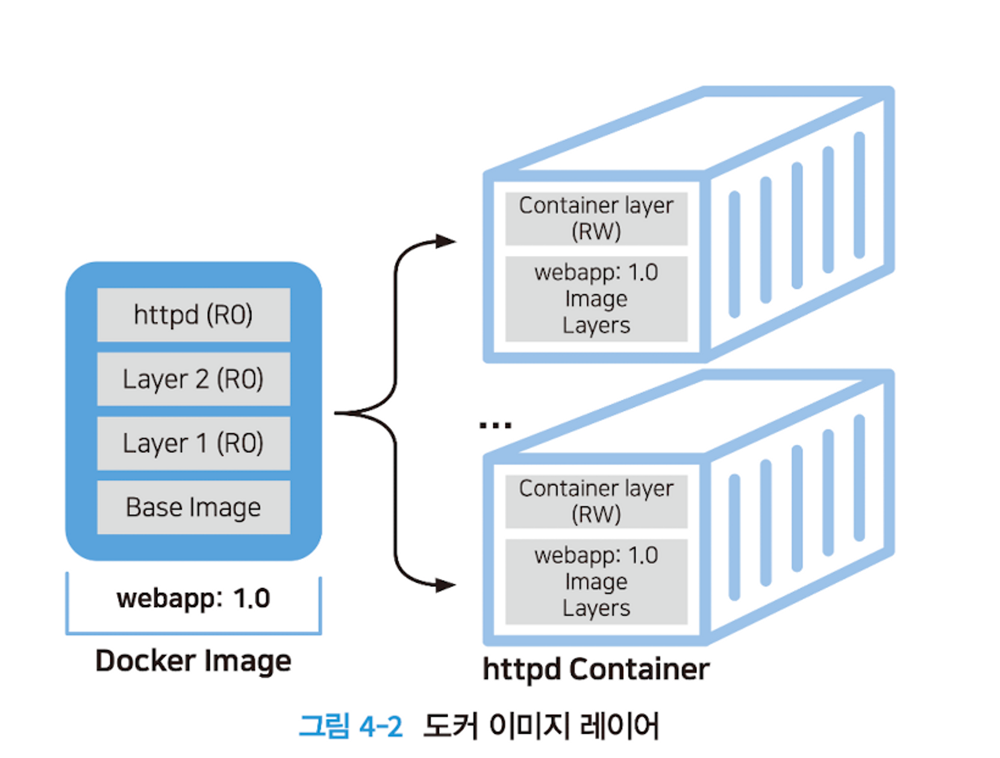

# Ch.4 코드로 개발하는 컨테이너 인프라, Dockerfile

## 4.1.1 IaC와 Dockerfile

- `Dockerfile`: 원하는 개발환경을 코드로 구성하는 방법(Infrastructure as Code, IaC)
- IaC는 왜 필요할까?
    - 커맨드 기반 인프라 구성 → 인적 오류 가능성 높음(매번 명령어 쳐야 하니)
    - 설치 순서, 상호 연관성을 고려해야 하는 문제 해결
- 이러한 수고로움을 하나의 이미지로 만들어두고, 수정사항은 언제든 코드 변경이 용이하다면 개발 업무 목적에만 온전히 집중할 수 있다.
- 프로그래밍형 인프라 개발은 탄력성, 확장성, 반복성을 부여해 동일한 환경 서버를 수십-수백 대까지 운영, 관리해준다.
- Dockerfile: 코드로서 인프라 환경을 프로비저닝 → 애플리케이션에 적용되는 새로운 환경을 사용자가 직접 정의해서 아이디어를 실현할 수 있음

## 4.1.2 최적의 Dockerfile 만들기

- 애플리케이션 파일 시스템 역할을 하는 도커 이미지를 생성하려면 Dockerfile이라는 이미지 빌드용 DSL(Domain Specific Language, 도메인 특화 언어) 파일을 사용한다. 특정 컨테이너를 위한 이미지를 개발할 경우 필요한 모든 설정 내용을 담은 파일이다.
- Dockerfile 기준
    - 경량의 컨테이너 서비스 제공
    - Dockerfile에 담기는 레이어 최소화
    - 하나의 애플리케이션은 하나의 컨테이너에
    - 캐시 기능 활용
    - IaC 환경 개발은 디렉토리 단위로
    - 서버리스 환경으로 개발

# 4.2 Dockerfile 명령어와 이미지 빌드

- 도커는 개발환경의 컨테이너화 표준

## 4.2.1 Dockerfile 명령어

- Dockerfile: 개발환경을 제공하기 위한 여러 가지 명령어들의 집합체(17개 내외)
    - `FROM` : 생성하려는 이미지의 베이스 이미지를 지정
        - 도커 허브에서 제공하는 공식 이미지를 권장
        - `FROM` ubuntu:20.04
    - `RUN`: 설정된 기본 이미지에 패키지 설치, 명령 실행 등을 작성(1개 이상 작성 가능)
        - 다단계 빌드 사용 권장, 각 이미지별로 개별 Dockerfile로 빌드
    - `CMD` : 생성된 이미지를 컨테이너로 실행할 때 실행되는 명령어
        - `ENTRYPOINT` 명령문으로 지정된 커맨드에 디폴트로 넘길 파라미터를 지정할 때 사용.
    - `ENTRYPOINT`: CMD와 마찬가지로 생성된 이미지가 컨테이너로 실행될 때 사용되지만 컨테이너가 실행될 때 명령어 및 인자 값을 전달하여 실행하는 점이 다르다.
        - CMD와 유사하나 인자 값을 사용하는 경우에 유용함
        - `ENTRYPOINT [”npm”, “start”]`
    - `COPY`: 호스트 환경의 파일, 디렉터리를 이미지 안에 복사하는 경우 작성
        - 단순한 복사 작업만 지원하며 빌드 작업 디렉토리 외부 파일은 COPY할 수 없음.
    - `ADD`:호스트 환경의 파일, 디렉토리를 이미지 안에 복사하는 경우뿐만 아니라 URL 주소에서 직접 다운로드해 이미지에 넣을 수도 있고, 압축 파일인 경우에는 경로에 압축 풀어서 추가
    - `ENV`:이미지 안에 각종 환경 변수를 지정하는 경우 작성
    - `EXPOSE`:컨테이너가 호스트 네트워크를 통해 들어오는 트래픽을 리스닝하는 포트와 프로토콜을 지정하기 위해 작성
    - `WORKDIR`:컨테이너상에서 작업할 경로 전환을 위해 작성. WORKDIR을 설정하면 RUN, CMD, ENTRYPOINT, COPY, ADD 명령문은 해당 디렉토리를 기준으로 실행.
- 일반적으로 FROM 명령어부터 작성하지만 그다음 명령부터는 순서가 없음. 하지만 명령 순서가 빌드 캐시 무효화와 연관되므로 변경 빈도수가 적은 명령을 먼저 배치하는 것을 권장한다.

## 4.2.2 이미지 생성을 위한 Dockerfile 빌드

### 이미지 빌드

- docker build 명령으로 Dockerfile로부터 이미지 생성 가능
1. 옵션
    - `-t`: “이미지명:태그”를 지정하는 경우
        - 동시에 여러 저장소 생성하려면 -t 반복 가능
    - `-f`: Dockerfile이 아닌 다른 파일명 사용하는 경우
2. 이미지명:[태그]
    - 생성할 이미지 이름과 태그 지정
    - 일반적으로 태그는 버전 관리 차원으로 고려
3. 경로
    - 디렉터리 단위 개발을 권고. 현재 경로에 Dockerfile이 있다면 “.” 사용.

### 왜 Dockerfile이 필요할까?

- 서버리스 환경을 개발할 수 있는 Dockerfile →반복적이고 수고로운 작업 자동화

> 💡 이번 실습부터는 AWS EC2를 활용해 우분투 환경에서 진행하겠습니다 🙂
> - AWS EC2 접속 방법
> - [도커 설치 on Ubuntu22.04](https://bundw.tistory.com/98)


```bash
ubuntu@ip-...-..-.-...:~$ sudo apt update
...
# apache2 설치
ubuntu@ip-...-..-.-...:~$ sudo apt -y install apache2

# netstat 명령어 사용하기 위해 net-tools 설치
ubuntu@ip-...-..-.-...:~$ sudo apt install net-tools
...
ubuntu@ip-...-..-.-...:~$ sudo netstat -nlp | grep 80
tcp6       0      0 :::80                   :::*                    LISTEN      2713/apache2

# apache2 실행
ubuntu@ip-...-..-.-...:~$ sudo service apache2 start
ubuntu@ip-...-..-.-...:~$ sudo service apache2 service
Usage: apache2 {start|stop|graceful-stop|restart|reload|force-reload}

# ip 주소로 접속

```


```bash
ubuntu@ip-...-..-.-...:/var/www/html$ sudo mv index.html index.html.org
ubuntu@ip-...-..-.-...:/var/www/html$ sudo vi index.html
ubuntu@ip-...-..-.-...:/var/www/html$ curl localhost:80
<h1> Welcome to my webserver! </h1>

...
ubuntu@ip-...-..-.-...:/var/www/html$ sudo vi index.php
...
<?php
    phpinfo();
?>
...

```


⇒ 이 작업을 도커 파일로 하면 어떻게 될까?

<aside>
💡 `sudo chmod 666 /var/run/docker.sock` →

</aside>

```bash
ubuntu@ip-...-..-.-...:~$ docker run -it --name myweb -p 8005:80 ubuntu:14.04 bash
docker: permission denied while trying to connect to the Docker daemon socket at unix:///var/run/docker.sock: Post "http://%2Fvar%2Frun%2Fdocker.sock/v1.24/containers/create?name=myweb": dial unix /var/run/docker.sock: connect: permission denied.
# 권한 변경해줘야 함
ubuntu@ip-...-..-.-...:~$ sudo chmod 666 /var/run/docker.sock
ubuntu@ip-...-..-.-...:~$ docker run -it --name myweb -p 8005:80 ubuntu:14.04 bash
# 컨테이너 진입
root@e7bbb006de5d:/# apt-get update
root@e7bbb006de5d:/# apt-get install -y apache2
root@e3f66c630dd1:/# service apache2 start
... 다른 터미널 창 오픈

ubuntu@ip-...-..-.-...:~$ curl localhost:8005
```


```bash
root@e3f66c630dd1:/# mv /var/www/html/index.html /var/www/html/index.html.org
root@e3f66c630dd1:/# vi /var/www/html/index.html

<h1> Hello, Docker application. </h1>

...
# 두번째 터미널
ubuntu@ip-...-..-.-...:~$ curl localhost:8005
<h1> Hello, Docker application. </h1>

# 다시 첫번째 터미널

root@e3f66c630dd1:/# apt-get -y install php5
root@e3f66c630dd1:/# vi /var/www/html/index.php

...
<?php
    phpinfo();
?>
...

root@e3f66c630dd1:/# service apache2 restart

#두번째 터미널
ubuntu@ip-...-..-.-...:~$ curl localhost:8005/index.php
```


```bash

#첫번째 터미널
ubuntu@ip-...-..-.-...:~$ docker commit myweb myphpapp:1.0
sha256:b6e5aaf3caac377cc228c25170466b509cbeb58b6880d208b0c53da216fe9e4b
ubuntu@ip-...-..-.-...:~$ docker images
REPOSITORY   TAG       IMAGE ID       CREATED         SIZE
myphpapp     1.0       b6e5aaf3caac   3 seconds ago   242MB
ubuntu       14.04     13b66b487594   23 months ago   197MB
ubuntu@ip-...-..-.-...:~$ docker run -itd -p 8006:80 --name=phpapp myphpapp:1.0
ce1b36263d790c5bc896245e9eb4b0c6f81f2f30cb1f91b7962306567ba45984
ubuntu@ip-...-..-.-...:~$ docker exec -it phpapp bash
root@ce1b36263d79:/# service apache2 start

#두번째 터미널
ubuntu@ip-...-..-.-...:~$ curl localhost:8006
<h1> Hello, Docker application. </h1>
```

```bash

#첫번째 터미널
ubuntu@ip-172-31-3-145:~$ docker commit myweb myphpapp:1.0
sha256:b6e5aaf3caac377cc228c25170466b509cbeb58b6880d208b0c53da216fe9e4b
ubuntu@ip-172-31-3-145:~$ docker images
REPOSITORY   TAG       IMAGE ID       CREATED         SIZE
myphpapp     1.0       b6e5aaf3caac   3 seconds ago   242MB
ubuntu       14.04     13b66b487594   23 months ago   197MB
ubuntu@ip-172-31-3-145:~$ docker run -itd -p 8006:80 --name=phpapp myphpapp:1.0
ce1b36263d790c5bc896245e9eb4b0c6f81f2f30cb1f91b7962306567ba45984
ubuntu@ip-172-31-3-145:~$ docker exec -it phpapp bash
root@ce1b36263d79:/# service apache2 start

#두번째 터미널
ubuntu@ip-172-31-3-145:~$ curl localhost:8006
<h1> Hello, Docker application. </h1>
```

## Dockerfile

```bash
FROM ubuntu:14.04
MAINTAINER "woony.kim <woony.kim@balancehero.com>"
LABEL title "IaC, PHP application"

RUN apt-get update && apt-get -y install apache2 \
php5 \
git \
curl \
ssh \
wget

ENV APACHE2_RUN_USER www-data \
        APACHE2_RUN_GROUP www-data \
        APACHE2_LOG_DIR /var/log/apache2 \
        APACHE2_WEB_DIR /var/www/html \
        APACHE2_PID_FILE /var/run/apache2/apache2.pid

# 기본 웹 페이지 생성
RUN echo 'Hello, Docker Application.' > /var/www/html/index.html

# 테스트 PHP 웹 페이지 생성
RUN echo '<?php phpinfo(); ?>' > /var/www/html/index.php

# 80번 포트 노출
EXPOSE 80

#RUN, CMD, ENTRYPOINT의 명령어가 실행되는 디렉토리 설정
WORKDIR /var/www/html

# 이미지가 컨테이너로 실행될 때 아파치 서비스를 자동으로 >실행
CMD ["/usr/sbin/apache2ctl", "-D", "FOREGROUND"]
```

docker build -t myphpapp:1.0 .

```bash
ubuntu@ip-172-31-3-145:~/phpapp2$ curl localhost:8007
Hello, Docker Application.
```

```bash
ubuntu@ip-172-31-3-145:~/phpapp2$ docker image inspect myphpapp:3.0
[
    {
        "Id": "sha256:b27a2abdd611be8ad6d2b440db5e89047b17756430958457a23b191303ed9dee",
        "RepoTags": [
            "myphpapp:3.0"
        ],
        "RepoDigests": [],
        "Parent": "",
        "Comment": "buildkit.dockerfile.v0",
        "Created": "2023-03-01T07:07:51.251753142Z",
        "Container": "",
        "ContainerConfig": {
            "Hostname": "",
            "Domainname": "",
            "User": "",
            "AttachStdin": false,
            "AttachStdout": false,
            "AttachStderr": false,
            "Tty": false,
            "OpenStdin": false,
            "StdinOnce": false,
            "Env": null,
            "Cmd": null,
            "Image": "",
            "Volumes": null,
            "WorkingDir": "",
            "Entrypoint": null,
            "OnBuild": null,
            "Labels": null
        },
        "DockerVersion": "",
        "Author": "\"woony.kim <woony.kim@balancehero.com>\"",
        "Config": {
            "Hostname": "",
            "Domainname": "",
            "User": "",
            "AttachStdin": false,
            "AttachStdout": false,
            "AttachStderr": false,
            "ExposedPorts": {
                **"80/tcp": {}**
            },
            "Tty": false,
            "OpenStdin": false,
            "StdinOnce": false,
            "Env": [
                "PATH=/usr/local/sbin:/usr/local/bin:/usr/sbin:/usr/bin:/sbin:/bin",
                "APACHE2_RUN_USER=www-data \tAPACHE2_RUN_GROUP ww-data \tAPACHE2_LOG_DIR /var/log/apache2 \tAPACHE2_WEB_DIR /var/www/html \tAPACHE2_PID_FILE /var/run/apache2/apache2.pid"
            ],
            "Cmd": [
                "/usr/sbin/apache2ctl",
                "-D",
                "FOREGROUND"
            ],
            "ArgsEscaped": true,
            "Image": "",
            "Volumes": null,
            "WorkingDir": "/var/www/html",
            "Entrypoint": null,
            "OnBuild": null,
            "Labels": {
                "title": "IaC, PHP application"
            }
        },
        "Architecture": "amd64",
        "Os": "linux",
        "Size": 297283906,
        "VirtualSize": 297283906,
        "GraphDriver": {
            "Data": {
                "LowerDir": "/var/lib/docker/overlay2/pui31lh34o01qw5vlqlb387is/diff:/var/lib/docker/overlay2/34y0alyn1dnuqmng0nmmehu26/diff:/var/lib/docker/overlay2/gv01eq5gnzj0nev9cmp65cyp7/diff:/var/lib/docker/overlay2/90dd47093542579a1798441feadfe8de342348b916de60b257ec7c2f1ad09f22/diff:/var/lib/docker/overlay2/1b5a0314e7f96480c7f7c856ab58af986f10208ffa2587380eccbf554143aee7/diff:/var/lib/docker/overlay2/9d59e06fc8c16479c027fcc638c41b83e56f0003f67f58fc665588cfd2c02e80/diff",
                "MergedDir": "/var/lib/docker/overlay2/iixbymmwcmfagv8izs2tfma1t/merged",
                "UpperDir": "/var/lib/docker/overlay2/iixbymmwcmfagv8izs2tfma1t/diff",
                "WorkDir": "/var/lib/docker/overlay2/iixbymmwcmfagv8izs2tfma1t/work"
            },
            "Name": "overlay2"
        },
        "RootFS": {
            "Type": "layers",
            "Layers": [
                "sha256:f2fa9f4cf8fd0a521d40e34492b522cee3f35004047e617c75fadeb8bfd1e6b7",
                "sha256:30d3c4334a2379748937816c01f5c972a8291a5ccc958d6b33d735457a16196e",
                "sha256:83109fa660b2ed9307948505abd3c1f24c27c64009691067edb765bd3714b98d",
                "sha256:34d383005add696ffcddfe81d5b9c16d2dffcdb191b5c8167180492732c179d6",
                "sha256:ebb280d2b332c072f6f322e4c2a0c561073de98aab23ec2bc17708fad62abb4e",
                "sha256:f0aaf67cbd90fffbda185eeaa4891a31a063d1648e0ab625eaea60f98d2dbc63",
                "sha256:5f70bf18a086007016e948b04aed3b82103a36bea41755b6cddfaf10ace3c6ef"
            ]
        },
        "Metadata": {
            "LastTagTime": "0001-01-01T00:00:00Z"
        }
    }
]
```

- 이렇게 Dockerfile을 통해 인프라를 프로비저닝하면 언제든 재사용 가능

## 4.2.3 이미지 빌드 과정

- 도커 허브로부터 다운로드한 이미지는 불변 → 빌드 완료된 이미지는 내용 수정 안됨.
- 따라서 이미지로부터 컨테이너 생성해서 변경 사항 추가하고, 다시 docker commit 명령을 통해 새로운 이미지를 생성하는 방법으로 변경할 수 있다.
- **만족할 만한 이미지를 도커 허브가 모두 보유하지는 않으므로 인프라 환경을 직접 구성하려면 서비스에 필요한 인프라 설계 요구서와 여러 환경 변수 등을 고려한 작업 시트를 작성해 Dockerfile을 생성해야 함 → 나중에 스테이지 환경 구성할 때 같이 실습해봅시다** 🙂

### Dockerfile 작성 라이프사이클

- Dockerfile: 인프라 구성을 위해 필요한 명령을 담은 일반 텍스트 문서
- 주의: 이미지 빌드는 사용자와의 대화식 처리가 아닌 자동화된 빌드! → 따라서 대화식에 필요한 모든 옵션을 사전에 미리 Dockerfile에 넣어줘야 한다.

### 이미지 빌드 과정

```bash
# Dockerfile ver.1: 깨진다 -> apt-get update를 하지 않았기 때문 
FROM ubuntu:18.04
RUN apt-get install python

# Dockerfile ver.2: 깨진다 -> 파이썬 패키지 설치 시 -y 옵션 넣지 않았기 때문. 원래 같으면 대화식으로 사용자 입력을 받기 위해 대기하나,  Dockerfile은 자동화 빌드기 때문에 입력을 기다리지 않고 곧바로 깨진다.

FROM ubuntu:18.04
RUN apt-get update
RUN apt-get install python

# Dockerfile ver.3: 빌드 성공!

FROM ubuntu:18.04
RUN apt-get update
RUN apt-get install python
```

- 파이썬 이미지 빌드 실패 →

```bash
ubuntu@ip-172-31-3-145:~/python_lab$ docker build -t mypyapp:1.0 .
[+] Building 5.1s (5/5) FINISHED                                        
 => [internal] load build definition from Dockerfile               0.0s
 => => transferring dockerfile: 83B                                0.0s
 => [internal] load .dockerignore                                  0.0s
 => => transferring context: 2B                                    0.0s
 => [internal] load metadata for docker.io/library/ubuntu:18.04    2.0s
 => [1/2] FROM docker.io/library/ubuntu:18.04@sha256:a3765b4d7474  2.5s
 => => resolve docker.io/library/ubuntu:18.04@sha256:a3765b4d7474  0.0s
 => => sha256:fdd3c9372c19afa928f99afde58f0f80a008ebb 424B / 424B  0.0s
 => => sha256:5d2df19066aca89df8e5317544a1cb599dc 2.30kB / 2.30kB  0.0s
 => => sha256:72d9f18d70f395ff9bfae4d193077ccea 25.69MB / 25.69MB  0.5s
 => => sha256:a3765b4d74747b5e9bdd03205b3fbc4fa19 1.33kB / 1.33kB  0.0s
 => => extracting sha256:72d9f18d70f395ff9bfae4d193077ccea3ca583e  1.7s
 => ERROR [2/2] RUN apt-get install python                         0.6s
------                                                                  
 > [2/2] RUN apt-get install python:                                    
#0 0.448 Reading package lists...
#0 0.461 Building dependency tree...
#0 0.461 Reading state information...
#0 0.463 E: Unable to locate package python
------
Dockerfile:2
--------------------
   1 |     FROM ubuntu:18.04
   2 | >>> RUN apt-get install python
   3 |     
   4 |     
--------------------
ERROR: failed to solve: process "/bin/sh -c apt-get install python" did not complete successfully: exit code: 100
```

- 빌드 컨텍스트: docker build를 실행하는 현재 작업 중인 디렉터리.
    - Dockerfile은 새로운 빈 디렉터리에서 생성해 빌드하는 것을 권장
    - -f 옵션으로 Dockerfile 이름이 다르더라도 가능
- 이미지 빌드 시작되면 Dockerfile 위치와 관계없이 현재 디렉터리에 있는 모든 파일과 디렉터리의 콘텐츠는 도커 데몬에 빌드 컨텍스트로 전달된다.

### 이미지 빌드 과정

- 도커 이미지는 Dockerfile의 명령어 단위로 실행할 때마다 읽기 전용 레이어를 생성해 최종 이미지로 생성

예시: Nginx 포함하는 이미지 빌드 과정

- Dockerfile_nginx

```bash
FROM ubuntu:latest

MAINTAINER "woony.kim <woony.kim@balancehero.com>"
RUN apt-get update && apt-get install -y nginx \
                                        curl \
                                        vim

RUN echo 'Docker Container Application.' > /var/www/html/index.html

EXPOSE 80

CMD ["nginx", "-g", "daemon off;"]
```

- 첫번째 빌드 → **39.5s**

```bash
ubuntu@ip-172-31-3-145:~/appimage$ docker build -f Dockerfile_nginx -t webapp:1.0 .
[+] Building 39.5s (7/7) FINISHED                                    
 => [internal] load build definition from Dockerfile_nginx      0.0s
 => => transferring dockerfile: 303B                            0.0s
 => [internal] load .dockerignore                               0.0s
 => => transferring context: 2B                                 0.0s
 => [internal] load metadata for docker.io/library/ubuntu:late  1.8s
 => [1/3] FROM docker.io/library/ubuntu:latest@sha256:9a0bdde4  2.8s
 => => resolve docker.io/library/ubuntu:latest@sha256:9a0bdde4  0.0s
 => => sha256:9a0bdde4188b896a372804be2384015e 1.13kB / 1.13kB  0.0s
 => => sha256:c985bc3f77946b8e92c9a3648c6f31751a7d 424B / 424B  0.0s
 => => sha256:58db3edaf2be6e80f628796355b1bdea 2.30kB / 2.30kB  0.0s
 => => sha256:677076032cca0a2362d25cf3660072 29.53MB / 29.53MB  0.5s
 => => extracting sha256:677076032cca0a2362d25cf3660072e738d1b  2.0s
 => [2/3] RUN apt-get update && apt-get install -y nginx       32.9s
 => [3/3] RUN echo 'Docker Container Application.' > /var/www/  0.5s 
 => exporting to image                                          1.5s 
 => => exporting layers                                         1.5s 
 => => writing image sha256:2d7a90b3d73a0b20478cb6c72d6e6aa6f8  0.0s 
 => => naming to docker.io/library/webapp:1.0                   0.0s
```

- 두번째 빌드 → **1.0s** by 캐싱!

```bash
ubuntu@ip-172-31-3-145:~/appimage$ docker build -f Dockerfile_nginx -t webapp:2.0 .
[+] Building 1.0s (7/7) FINISHED                                     
 => [internal] load build definition from Dockerfile_nginx      0.0s
 => => transferring dockerfile: 303B                            0.0s
 => [internal] load .dockerignore                               0.0s
 => => transferring context: 2B                                 0.0s
 => [internal] load metadata for docker.io/library/ubuntu:late  1.0s
 => [1/3] FROM docker.io/library/ubuntu:latest@sha256:9a0bdde4  0.0s
 => CACHED [2/3] RUN apt-get update && apt-get install -y ngin  0.0s
 => CACHED [3/3] RUN echo 'Docker Container Application.' > /v  0.0s
 => exporting to image                                          0.0s
 => => exporting layers                                         0.0s
 => => writing image sha256:2d7a90b3d73a0b20478cb6c72d6e6aa6f8  0.0s
 => => naming to docker.io/library/webapp:2.0                   0.0s
```

### 빌드 과정 살펴보기

```bash
ubuntu@ip-172-31-3-145:~/appimage$ docker build -f Dockerfile_nginx -t webapp:1.0 .
[+] Building 39.5s (7/7) FINISHED                                    
 => [internal] load build definition from Dockerfile_nginx      0.0s
 => => transferring dockerfile: 303B                            0.0s
 => [internal] load .dockerignore                               0.0s
 => => transferring context: 2B                                 0.0s
 => [internal] load metadata for docker.io/library/ubuntu:late  1.8s

#step 1: 베이스 이미지 ubuntu 가져와서 이미지 ID 부여
 => [1/3] FROM docker.io/library/ubuntu:latest@sha256:9a0bdde4  2.8s
 => => resolve docker.io/library/ubuntu:latest@sha256:9a0bdde4  0.0s
 => => sha256:9a0bdde4188b896a372804be2384015e 1.13kB / 1.13kB  0.0s
 => => sha256:c985bc3f77946b8e92c9a3648c6f31751a7d 424B / 424B  0.0s
 => => sha256:58db3edaf2be6e80f628796355b1bdea 2.30kB / 2.30kB  0.0s
 => => sha256:677076032cca0a2362d25cf3660072 29.53MB / 29.53MB  0.5s
 => => extracting sha256:677076032cca0a2362d25cf3660072e738d1b  2.0s
 => [2/3] RUN apt-get update && apt-get install -y nginx       32.9s
 => [3/3] RUN echo 'Docker Container Application.' > /var/www/  0.5s 
 => exporting to image                                          1.5s 
 => => exporting layers                                         1.5s 
 => => writing image sha256:2d7a90b3d73a0b20478cb6c72d6e6aa6f8  0.0s 
 => => naming to docker.io/library/webapp:1.0                   0.0s
```

1. **`load build definition from Dockerfile_nginx`**: 도커는 지정된 Dockerfile_nginx 파일에서 이미지 빌드 지침을 로드합니다.
2. **`transferring dockerfile: 303B`**: Dockerfile이 Docker 데몬으로 전송되어 처리됩니다.
3. **`load .dockerignore`**: 지정된 .dockerignore 파일을 로드하여 빌드 컨텍스트에서 제외할 파일 및 디렉터리를 지정합니다.
4. **`transferring context: 2B`**: 빌드 컨텍스트가 Docker 데몬으로 전송되어 처리됩니다. 빌드 컨텍스트는 .dockerignore 파일에 지정된 파일 및 디렉터리를 제외한 현재 디렉터리의 파일 및 디렉터리 세트입니다.
5. **`load metadata for docker.io/library/ubuntu:latest@sha256:9a0bdde4`**: Docker는 Dockerfile의 FROM 명령에서 지정한 기본 이미지의 메타데이터를 로드합니다. 이 경우 공식 Ubuntu 이미지의 최신 버전입니다.
6. **`FROM docker.io/library/ubuntu:latest@sha256:9a0bdde4`**: Docker 데몬은 FROM 명령에서 지정한 기본 이미지를 가져와 새 레이어를 만듭니다.
7. **`apt-get update && apt-get install -y nginx`**: Docker 데몬은 Dockerfile의 명령을 실행하여 기본 Ubuntu 이미지 위에 Nginx 웹 서버를 설치합니다.
8. **`echo 'Docker Container Application.' > /var/www/index.html`**: Docker 데몬은 지정된 내용으로 간단한 index.html 파일을 만들고 해당 디렉터리에 저장하는 Dockerfile의 명령을 실행합니다.
9. **`exporting to image`**: Docker 데몬은 모든 레이어를 포함한 최종 이미지를 내보냅니다.
10. **`exporting layers`**: Docker 데몬은 이미지의 각 레이어를 내보냅니다.
11. **`writing image sha256:2d7a90b3d73a0b20478cb6c72d6e6aa6f8`**: Docker 데몬은 최종 이미지를 지정된 이미지 ID로 디스크에 기록합니다.
12. **`naming to docker.io/library/webapp:1.0`**: Docker 데몬은 최종 이미지에 이름과 태그를 할당합니다. 이 경우 이미지의 이름은 "webapp"이고 버전은 "1.0"입니다.

- 두 번째 과정에서는 Using cache가 많음 → 빌드 캐시.
- docker build는 빌드 속도 향상을 위해 실행 중간에 있는 이미지 캐시 사용
    - 빌드 캐시는 동일한 이미지 작업으로 제한
- 빌드 과정에서 캐시 사용하지 않으면 `—-no-cache` 지정해서 빌드
- 도커 18.09버전 → Buildkit 기능 추가
    - 빌드 과정을 병렬 처리 → 더 빠른 빌드
    - 사용되지 않는 빌드 단계를 찾아 비활성화
    - 보안 데이터 포함되는 경우 비밀 구축
    - 빌드 중 빌드 정보에 따라 변경된 파일만 전송
    - 자동 빌드 시 빌드 캐시 우선순위 정한다.
- Buildkit 사용하려면 → `export DOCKER_BUILDKIT=1` 환경 변수 설정해야 함.

## 4.3 Dockerfile을 활용한 다양한 이미지 생성

- 애플리케이션 컨테이너 서비스 환경 제공하기 위해 도커는 Dockerfile을 통해 원하는 이미지 제공
- Dockerfile은 작성한 명령어를 순서대로 실행하기 위해 읽기 전용 이미지 레이어 생성과 임시 컨테이너를 생성하는 과정을 반복하면서 자동으로 빌드
- 샘플 Dockerfile 코드

    ```docker
    FROM ubuntu:20.04
    COPY app.py /app
    RUN apt-get update && apt-get -y install python python-pip
    CMD python /app/app.py
    ```

- Dockerfile에 정의된 모든 명령이 레이어를 만드는 건 아님.
    - RUN, ADD, COPY 세 가지 명령어만 레이어로 저장
    - CMD, LABEL, ENV, EXPOSE 등 메타 정보를 다루는 명령어는 저장되지 않는 임시 레이어로 생성해 도커 이미지 용량에 영향을 주지 않음
- 샘플 Dockerfile 코드를 실행해보면 속도가 느리더라. → how to 최적화?
    1. FROM 명령에 있는 ubuntu: 무거운 리눅스! 더 가벼운 리눅스를 이용하자
    2. COPY에 사용된 소스코드 복사는 RUN 명령어를 사용한 파이썬과 pip 패키지 종속성 설치 후에 작성해야 함.
- 샘플 Dockerfile 코드(Optimization)

```docker
FROM python:3.9.2-alpine
RUN apt-get update && apt-get -y install python python-pip
RUN pip install -r requirements.txt
COPY app.py /app
CMD python /app/app.py
```

- 최적화된 Dockerfile을 통해 빌드 수행 시, 명령어에 따른 읽기 전용 이미지 레이어가 생성
- 추가되는 변경사항을 위해 쓰기 가능한 컨테이너 레이어를 임시로 추가해 새 파일을 쓰거나 복사/수정
- 생성된 이미지로 수십~수백 개 컨테이너 실행해도 읽기 전용 레이어는 보존되며 컨테이너마다 병합된 스냅숏 형태로 제공한다.

> 💡 즉, 읽기 전용 레이어 위에 쓰기 가능한 컨테이너(프로세스) 레이어가 추가되는 것!




- 잘 만들어진 도커 이미지는?
    - 도커 이미지 빌드의 기본적인 원리를 이해하고
    - Dockerfile 작성 시 권장 사항을 준수하는 것
- 이미지 빌드 시간을 단축하고 크기가 작은 이미지는 컨테이너 애플리케이션 효율성의 기본!
- 도커 컨테이너를 사용하는 이유도 마찬가지다. 빠르고 탄력적인 컨테이너 서비스를 원하기 때문.

## 4.3.1 다양한 방법의 Dockerfile 작성

### 실습 4-1 셸 스크립트를 이용한 환경 구성 실습

- ubuntu 18.04 버전을 베이스로 아파치2 패키지 설치
- 필요한 환경 구성을 셸 스크립트로 생성하고 컨테이너 실행될 때 셸 실행
- 이미지 빌드 시 Buildkit 이용하면 빌드를 병렬 처리 → docker build 방식보다 이미지 생성 속도가 빠름

```docker
ubuntu@ip-172-31-3-145:~/webapp1$ vi Dockerfile

```Dockerfile
FROM ubuntu:18.04
RUN apt-get update && \
apt-get -y install apache2

# 웹 기본 페이지 생성
RUN echo 'Docker Container Application.' > /var/www/html/index.html

# 필요한 작업 경로 생성(WORKDIR로 지정해도 무방)
RUN mkdir /webapp

# 아파치2에 필요한 환경 변수, 디렉토리, 서비스 실행 등의 정보를 셸 스크립트에
 작성하고 실행 권한 부여

RUN echo '. /etc/apache2/envvars' > /webapp/run_http.sh && \
echo 'mkdir -p /var/run/apache2' >> /webapp/run_http.sh && \
echo 'mkdir -p /var/lock/apache2' >> /webapp/run_http.sh && \
echo '/usr/sbin/apache2 -D FOREGROUND' >> /webapp/run_http.sh && \
chmod 744 /webapp/run_http.sh

#80번 포트 오픈
EXPOSE 80

#RUN 명령어로 작성된 셸 스크립트를 컨테이너가 동작할 때 실행
CMD /webapp/run_http.sh
```

```

- buildkit을 이용해 이미지 빌드 수행

```docker
# buildkit을 이용해 이미지 빌드 수행
ubuntu@ip-172-31-3-145:~/webapp1$ DOCKER_BUILDKIT=1 docker build -t webapp:7.0 .
[+] Building 33.5s (9/9) FINISHED                                            
 => [internal] load build definition from Dockerfile                    0.1s
 => => transferring dockerfile: 861B                                    0.0s
 => [internal] load .dockerignore                                       0.0s
 => => transferring context: 2B                                         0.0s
 => [internal] load metadata for docker.io/library/ubuntu:18.04         1.5s
 => CACHED [1/5] FROM docker.io/library/ubuntu:18.04@sha256:a3765b4d74  0.0s
 => [2/5] RUN apt-get update && apt-get -y install apache2             29.0s
 => [3/5] RUN echo 'Docker Container Application.' > /var/www/html/ind  0.5s
 => [4/5] RUN mkdir /webapp                                             0.4s 
 => [5/5] RUN echo '. /etc/apache2/envvars' > /webapp/run_http.sh && e  0.4s 
 => exporting to image                                                  1.5s 
 => => exporting layers                                                 1.5s 
 => => writing image sha256:c9a3fae5dcff3161d2c49a3e6c4ebc3a8834af2133  0.0s 
 => => naming to docker.io/library/webapp:7.0                           0.0s
```

- 빌드 완료된 이미지 정보를 통해 Dockerfile에 작성된 명령어를 확인

```docker
ubuntu@ip-172-31-3-145:~/webapp1$ docker image history webapp:7.0
IMAGE          CREATED         CREATED BY                                      SIZE      COMMENT
c9a3fae5dcff   2 minutes ago   CMD ["/bin/sh" "-c" "/webapp/run_http.sh"]      0B        buildkit.dockerfile.v0
<missing>      2 minutes ago   EXPOSE map[80/tcp:{}]                           0B        buildkit.dockerfile.v0
<missing>      2 minutes ago   RUN /bin/sh -c echo '. /etc/apache2/envvars'…   108B      buildkit.dockerfile.v0
<missing>      2 minutes ago   RUN /bin/sh -c mkdir /webapp # buildkit         0B        buildkit.dockerfile.v0
<missing>      2 minutes ago   RUN /bin/sh -c echo 'Docker Container Applic…   30B       buildkit.dockerfile.v0
<missing>      2 minutes ago   RUN /bin/sh -c apt-get update && apt-get -y …   141MB     buildkit.dockerfile.v0
<missing>      4 weeks ago     /bin/sh -c #(nop)  CMD ["/bin/bash"]            0B        
<missing>      4 weeks ago     /bin/sh -c #(nop) ADD file:365c129e10f7ef159…   63.1MB    
<missing>      4 weeks ago     /bin/sh -c #(nop)  LABEL org.opencontainers.…   0B        
<missing>      4 weeks ago     /bin/sh -c #(nop)  LABEL org.opencontainers.…   0B        
<missing>      4 weeks ago     /bin/sh -c #(nop)  ARG LAUNCHPAD_BUILD_ARCH     0B        
<missing>      4 weeks ago     /bin/sh -c #(nop)  ARG RELEASE                  0B
```

- 컨테이너 생성해 이미지 사용을 테스트

```docker
ubuntu@ip-172-31-3-145:~/webapp1$ docker run -itd -p 8007:80 --name=webapp07 webapp:7.0

ubuntu@ip-172-31-3-145:~/webapp1$ docker ps
CONTAINER ID   IMAGE          COMMAND                  CREATED         STATUS         PORTS                                   NAMES
2afbb2f62cf4   webapp:7.0     "/bin/sh -c /webapp/…"   4 seconds ago   Up 4 seconds   0.0.0.0:8007->80/tcp, :::8007->80/tcp   webapp07
ce1b36263d79   myphpapp:1.0   "bash"                   43 hours ago    Up 43 hours    0.0.0.0:8006->80/tcp, :::8006->80/tcp   phpapp
ubuntu@ip-172-31-3-145:~/webapp1$ curl localhost:8007
Docker Container Application.
```

<aside>
💡 `RUN`과 `CMD` 차이:
- `RUN`: Dockerfile로 이미지 빌드 시에 한 번만 실행
- `CMD`: 컨테이너가 실행될 때 사용되는 기본 명령을 작성

</aside>

### 실습 4-2: `ADD` 명령어의 자동 압축 해제 기능 활용 실습

- Dockerfile

```docker
FROM ubuntu:14.04
MAINTAINER "woony.kim <woony.kim@balancehero.com>"
LABEL "purpose"="container web application practice."

#apt 업데이트 후 필요한 패키지 설치
RUN apt-get update && apt-get -y install apache2 \
vim \
curl

#다운로드한 웹 소스 압축파일을 아파치 기본 웹 페이지 경로에 복사
#ADD 명령어는 COPY와 달리 압축 파일을 해제해 경로에 복사하는 장점이 있
음

ADD webapp.tar.gz /var/www/html

# 해당 경로로 이동. 이후 컨테이너 실행 시 기본 경로로 설정

WORKDIR /var/www/html

# 컨테이너 80번 포트 열어주기
EXPOSE 80

#컨테이너 실행 시 자동으로 아파치 데몬 실행
CMD /usr/sbin/apachectl -D FOREGROUND
```

- docker 빌드 & 이미지 정보 확인

```docker
ubuntu@ip-172-31-3-145:~/webapp$ docker build -t webapp:8.0 -f ./dockerfiles/Dockerfile .
[+] Building 26.8s (9/9) FINISHED                                     
 => [internal] load build definition from Dockerfile             0.0s
 => => transferring dockerfile: 758B                             0.0s
 => [internal] load .dockerignore                                0.0s
 => => transferring context: 2B                                  0.0s
 => [internal] load metadata for docker.io/library/ubuntu:14.04  0.0s
 => CACHED [1/4] FROM docker.io/library/ubuntu:14.04             0.0s
 => [2/4] RUN apt-get update && apt-get -y install apache2 vim  25.8s
 => [internal] load build context                                0.0s
 => => transferring context: 55.73kB                             0.0s
 => [3/4] ADD webapp.tar.gz /var/www/html                        0.2s
 => [4/4] WORKDIR /var/www/html                                  0.0s 
 => exporting to image                                           0.7s 
 => => exporting layers                                          0.7s 
 => => writing image sha256:71849b634a722d8ba93bba3c64ba71bbfa7  0.0s 
 => => naming to docker.io/library/webapp:8.0                    0.0s 
ubuntu@ip-172-31-3-145:~/webapp$ docker image history webapp:8.0
IMAGE          CREATED              CREATED BY                                      SIZE      COMMENT
71849b634a72   About a minute ago   CMD ["/bin/sh" "-c" "/usr/sbin/apachectl -D …   0B        buildkit.dockerfile.v0
<missing>      About a minute ago   EXPOSE map[80/tcp:{}]                           0B        buildkit.dockerfile.v0
<missing>      About a minute ago   WORKDIR /var/www/html                           0B        buildkit.dockerfile.v0
<missing>      About a minute ago   ADD webapp.tar.gz /var/www/html # buildkit      197kB     buildkit.dockerfile.v0
<missing>      About a minute ago   RUN /bin/sh -c apt-get update && apt-get -y …   67.3MB    buildkit.dockerfile.v0
<missing>      About a minute ago   LABEL purpose=container web application prac…   0B        buildkit.dockerfile.v0
<missing>      About a minute ago   MAINTAINER "woony.kim <woony.kim@balancehero…   0B        buildkit.dockerfile.v0
<missing>      23 months ago        /bin/sh -c #(nop)  CMD ["/bin/bash"]            0B        
<missing>      23 months ago        /bin/sh -c mkdir -p /run/systemd && echo 'do…   7B        
<missing>      23 months ago        /bin/sh -c [ -z "$(apt-get indextargets)" ]     0B        
<missing>      23 months ago        /bin/sh -c set -xe   && echo '#!/bin/sh' > /…   195kB     
<missing>      23 months ago        /bin/sh -c #(nop) ADD file:276b5d943a4d284f8…   196MB
```

- docker run & curl을 이용해 테스트

```docker
ubuntu@ip-172-31-3-145:~/webapp$ docker run -itd -p 8008:80 --name=webapp08 webapp:8.0
860caead6e7707f1c1c4b58b7ff50453feedd05656eb002780d1445a1f763499
ubuntu@ip-172-31-3-145:~/webapp$ curl localhost:8008
<html>

<head>
  <meta charset="utf-8">
  <title>Docker Container Web Application</title>
  <meta name="viewport" content="width=device-width, initial-scale=1">
  <meta http-equiv="X-UA-Compatible" content="IE=edge" />
  <link rel="stylesheet" href="./css/bootstrap.css">
</head>

<body>
  <nav class="navbar navbar-expand-sm" style="background-color:#2684FF;">
    <a class="navbar-brand" href="https:///hub.docker.com" target="_blank" style="color:#fff;">
	Docker Container Application by kevin.lee "hylee@dshub.cloud"</a>
  </nav>

  <div class="container" style="padding:20px 0 0 0">
    <div class="row">
      
    </div>
  </div>
</body>

</html>
```

- 컨테이너 내부 진입 → 확인

```docker
ubuntu@ip-172-31-3-145:~/webapp$ docker exec -it webapp08 bash
root@860caead6e77:/var/www/html# ls
css  index.html  pngs
root@860caead6e77:/var/www/html#
```

- Dockerfile의 ADD는 일반적인 호스트 파일과 디렉터리를 복사하는 방법도 제공하지만, 압축 파일이면 이미지 내에 포함시킬 때 압축을 자동으로 풀어서 저장해주는 장점이 있음

### 실습 4-3: 이미지 용량 절감을 위한 실습

- apt를 이용한 패키지 업데이트와 설치 시 남는 캐시를 제거해 생성 이미지 용량이 줄어드는 걸 체크
- 캐시 삭제 명령: `apt-get clean, apt-get autoremove, rm -rfv ~`

---

- Dockerfile

```docker
FROM ubuntu:14.04
RUN apt-get update && \
apt-get install apache2 -y -qq --no-install-recommends && \
apt-get clean -y && \
apt-get autoremove -y && \
rm -rfv /var/lib/apt/lists/* /tmp/* /var/tmp/*

WORKDIR /var/www/html

ADD index.html .

EXPOSE 80

# 컨테이너 실행 시 자동으로 아파치 데몬 실행
CMD apachectl -D FOREGROUND
```

- 빌드

```docker
ubuntu@ip-172-31-3-145:~/webapp3$ docker build -t webapp:9.0 .
[+] Building 0.1s (9/9) FINISHED                                              
 => [internal] load build definition from Dockerfile                     0.0s
 => => transferring dockerfile: 381B                                     0.0s
 => [internal] load .dockerignore                                        0.0s
 => => transferring context: 2B                                          0.0s
 => [internal] load metadata for docker.io/library/ubuntu:14.04          0.0s
 => [1/4] FROM docker.io/library/ubuntu:14.04                            0.0s
 => [internal] load build context                                        0.0s
 => => transferring context: 31B                                         0.0s
 => CACHED [2/4] RUN apt-get update && apt-get install apache2 -y -qq -  0.0s
 => CACHED [3/4] WORKDIR /var/www/html                                   0.0s
 => CACHED [4/4] ADD index.html .                                        0.0s
 => exporting to image                                                   0.0s
 => => exporting layers                                                  0.0s
 => => writing image sha256:1d328fd9765ad14252603e66e5432d6e79835374ad4  0.0s
 => => naming to docker.io/library/webapp:9.0                            0.0s
```

- 이미지 확인

```docker
ubuntu@ip-172-31-3-145:~/webapp3$ docker image history webapp:9.0
IMAGE          CREATED         CREATED BY                                      SIZE      COMMENT
1d328fd9765a   3 minutes ago   CMD ["/bin/sh" "-c" "apachectl -D FOREGROUND…   0B        buildkit.dockerfile.v0
<missing>      3 minutes ago   EXPOSE map[80/tcp:{}]                           0B        buildkit.dockerfile.v0
<missing>      3 minutes ago   ADD index.html . # buildkit                     33B       buildkit.dockerfile.v0
<missing>      3 minutes ago   WORKDIR /var/www/html                           0B        buildkit.dockerfile.v0
<missing>      3 minutes ago   RUN /bin/sh -c apt-get update && apt-get ins…   8.8MB     buildkit.dockerfile.v0
<missing>      23 months ago   /bin/sh -c #(nop)  CMD ["/bin/bash"]            0B        
<missing>      23 months ago   /bin/sh -c mkdir -p /run/systemd && echo 'do…   7B        
<missing>      23 months ago   /bin/sh -c [ -z "$(apt-get indextargets)" ]     0B        
<missing>      23 months ago   /bin/sh -c set -xe   && echo '#!/bin/sh' > /…   195kB     
<missing>      23 months ago   /bin/sh -c #(nop) ADD file:276b5d943a4d284f8…   196MB
```

```docker
ubuntu@ip-172-31-3-145:~/webapp3$ curl localhost:8009
<h1> Docker container app. </h1>
```

---

- 이미지 용량 줄이는 방법으로 하나의 RUN 명령에 clean, autoremove 및 캐시, 임시 파일 삭제하는 rm 명령을 포함시켜 레이어 크기 최소화
    - `apt-get clean` : 설치에 사용한 패키지 라이브러리, 임시 파일, 오래된 파일 삭제
    - `apt-get autoremove` : 다른 패키지 종속성 충족시키기 위해 자동으로 설치된 패키지 삭제
    - `rm -rfv /tmp/* /var/lib/apt/lists/* /var/tmp/*` : 연관된 캐시 파일 모두 삭제
- 캐시 제거하지 않은 이미지와 용량 비교(**8.8MB vs 23MB**)

```docker
ubuntu@ip-172-31-3-145:~/webapp3$ docker image history webapp:9.0
IMAGE          CREATED         CREATED BY                                      SIZE      COMMENT
1d328fd9765a   3 minutes ago   CMD ["/bin/sh" "-c" "apachectl -D FOREGROUND…   0B        buildkit.dockerfile.v0
<missing>      3 minutes ago   EXPOSE map[80/tcp:{}]                           0B        buildkit.dockerfile.v0
<missing>      3 minutes ago   ADD index.html . # buildkit                     33B       buildkit.dockerfile.v0
<missing>      3 minutes ago   WORKDIR /var/www/html                           0B        buildkit.dockerfile.v0
<missing>      3 minutes ago   **RUN /bin/sh -c apt-get update && apt-get ins…   8.8MB**     buildkit.dockerfils
le.v0
<missing>      23 months ago   /bin/sh -c #(nop)  CMD ["/bin/bash"]            0B        
<missing>      23 months ago   /bin/sh -c mkdir -p /run/systemd && echo 'do…   7B        
<missing>      23 months ago   /bin/sh -c [ -z "$(apt-get indextargets)" ]     0B        
<missing>      23 months ago   /bin/sh -c set -xe   && echo '#!/bin/sh' > /…   195kB     
<missing>      23 months ago   /bin/sh -c #(nop) ADD file:276b5d943a4d284f8…   196MB
```

```docker
ubuntu@ip-172-31-3-145:~/webapp3_no_cache$ docker image history webapp:10.0
IMAGE          CREATED          CREATED BY                                      SIZE      COMMENT
728c6750782c   15 seconds ago   CMD ["/bin/sh" "-c" "apachectl -D FOREGROUND…   0B        buildkit.dockerfile.v0
<missing>      15 seconds ago   EXPOSE map[80/tcp:{}]                           0B        buildkit.dockerfile.v0
<missing>      15 seconds ago   ADD index.html . # buildkit                     33B       buildkit.dockerfile.v0
<missing>      15 seconds ago   WORKDIR /var/www/html                           0B        buildkit.dockerfile.v0
<missing>      15 seconds ago   **RUN /bin/sh -c apt-get update && apt-get ins…   23MB**      buildkit.dockerfile.v0
<missing>      23 months ago    /bin/sh -c #(nop)  CMD ["/bin/bash"]            0B        
<missing>      23 months ago    /bin/sh -c mkdir -p /run/systemd && echo 'do…   7B        
<missing>      23 months ago    /bin/sh -c [ -z "$(apt-get indextargets)" ]     0B        
<missing>      23 months ago    /bin/sh -c set -xe   && echo '#!/bin/sh' > /…   195kB     
<missing>      23 months ago    /bin/sh -c #(nop) ADD file:276b5d943a4d284f8…   196MB
```


> 💡 캐시와 임시 파일만 삭제해도 용량 변화가 크다!

- dive: 도커 이미지 레이어 효율성 검증 도구

### 실습 4-4: 파이썬 웹 프레임워크인 플라스크를 이용한 마이크로 웹 프레임워크 구축 실습

- 플라스크: 간결하고 가벼운 파이썬 웹 프레임워크
- 쿠버네티스를 이용한 플라스크 서버 구축 시 사전에 도커로 테스트
- 파이썬 이미지를 베이스로 지정하고 필요한 패키지 설치
- 파이썬 코드로 플라스크 애플리케이션 생성

---

- 디렉토리명: 4_4_py_flask (`mkdir`)

- 1. Dockerfile 작성

  ```docker
  # 베이스 이미지 작성
  FROM python:3.8-alpine
  
  #업데이트 및 필요한 패키지 설치
  RUN apk update && \
          apk add --no-cache \
          bash
  RUN apk add --update build-base python3-dev py-pip
  
  # 플라스크 환경 변수 생성
  # 플라스크는 기본 애플리케이션으로 app.py 인식
  # FLASK_APP 환경 변수를 통해 애플리케이션 이름 지정
  # FLASK_ENV=development를 지정하지 않으면 운영 환경(production)으로 설치
  
  ENV LIBRARY_PATH=/lib:/usr/lib
  ENV FLASK_APP=py_app
  ENV FLASK_ENV=development
  
  #컨테이너 9000번 포트 오픈
  EXPOSE 9000
  
  # WORKDIR 명령어로 /py_app 경로로 이동 & 현재 디렉터리의 app 경로에 모든 파일을 /py_app에 복사
  
  WORKDIR /py_app
  COPY ./app/ .
  
  # requirements.txt 목록에 있는 모듈 설치
  RUN pip install -r requirements.txt
  
  # 파이썬 실행 명령으로 py_app.py 코드를 인수로 받아 실행
  # ENTRYPOINT: 인자 변경 불가
  ENTRYPOINT ["python"]
  # CMD: 인자 변경 가능
  CMD ["py_app.py"]
  ```

- 2. 플라스크 작성
    - requirements.txt

  ```docker
  Flask==2.0
  # 책의 1.1.2 버전은 jinja2 의존성으로 인해 fail
  ```

  ```docker
  docker run -it -p 9000:9000 -v ${PWD}/app:/py_app py_flask:1.0
  
  ---
  
  Traceback (most recent call last):
    File "py_app.py", line 1, in <module>
      from flask import Flask
    File "/usr/local/lib/python3.8/site-packages/flask/__init__.py", line 14, in <module>
      from jinja2 import escape
  ImportError: cannot import name 'escape' from 'jinja2' (/usr/local/lib/python3.8/site-packages/jinja2/__init__.py)
  ```

    - py_app.py

  ```docker
  from flask import Flask
  
  py_app = Flask(__name__)
  
  # 특정 주소에 접속하면 바로 다음 줄에 있는 python_flask() 함수를 호출하는 플라스크 데코레이터
  
  @py_app.route('/')
  def python_flask():
      return """
      <h1 style="text-align:center;">Docker container application: Python & Flask!</h1>
          <p style="text-align:center;">This is micro web framework for running Flask inside Docker.</p>
          """
  # 프로그램 시작 시 아래 코드 실행(기본 포트 ->9000)
  if __name__ == '__main__':
      py_app.run(host:'0.0.0.0', port=9000, debug=True)
  ```

- 3. .dockerignore 작성

  ```docker
  Dockerfile
  ```

- 4. tree 도구로 애플리케이션 전체 구조 확인
    - `sudo apt-get -y install tree` (tree 도구 설치)
    - `tree -a`

  ```docker
  ubuntu@ip-172-31-3-145:~/4th/4_4_py_flask$ tree -a
  .
  ├── .dockerignore
  ├── Dockerfile
  └── app
      ├── py_app.py
      └── requirements.txt
  ```

- 5. 빌드킷으로 이미지 빌드

  ```docker
  DOCKER_BUILDKIT=1 docker build -t py_flask:1.0 .
  ```

- 6. 이미지 확인

  ```docker
  **ubuntu@ip-172-31-3-145**:**~/4th/4_4_py_flask**$ docker images | grep py_flask
  
  **py_flask**         1.0       724a1864e82a   14 seconds ago   418MB
  
  **ubuntu@ip-172-31-3-145**:**~/4th/4_4_py_flask**$ docker image history py_flask1.0
  
  Error response from daemon: No such image: py_flask1.0:latest
  
  **ubuntu@ip-172-31-3-145**:**~/4th/4_4_py_flask**$ docker image history py_flask:1.0
  
  IMAGE          CREATED          CREATED BY                                      SIZE      COMMENT
  
  724a1864e82a   39 seconds ago   CMD ["py_app.py"]                               0B        buildkit.dockerfile.v0
  
  <missing>      39 seconds ago   ENTRYPOINT ["python"]                           0B        buildkit.dockerfile.v0
  
  <missing>      39 seconds ago   RUN /bin/sh -c pip install -r requirements.t…   11.2MB    buildkit.dockerfile.v0
  
  <missing>      44 seconds ago   COPY ./app/ . # buildkit                        598B      buildkit.dockerfile.v0
  
  <missing>      44 seconds ago   WORKDIR /py_app                                 0B        buildkit.dockerfile.v0
  
  <missing>      44 seconds ago   EXPOSE map[9000/tcp:{}]                         0B        buildkit.dockerfile.v0
  
  <missing>      44 seconds ago   ENV FLASK_ENV=development                       0B        buildkit.dockerfile.v0
  
  <missing>      44 seconds ago   ENV FLASK_APP=py_app                            0B        buildkit.dockerfile.v0
  
  <missing>      44 seconds ago   ENV LIBRARY_PATH=/lib:/usr/lib                  0B        buildkit.dockerfile.v0
  
  <missing>      44 seconds ago   RUN /bin/sh -c apk add --update build-base p…   356MB     buildkit.dockerfile.v0
  
  <missing>      51 seconds ago   RUN /bin/sh -c apk update &&  apk add --no-c…   4.02MB    buildkit.dockerfile.v0
  
  <missing>      7 days ago       /bin/sh -c #(nop)  CMD ["python3"]              0B
  
  <missing>      7 days ago       /bin/sh -c set -eux;   wget -O get-pip.py "$…   10.2MB
  
  <missing>      7 days ago       /bin/sh -c #(nop)  ENV PYTHON_GET_PIP_SHA256…   0B
  
  <missing>      7 days ago       /bin/sh -c #(nop)  ENV PYTHON_GET_PIP_URL=ht…   0B
  
  <missing>      2 weeks ago      /bin/sh -c #(nop)  ENV PYTHON_SETUPTOOLS_VER…   0B
  
  <missing>      2 weeks ago      /bin/sh -c #(nop)  ENV PYTHON_PIP_VERSION=22…   0B
  
  <missing>      2 weeks ago      /bin/sh -c set -eux;  for src in idle3 pydoc…   32B
  
  <missing>      2 weeks ago      /bin/sh -c set -eux;   apk add --no-cache --…   28.6MB
  
  <missing>      2 weeks ago      /bin/sh -c #(nop)  ENV PYTHON_VERSION=3.8.16    0B
  
  <missing>      2 weeks ago      /bin/sh -c #(nop)  ENV GPG_KEY=E3FF2839C048B…   0B
  
  <missing>      2 weeks ago      /bin/sh -c set -eux;  apk add --no-cache   c…   1.64MB
  
  <missing>      2 weeks ago      /bin/sh -c #(nop)  ENV LANG=C.UTF-8             0B
  
  <missing>      2 weeks ago      /bin/sh -c #(nop)  ENV PATH=/usr/local/bin:/…   0B
  
  <missing>      3 weeks ago      /bin/sh -c #(nop)  CMD ["/bin/sh"]              0B
  
  <missing>      3 weeks ago      /bin/sh -c #(nop) ADD file:40887ab7c06977737…   7.05MB
  ```

- 7. Docker run

  ```docker
  ubuntu@ip-172-31-3-145:~/4th/4_4_py_flask$ 
  
  docker run -it -p 9000:9000 \
  > -v ${PWD}/app:/py_app \
  > py_flask:1.0
  ```

- 8. 사이트 확인(저는 포트 열기 귀찮아서 터미널 하나 더 열고 curl 명령어로 확인했습니다 ㅎ..)

  ```bash
  ubuntu@ip-172-31-3-145:~$ curl localhost:9000
  
      <h1 style="text-align:center;">Docker container application: Python & Flask!</h1>
          <p style="text-align:center;">This is micro web framework for running Flask inside Docker.</p>


- 도커 컨테이너: 개발자가 각 애플리케이션을 단일 운영체제에서 격리하고 실행한다.
- 경량 컨테이너는 가상 머신에 비해 비용 절감 및 자원 효율적 사용 → 성능 향상에 도움

### 4-5 빌드 의존성 제거와 이미지 경량화를 위한 다단계 빌드 실습

- 다단계 빌드는 FROM 명령으로 여러 단계 빌드 만들고 다른 단계에 AS를 이용해 이름 부여 가능
- 애플리케이션 구동에 필요한 특정 데이터만 가져올 수 있기에 이미지 경량화할 수 있음
- 다단계 빌드로 작성된 이미지는 모든 빌드 의존성이 하나의 환경에 포함되므로 빌드 의존성 제거 가능

- 1. 전용 디렉터리 생성 → `mkdir goapp` & `cd goapp`
- 2. go 코드 작성

  ```go
  package main
  
  import (
          "fmt"
          "os"
          "log"
          "net"
          "net/http"
  )
  func gohandler(w http.ResponseWriter, r *http.Request){
          name, err:= os.Hostname()
          if err != nil {
                  fmt.Printf("error: %v\n", err)
                  return
          }
          fmt.Fprintln(w, "Hostname: ", name)
  
          addr, err:= net.LookupHost(name)
          if err != nil {
                  fmt.Printf("error: %v\n", err)
                  return
          }
          fmt.Fprintln(w, "IP: ", addr)
  }
  func main() {
          fmt.Fprintln(os.Stdout, "Go!! Go Application ......")
          http.HandleFunc("/",gohandler)
          log.Fatal(http.ListenAndServe(":9090",nil))
  ```

- 3. Dockerfile 작성

  ```docker
  # 베이스 이미지 작성 & AS 절에 단계 이름 지정
  FROM golang:1.15-alpine3.12 AS gobuilder-stage
  
  # /usr/src/goapp 경로로 이동
  WORKDIR /usr/src/goapp
  
  # 현재 디렉터리의 goapp.go 파일을 이미지 내부의 현재 경로에 복사
  COPY goapp.go .
  
  #Go 언어 환경 변수를 지정하고 /usr/local/bin 경로에 gostart 실행 파일을 생성
  #CGO_ENABLED=0 : cgo 비활성화. 스크래치 이미지에는 C 바이너리가 없기에 cgo를 비활성화한 후 빌드해야 함
  #GOOS=linux GOARCH=amd64: OS, 아키텍처 설정
  
  RUN CGO_ENABLED=0 GOOS=linux GOARCH=amd64 go build -o /usr/local/bin/gostart
  
  # 두 번째 단계 -> 두 번째 Dockerfile 작성한 것과 동일.
  FROM scratch AS runtime-stage
  
  # 첫 단계를 --from 옵션에 넣으면 해당 단계로부터 파일 가져와서 복사
  COPY --from=gobuilder-stage /usr/local/bin/gostart /usr/local/bin/gostart
  
  # 컨테이너 실행 시 파일 실행
  CMD ["/usr/local/bin/gostart"]
  ```

- 4. 이미지 빌드: `DOCKER_BUILDKIT=1 docker build -t goapp:1.0 .`
- 5. 이미지 정보 조회 → 경량화된 이미지 확인 가능

  ```docker
  [
      {
          "Id": "sha256:abd311414274beeabc856fdbff0529115ba38df2d6cde5b7632949663725516f",
          "RepoTags": [
              "goapp:1.0"
          ],
          "RepoDigests": [],
          "Parent": "",
          "Comment": "buildkit.dockerfile.v0",
          "Created": "2023-03-04T08:33:36.286583101Z",
          "Container": "",
          "ContainerConfig": {
              "Hostname": "",
              "Domainname": "",
              "User": "",
              "AttachStdin": false,
              "AttachStdout": false,
              "AttachStderr": false,
              "Tty": false,
              "OpenStdin": false,
              "StdinOnce": false,
              "Env": null,
              "Cmd": null,
              "Image": "",
              "Volumes": null,
              "WorkingDir": "",
              "Entrypoint": null,
              "OnBuild": null,
              "Labels": null
          },
          "DockerVersion": "",
          "Author": "",
          "Config": {
              "Hostname": "",
              "Domainname": "",
              "User": "",
              "AttachStdin": false,
              "AttachStdout": false,
              "AttachStderr": false,
              "Tty": false,
              "OpenStdin": false,
              "StdinOnce": false,
              "Env": [
                  "PATH=/usr/local/sbin:/usr/local/bin:/usr/sbin:/usr/bin:/sbin:/bin"
              ],
              "Cmd": [
                  "/usr/local/bin/gostart"
              ],
              "ArgsEscaped": true,
              "Image": "",
              "Volumes": null,
              "WorkingDir": "/",
              "Entrypoint": null,
              "OnBuild": null,
              "Labels": null
          },
          "Architecture": "amd64",
          "Os": "linux",
          "Size": 6394585,
          "VirtualSize": 6394585,
          "GraphDriver": {
              "Data": {
                  "MergedDir": "/var/lib/docker/overlay2/8oti8q5gbxznwt5lg3mdg4ncy/merged",
                  "UpperDir": "/var/lib/docker/overlay2/8oti8q5gbxznwt5lg3mdg4ncy/diff",
                  "WorkDir": "/var/lib/docker/overlay2/8oti8q5gbxznwt5lg3mdg4ncy/work"
              },
              "Name": "overlay2"
          },
          "RootFS": {
              "Type": "layers",
              "Layers": [
                  "sha256:ba9d5b6ca8cb54c8b6160b67664a202fdbae0f7c5ce27d8e50fe141c41e5dfa3"
              ]
          },
          "Metadata": {
              "LastTagTime": "0001-01-01T00:00:00Z"
          }
      }
  ]
  ```
  ### 다른 예시!

**Dockerfile without multi-stage**

- Dockerfile 작성 (w/o multi-stage)

    ```docker
    FROM golang:1.8.3
    MAINTAINER Woony
    
    ENV VAULT_VERSION=0.7.3
    
    ## clone vault source code
    WORKDIR /go/src/github.com/hashicorp
    RUN git clone https://github.com/hashicorp/vault.git
    
    ## build vault
    WORKDIR /go/src/github.com/hashicorp/vault
    RUN git checkout v"4{VAULT_VERSION}"
    RUN make bootstrap
    RUN make dev
    
    RUN mv /go/src/github.com/hashicorp/vault/bin/vault /bin/
    
    CMD ["vault", "server", "-dev"]
    ```


**Dockerfile with multi-stage**

- Dockerfile 작성 (w/ multi-stage)

    ```docker
    #build stage
    FROM golang:1.8.3 AS build
    MAINTAINER Woony
    
    ENV VAULT_VERSION=0.7.3
    
    ## clone vault source code
    WORKDIR /go/src/github.com/hashicorp
    RUN git clone https://github.com/hashicorp/vault.git
    
    ## build vault
    WORKDIR /go/src/github.com/hashicorp/vault
    RUN git checkout v"${VAULT_VERSION}"
    RUN make bootstrap
    RUN make dev
    
    #final stage
    FROM debian:jessie
    MAINTAINER Woony
    #copy vault from build
    COPY --from=build /go/src/github.com/hashicorp/vault/bin/vault /bin/
    
    CMD ["vault", "server", "-dev"]
    ~
    ```

- **이미지 용량 확인: 1.32 GB vs 189MB**

```docker
REPOSITORY       TAG       IMAGE ID       CREATED          SIZE
multi-stage      1.0       13ca55c9425c   8 seconds ago    189MB
single-stage     1.0       f1d719a11605   23 minutes ago   1.32GB
```

⇒ multi-stage(다단계)빌드를 하면 경량화된 이미지를 얻을 수 있다!

- 첫 번째 단계: 빌더 스테이지(builder stage)
    - FROM 명령어에 포함된 이미지 뒤에 AS 절을 이용해 단계명을 입력
    - 이렇게 앞서 생성한 파일을 뒷 단계에 넣어주고 해당 이미지는 버린다.
    - 즉, 앞단계 빌드는 완성 파일만 빌드해서 뒷단계에 넘겨주기 위한 용도! 앞 작업이 끝나면 해당 이미지는 버려지니 가벼워질 수밖에 없다.
- 다단계 빌드: 하나의 Dockerfile로 의존성이 있는 2개 이미지를 연결해 경량화된 이미지를 생성하는 기능

# 4.4 깃허브를 이용한 Dockerfile 코드 공유

## 4.4.1 깃허브 사용 → 간단하게 저장소 만들고 Dockerfile만 올리기

```docker
FROM ubuntu:18.04

RUN apt-get update && \
    apt-get -y install apache2

RUN echo 'Docker Container Application.' > /var/www/html/index.html

# 필요한 작업 경로 생성(WORKDIR로 지정해도 무방)
RUN mkdir /webapp

#아파치2에 필요한 환경변수, 디렉토리, 서비스 실행 등 정보를 셸 스크립트에 작성 & 실행 권한 부여
RUN echo '. /etc/apache2/envvars' > /webapp/run_http.sh && \
    echo 'mkdir -p /var/run/apache2' >> /webapp/run_http.sh && \
    echo 'mkdir -p /var/lock/apache2' >> /webapp/run_http.sh && \
    chmod 744 /webapp/run_http.sh

#80번 포트 오픈
EXPOSE 80

CMD /webapp/run_http.sh
```

## 4.4.2 도커 허브의 자동화된 빌드와 깃허브 → 도커 유료 사용자만 가능..
ㅇㅅㅇ.. 이런 것도 있구나 정도만 알고 넘어갑시다..

# 4.5 개별 이미지 저장을 위한 프라이빗 레지스트리 구성

- 4.4절 → 작성한 Dockerfile을 깃헙에 저장하고 수동이든 자동이든 이미지 빌드에 코드를 활용하는 방식을 살펴봄
- 이번 절에서는 빌드가 완료된 이미지를 회사 인프라 서버나 개인 용도의 저장소에 저장하는 프라이빗 레지스트리에 대해 알아보자
- 왜 별도 저장소가 필요할까? → 도커 허브 저장소는 기본 세팅이 public → 회사 프로젝트용 이미지를 개발하면 보안상 우려
- 프라이빗 저장소는 하나만 무료로 지원 → 그 이상은 유료

### 4.5.1 도커 레지스트리 컨테이너

- `docker search registry`

    ```docker
    ubuntu@ip-172-31-3-145:~/4th/4_5_goapp$ docker search registry
    NAME                             DESCRIPTION                                     STARS     OFFICIAL   AUTOMATED
    registry                         The Docker Registry 2.0 implementation for s…   3777      [OK]       
    ibmcom/registry                  Docker Image for IBM Cloud private-CE (Commu…   1                    
    vmware/registry                                                                  6                    
    vmware/registry-photon                                                           0                    
    okteto/registry                                                                  0                    
    ibmcom/registry-ppc64le          Docker Image for IBM Cloud Private-CE (Commu…   2                    
    ibmcom/registry-s390x                                                            1                    
    distribution/registry            WARNING: NOT the registry official image!!! …   57                   [OK]
    okteto/registry-configurator                                                     0                    
    hephy/registry-proxy                                                             0                    
    kope/registry                                                                    0                    
    ibmcom/registry-amd64                                                            0                    
    hephy/registry                   Docker image registry for the Hephy - Fork o…   0                    
    silintl/registry-proxy           A reverse proxy for the Docker Registry 2.0     1                    [OK]
    drud/registry                                                                    0                    
    okteto/registry-auth                                                             0                    
    hephy/registry-token-refresher                                                   0                    
    docker/dtr                       Docker Trusted Registry                         15                   
    google/docker-registry           Docker Registry w/ Google Cloud Storage driv…   51                   
    snyk/container-registry-agent    Container registry agent allows securely con…   2                    
    astronomerinc/ap-registry        Docker registry for the Astronomer Platform.    0                    
    bitnami/schema-registry          Bitnami Docker Image for Schema Registry        0                    
    docker/migrator                  Tool to migrate Docker images from a v1 regi…   6                    [OK]
    ibmcom/isam-openldap             This image provides a user registry which ca…   10                   
    ibmcom/reg-crawler               Docker Image for IBM Cloud Private-CE (Commu…   0
    ```

- `docker pull registry`

    ```bash
    ubuntu@ip-172-31-3-145:~/4th/4_5_goapp$ docker pull registry
    Using default tag: latest
    latest: Pulling from library/registry
    ef5531b6e74e: Pull complete 
    a52704366974: Pull complete 
    dda5a8ba6f46: Pull complete 
    eb9a2e8a8f76: Pull complete 
    25bb6825962e: Pull complete 
    Digest: sha256:3f71055ad7c41728e381190fee5c4cf9b8f7725839dcf5c0fe3e5e20dc5db1fa
    Status: Downloaded newer image for registry:latest
    docker.io/library/registry:latest
    ```

- `docker images | grep registry`

    ```bash
    **ubuntu@ip-172-31-3-145**:**~/4th/4_5_goapp**$ docker images | grep registry
    
    **registry**         latest    0d153fadf70b   3 weeks ago      24.2MB
    ```

- `sudo vi /etc/init.d/docker`

    ```bash
    ubuntu@ip-172-31-3-145:~$ df -h
    Filesystem      Size  Used Avail Use% Mounted on
    /dev/root       7.6G  5.0G  2.7G  66% /
    tmpfs           484M     0  484M   0% /dev/shm
    tmpfs           194M  876K  193M   1% /run
    tmpfs           5.0M     0  5.0M   0% /run/lock
    /dev/xvda15     105M  6.1M   99M   6% /boot/efi
    tmpfs            97M  4.0K   97M   1% /run/user/1000
    ubuntu@ip-172-31-3-145:~$ df
    Filesystem     1K-blocks    Used Available Use% Mounted on
    /dev/root        7941576 5188148   2737044  66% /
    tmpfs             494692       0    494692   0% /dev/shm
    tmpfs             197880     876    197004   1% /run
    tmpfs               5120       0      5120   0% /run/lock
    /dev/xvda15       106858    6161    100697   6% /boot/efi
    tmpfs              98936       4     98932   1% /run/user/1000
    ubuntu@ip-172-31-3-145:~$ df -h
    Filesystem      Size  Used Avail Use% Mounted on
    /dev/root       7.6G  5.0G  2.7G  66% /
    tmpfs           484M     0  484M   0% /dev/shm
    tmpfs           194M  876K  193M   1% /run
    tmpfs           5.0M     0  5.0M   0% /run/lock
    /dev/xvda15     105M  6.1M   99M   6% /boot/efi
    tmpfs            97M  4.0K   97M   1% /run/user/1000
    ubuntu@ip-172-31-3-145:~$ ls
    4th  get-docker.sh  webapp4
    ubuntu@ip-172-31-3-145:~$ cd 4th/
    ubuntu@ip-172-31-3-145:~/4th$ ls
    4_4_py_flask  4_5_goapp
    ubuntu@ip-172-31-3-145:~/4th$ ls
    4_4_py_flask  4_5_goapp
    ubuntu@ip-172-31-3-145:~/4th$ cd 4_5_goapp/
    ubuntu@ip-172-31-3-145:~/4th/4_5_goapp$ ls
    Dockerfile  goapp.go
    ubuntu@ip-172-31-3-145:~/4th/4_5_goapp$ mkdir another
    ubuntu@ip-172-31-3-145:~/4th/4_5_goapp$ ls
    Dockerfile  another  goapp.go
    ubuntu@ip-172-31-3-145:~/4th/4_5_goapp$ cd another/
    ubuntu@ip-172-31-3-145:~/4th/4_5_goapp/another$ vi Dockerfile
    ubuntu@ip-172-31-3-145:~/4th/4_5_goapp/another$ ls
    ubuntu@ip-172-31-3-145:~/4th/4_5_goapp/another$ vi Dockerfile_without_multistage
    ubuntu@ip-172-31-3-145:~/4th/4_5_goapp/another$ ls
    :q  Dockerfile_without_multistage
    ubuntu@ip-172-31-3-145:~/4th/4_5_goapp/another$ ls
    :q  Dockerfile_without_multistage
    ubuntu@ip-172-31-3-145:~/4th/4_5_goapp/another$ vi ;q
    vi Command 'q' not found, but can be installed with:
    sudo apt install python3-q-text-as-data
    ubuntu@ip-172-31-3-145:~/4th/4_5_goapp/another$ vi :q
    ubuntu@ip-172-31-3-145:~/4th/4_5_goapp/another$ ls
    :q  Dockerfile_without_multistage
    ubuntu@ip-172-31-3-145:~/4th/4_5_goapp/another$ rm :q
    ubuntu@ip-172-31-3-145:~/4th/4_5_goapp/another$ ls
    Dockerfile_without_multistage
    ubuntu@ip-172-31-3-145:~/4th/4_5_goapp/another$ cp Dockerfile_without_multistage Dockerfile_with_multistage
    ubuntu@ip-172-31-3-145:~/4th/4_5_goapp/another$ ls
    Dockerfile_with_multistage  Dockerfile_without_multistage
    ubuntu@ip-172-31-3-145:~/4th/4_5_goapp/another$ vi Dockerfile_with_multistage 
    ubuntu@ip-172-31-3-145:~/4th/4_5_goapp/another$ ls
    Dockerfile_with_multistage  Dockerfile_without_multistage
    ubuntu@ip-172-31-3-145:~/4th/4_5_goapp/another$ vi Dockerfile_with_multistage 
    ubuntu@ip-172-31-3-145:~/4th/4_5_goapp/another$ vi Dockerfile_without_multistage 
    ubuntu@ip-172-31-3-145:~/4th/4_5_goapp/another$ docker build -t single-stage:1.0 -f Dockerfile_without_multistage
    ERROR: "docker buildx build" requires exactly 1 argument.
    See 'docker buildx build --help'.
    
    Usage:  docker buildx build [OPTIONS] PATH | URL | -
    
    Start a build
    ubuntu@ip-172-31-3-145:~/4th/4_5_goapp/another$ docker build -t single-stage:1.0 -f Dockerfile_without_multistage .
    [+] Building 173.7s (12/12) FINISHED                                                                                                         
     => [internal] load build definition from Dockerfile_without_multistage                                                                 0.0s
     => => transferring dockerfile: 456B                                                                                                    0.0s
     => [internal] load .dockerignore                                                                                                       0.0s
     => => transferring context: 2B                                                                                                         0.0s
     => [internal] load metadata for docker.io/library/golang:1.8.3                                                                         3.7s
     => [1/8] FROM docker.io/library/golang:1.8.3@sha256:32c769bf92205580d6579d5b93c3c705f787f6c648105f00bb88a35024c7f8e4                  23.1s
     => => resolve docker.io/library/golang:1.8.3@sha256:32c769bf92205580d6579d5b93c3c705f787f6c648105f00bb88a35024c7f8e4                   0.0s
     => => sha256:15a33158a1367c7c4103c89ae66e8f4fdec4ada6a39d4648cf254b32296d6668 19.26MB / 19.26MB                                        0.8s
     => => sha256:32c769bf92205580d6579d5b93c3c705f787f6c648105f00bb88a35024c7f8e4 1.70kB / 1.70kB                                          0.0s
     => => sha256:1e7d97b589e4c0e782b72878f37dca0abceca334dfed6892e631a2ec5e2d75d4 1.79kB / 1.79kB                                          0.0s
     => => sha256:7e62a8729fa7bd7e8711048e300b3dbf3335cc72536cec59b8636363b9204def 5.61kB / 5.61kB                                          0.0s
     => => sha256:aa18ad1a0d334d80981104c599fa8cef9264552a265b1197af11274beba767cf 52.60MB / 52.60MB                                        3.4s
     => => sha256:f67323742a64d3540e24632f6d77dfb02e72301c00d1e9a3c28e0ef15478fff9 43.23MB / 43.23MB                                        2.1s
     => => sha256:1b4531640cb0c4cdf08047810bd0587389b338d74e943d96e34affe7c326d5c6 60.88MB / 60.88MB                                        3.6s
     => => sha256:3e7f1f935f2c34141de6482847277f45465e39fcc8e7bc2171af787fb0a571f3 90.04MB / 90.04MB                                        4.7s
     => => sha256:a4db2a724d81a1a454b5a793b1389cecebd8c554b8aa8bb2b6d20fc8e526b84d 126B / 126B                                              3.8s
     => => sha256:9a798ef77d3062e8d3387cbc9fcc83d4199a177d9734eb0bcbf9a5df7bc1a5cb 1.37kB / 1.37kB                                          4.1s
     => => extracting sha256:aa18ad1a0d334d80981104c599fa8cef9264552a265b1197af11274beba767cf                                               4.0s
     => => extracting sha256:15a33158a1367c7c4103c89ae66e8f4fdec4ada6a39d4648cf254b32296d6668                                               1.0s
     => => extracting sha256:f67323742a64d3540e24632f6d77dfb02e72301c00d1e9a3c28e0ef15478fff9                                               3.4s
     => => extracting sha256:1b4531640cb0c4cdf08047810bd0587389b338d74e943d96e34affe7c326d5c6                                               2.9s
     => => extracting sha256:3e7f1f935f2c34141de6482847277f45465e39fcc8e7bc2171af787fb0a571f3                                               6.1s
     => => extracting sha256:a4db2a724d81a1a454b5a793b1389cecebd8c554b8aa8bb2b6d20fc8e526b84d                                               0.0s
     => => extracting sha256:9a798ef77d3062e8d3387cbc9fcc83d4199a177d9734eb0bcbf9a5df7bc1a5cb                                               0.0s
     => [2/8] WORKDIR /go/src/github.com/hashicorp                                                                                          0.4s
     => [3/8] RUN git clone https://github.com/hashicorp/vault.git                                                                         31.6s
     => [4/8] WORKDIR /go/src/github.com/hashicorp/vault                                                                                    0.1s
     => [5/8] RUN git checkout v"0.7.3"                                                                                                     1.5s
     => [6/8] RUN make bootstrap                                                                                                            9.2s
     => [7/8] RUN make dev                                                                                                                 89.3s
     => [8/8] RUN mv /go/src/github.com/hashicorp/vault/bin/vault /bin/                                                                     1.4s 
     => exporting to image                                                                                                                 13.2s 
     => => exporting layers                                                                                                                13.2s 
     => => writing image sha256:f1d719a116054310693eced83eaac3b3e161c76e3f3821cbde1b0ef6ba09caef                                            0.0s 
     => => naming to docker.io/library/single-stage:1.0                                                                                     0.0s 
    ubuntu@ip-172-31-3-145:~/4th/4_5_goapp/another$ ls
    Dockerfile_with_multistage  Dockerfile_without_multistage
    ubuntu@ip-172-31-3-145:~/4th/4_5_goapp/another$ docker image history single-stage:1.0
    IMAGE          CREATED          CREATED BY                                      SIZE      COMMENT
    f1d719a11605   17 minutes ago   CMD ["vault" "server" "-dev"]                   0B        buildkit.dockerfile.v0
    <missing>      17 minutes ago   RUN /bin/sh -c mv /go/src/github.com/hashico…   60MB      buildkit.dockerfile.v0
    <missing>      17 minutes ago   RUN /bin/sh -c make dev # buildkit              180MB     buildkit.dockerfile.v0
    <missing>      19 minutes ago   RUN /bin/sh -c make bootstrap # buildkit        28.2MB    buildkit.dockerfile.v0
    <missing>      19 minutes ago   RUN /bin/sh -c git checkout v"${VAULT_VERSIO…   33.5MB    buildkit.dockerfile.v0
    <missing>      19 minutes ago   WORKDIR /go/src/github.com/hashicorp/vault      0B        buildkit.dockerfile.v0
    <missing>      19 minutes ago   RUN /bin/sh -c git clone https://github.com/…   318MB     buildkit.dockerfile.v0
    <missing>      20 minutes ago   WORKDIR /go/src/github.com/hashicorp            0B        buildkit.dockerfile.v0
    <missing>      20 minutes ago   ENV VAULT_VERSION=0.7.3                         0B        buildkit.dockerfile.v0
    <missing>      20 minutes ago   MAINTAINER Woony                                0B        buildkit.dockerfile.v0
    <missing>      5 years ago      /bin/sh -c #(nop) COPY file:ea7c9f4702f94a0d…   2.48kB    
    <missing>      5 years ago      /bin/sh -c #(nop) WORKDIR /go                   0B        
    <missing>      5 years ago      /bin/sh -c mkdir -p "$GOPATH/src" "$GOPATH/b…   0B        
    <missing>      5 years ago      /bin/sh -c #(nop)  ENV PATH=/go/bin:/usr/loc…   0B        
    <missing>      5 years ago      /bin/sh -c #(nop)  ENV GOPATH=/go               0B        
    <missing>      5 years ago      /bin/sh -c set -eux;   dpkgArch="$(dpkg --pr…   269MB     
    <missing>      5 years ago      /bin/sh -c #(nop)  ENV GOLANG_VERSION=1.8.3     0B        
    <missing>      5 years ago      /bin/sh -c apt-get update && apt-get install…   140MB     
    <missing>      5 years ago      /bin/sh -c apt-get update && apt-get install…   123MB     
    <missing>      5 years ago      /bin/sh -c set -ex;  if ! command -v gpg > /…   0B        
    <missing>      5 years ago      /bin/sh -c apt-get update && apt-get install…   44.6MB    
    <missing>      5 years ago      /bin/sh -c #(nop)  CMD ["bash"]                 0B        
    <missing>      5 years ago      /bin/sh -c #(nop) ADD file:d7333b3e0bc6479d2…   123MB     
    ubuntu@ip-172-31-3-145:~/4th/4_5_goapp/another$ docker image inspect single-stage:1.0
    [
        {
            "Id": "sha256:f1d719a116054310693eced83eaac3b3e161c76e3f3821cbde1b0ef6ba09caef",
            "RepoTags": [
                "single-stage:1.0"
            ],
            "RepoDigests": [],
            "Parent": "",
            "Comment": "buildkit.dockerfile.v0",
            "Created": "2023-03-06T12:11:27.706655653Z",
            "Container": "",
            "ContainerConfig": {
                "Hostname": "",
                "Domainname": "",
                "User": "",
                "AttachStdin": false,
                "AttachStdout": false,
                "AttachStderr": false,
                "Tty": false,
                "OpenStdin": false,
                "StdinOnce": false,
                "Env": null,
                "Cmd": null,
                "Image": "",
                "Volumes": null,
                "WorkingDir": "",
                "Entrypoint": null,
                "OnBuild": null,
                "Labels": null
            },
            "DockerVersion": "",
            "Author": "Woony",
            "Config": {
                "Hostname": "",
                "Domainname": "",
                "User": "",
                "AttachStdin": false,
                "AttachStdout": false,
                "AttachStderr": false,
                "Tty": false,
                "OpenStdin": false,
                "StdinOnce": false,
                "Env": [
                    "PATH=/go/bin:/usr/local/go/bin:/usr/local/sbin:/usr/local/bin:/usr/sbin:/usr/bin:/sbin:/bin",
                    "GOLANG_VERSION=1.8.3",
                    "GOPATH=/go",
                    "VAULT_VERSION=0.7.3"
                ],
                "Cmd": [
                    "vault",
                    "server",
                    "-dev"
                ],
                "ArgsEscaped": true,
                "Image": "",
                "Volumes": null,
                "WorkingDir": "/go/src/github.com/hashicorp/vault",
                "Entrypoint": null,
                "OnBuild": null,
                "Labels": null
            },
            "Architecture": "amd64",
            "Os": "linux",
            "Size": 1319120219,
            "VirtualSize": 1319120219,
            "GraphDriver": {
                "Data": {
                    "LowerDir": "/var/lib/docker/overlay2/jmysfth3a8o4vzz7hy92h8o63/diff:/var/lib/docker/overlay2/kxn6taip7t94mcw0m6yd1wwvk/diff:/var/lib/docker/overlay2/vzw4793x9bm6s6i6r46fw8qnc/diff:/var/lib/docker/overlay2/fgz7ivz1wkmzpn1mu26yprkon/diff:/var/lib/docker/overlay2/gkrdlxjil1o3pmdb1zie98qpj/diff:/var/lib/docker/overlay2/5qs6nemiq3uc3g9nwsn93ow5e/diff:/var/lib/docker/overlay2/fbbff29f0324004ed0d8b969e555d323420aac29e342b02e47dd191797370bf5/diff:/var/lib/docker/overlay2/bfc1b017c8e0a7f794d53e4a0e8e00238aa506772e16727b696e2f916f3a1da1/diff:/var/lib/docker/overlay2/4289dab2a1a2a4d49c983800d787f48bc55cc77ab01cfeb9cd68bf32335bb9c1/diff:/var/lib/docker/overlay2/ff172948e4fcd88c1001862e04358f41b065bc557c7e213482faf2249dbf922b/diff:/var/lib/docker/overlay2/a694463a72ee95128ee409111c68f8986fe3ae0f78b841ddcdbbf84dd16e8b5e/diff:/var/lib/docker/overlay2/cf90f409bae44a738b965bb337d69e5365edef156abd9b4f8cc0c5c8c200ebc2/diff:/var/lib/docker/overlay2/f5a7a5d0cea09813800d33d9b855c78ac49c3e3e992591efd0937bc361c5e451/diff",
                    "MergedDir": "/var/lib/docker/overlay2/msbauu5dasezn9ma5w9s6ieqd/merged",
                    "UpperDir": "/var/lib/docker/overlay2/msbauu5dasezn9ma5w9s6ieqd/diff",
                    "WorkDir": "/var/lib/docker/overlay2/msbauu5dasezn9ma5w9s6ieqd/work"
                },
                "Name": "overlay2"
            },
            "RootFS": {
                "Type": "layers",
                "Layers": [
                    "sha256:18f9b4e2e1bcd5abe381a557c44cba379884c88f6049564f58fd8c10ab5733df",
                    "sha256:d70ce8b0dad684a9e2294b64afa06b8848db950c109cde60cb543bf16d5093c9",
                    "sha256:ecd70829ec3d4a56a3eca79cec39d5ab3e4d404bf057ea74cf82682bb965e119",
                    "sha256:10f4d6f7cac5e2543814b9f76f21b778fe6a3c90a416166572ad5900879d3066",
                    "sha256:0719c0ed1c493314f930b29756bf2aa1de6459021ecba367dcfd8c8615433b35",
                    "sha256:77d25fa67bc32d1c63d8c93699c02442705ebfa154a91764ebe9c01e49e67a67",
                    "sha256:c2b3dc1a30ced556384e4f40ad60b36fadde7690075cc883160dd4388115e301",
                    "sha256:b7b9295ccf5e489d397497c402b48e4a32e15d1e0c6a52ee01e575047f8217ad",
                    "sha256:c66f31af1ba7f96ec93ab1c7071c6e81dc7b15f4d61f587efcd659d808c88f58",
                    "sha256:5f70bf18a086007016e948b04aed3b82103a36bea41755b6cddfaf10ace3c6ef",
                    "sha256:7227e6c3acc7ae19c213b71dab978277c5a908b6e50a76a1355e69b94f0f9d4b",
                    "sha256:9c92d67bdd5d407a5140ab49a2ce24656295dc1861ed5f52518a9b269133478a",
                    "sha256:6ca5a1e40e78264be3cea29b1d551687f0dd8a533de4043c0edf8c4a7121115a",
                    "sha256:d35b615f3f301ec1d733a892abab515036dd19ca41093cbdffacd21c9eeb7152"
                ]
            },
            "Metadata": {
                "LastTagTime": "0001-01-01T00:00:00Z"
            }
        }
    ]
    ubuntu@ip-172-31-3-145:~/4th/4_5_goapp/another$ docker images
    REPOSITORY       TAG       IMAGE ID       CREATED          SIZE
    single-stage     1.0       f1d719a11605   22 minutes ago   1.32GB
    goapp            1.0       abd311414274   2 days ago       6.39MB
    py_flask         2.0       bf53f25a7abc   2 days ago       418MB
    py_flask         1.0       724a1864e82a   2 days ago       418MB
    webapp           1.0       cfce1deb6a12   4 days ago       238MB
    webapp           2.0       cfce1deb6a12   4 days ago       238MB
    pyapptest        1.0       321a6e45fa63   4 days ago       142MB
    myphpapp         1.0       74af8b24adf8   4 days ago       297MB
    webapp           10.0      728c6750782c   5 days ago       219MB
    webapp           9.0       1d328fd9765a   5 days ago       205MB
    webapp           4.0       2d7a90b3d73a   5 days ago       238MB
    mypyapp          1.0       74dedae556a8   5 days ago       142MB
    myphpapp         3.0       b27a2abdd611   5 days ago       297MB
    <none>           <none>    b6e5aaf3caac   6 days ago       242MB
    ubuntu           14.04     13b66b487594   23 months ago    197MB
    wagoodman/dive   latest    822b23d200a3   24 months ago    82.4MB
    ubuntu@ip-172-31-3-145:~/4th/4_5_goapp/another$ ls
    Dockerfile_with_multistage  Dockerfile_without_multistage
    ubuntu@ip-172-31-3-145:~/4th/4_5_goapp/another$ docker build -t multi-stage:1.0 -f Dockerfile_with_multistage .
    [+] Building 8.7s (14/14) FINISHED                                                                                                                                                                                 
     => [internal] load build definition from Dockerfile_with_multistage                                                                                                                                          0.1s
     => => transferring dockerfile: 558B                                                                                                                                                                          0.0s
     => [internal] load .dockerignore                                                                                                                                                                             0.0s
     => => transferring context: 2B                                                                                                                                                                               0.0s
     => [internal] load metadata for docker.io/library/debian:jessie                                                                                                                                              2.2s
     => [internal] load metadata for docker.io/library/golang:1.8.3                                                                                                                                               1.3s
     => [build 1/7] FROM docker.io/library/golang:1.8.3@sha256:32c769bf92205580d6579d5b93c3c705f787f6c648105f00bb88a35024c7f8e4                                                                                   0.0s
     => [stage-1 1/2] FROM docker.io/library/debian:jessie@sha256:32ad5050caffb2c7e969dac873bce2c370015c2256ff984b70c1c08b3a2816a0                                                                                5.3s
     => => resolve docker.io/library/debian:jessie@sha256:32ad5050caffb2c7e969dac873bce2c370015c2256ff984b70c1c08b3a2816a0                                                                                        0.0s
     => => sha256:32ad5050caffb2c7e969dac873bce2c370015c2256ff984b70c1c08b3a2816a0 982B / 982B                                                                                                                    0.0s
     => => sha256:23f6c1ca631220b4a17c659e70e4c20092965590b406b1fb02780475680622f4 529B / 529B                                                                                                                    0.0s
     => => sha256:3aaeab7a47777b5ca21fc6de40a6f9e7ee7ebb7302e7a025795eb9e73200c404 1.46kB / 1.46kB                                                                                                                0.0s
     => => sha256:b82b9923b08dfd4c2a83d1669b67a3a0c12f2d17fc989315c05f201eabc33b52 54.39MB / 54.39MB                                                                                                              0.9s
     => => extracting sha256:b82b9923b08dfd4c2a83d1669b67a3a0c12f2d17fc989315c05f201eabc33b52                                                                                                                     3.9s
     => CACHED [build 2/7] WORKDIR /go/src/github.com/hashicorp                                                                                                                                                   0.0s
     => CACHED [build 3/7] RUN git clone https://github.com/hashicorp/vault.git                                                                                                                                   0.0s
     => CACHED [build 4/7] WORKDIR /go/src/github.com/hashicorp/vault                                                                                                                                             0.0s
     => CACHED [build 5/7] RUN git checkout v"0.7.3"                                                                                                                                                              0.0s
     => CACHED [build 6/7] RUN make bootstrap                                                                                                                                                                     0.0s
     => CACHED [build 7/7] RUN make dev                                                                                                                                                                           0.0s
     => [stage-1 2/2] COPY --from=build /go/src/github.com/hashicorp/vault/bin/vault /bin/                                                                                                                        0.9s
     => exporting to image                                                                                                                                                                                        0.3s
     => => exporting layers                                                                                                                                                                                       0.3s
     => => writing image sha256:13ca55c9425cedb33662406ddd50b43859c19b2a3ea46077b1eb1548297b1a7f                                                                                                                  0.0s
     => => naming to docker.io/library/multi-stage:1.0                                                                                                                                                            0.0s
    ubuntu@ip-172-31-3-145:~/4th/4_5_goapp/another$ ls
    Dockerfile_with_multistage  Dockerfile_without_multistage
    ubuntu@ip-172-31-3-145:~/4th/4_5_goapp/another$ docker images
    REPOSITORY       TAG       IMAGE ID       CREATED          SIZE
    multi-stage      1.0       13ca55c9425c   8 seconds ago    189MB
    single-stage     1.0       f1d719a11605   23 minutes ago   1.32GB
    goapp            1.0       abd311414274   2 days ago       6.39MB
    py_flask         2.0       bf53f25a7abc   2 days ago       418MB
    py_flask         1.0       724a1864e82a   2 days ago       418MB
    webapp           1.0       cfce1deb6a12   4 days ago       238MB
    webapp           2.0       cfce1deb6a12   4 days ago       238MB
    pyapptest        1.0       321a6e45fa63   4 days ago       142MB
    myphpapp         1.0       74af8b24adf8   4 days ago       297MB
    webapp           10.0      728c6750782c   5 days ago       219MB
    webapp           9.0       1d328fd9765a   5 days ago       205MB
    webapp           4.0       2d7a90b3d73a   5 days ago       238MB
    mypyapp          1.0       74dedae556a8   5 days ago       142MB
    myphpapp         3.0       b27a2abdd611   5 days ago       297MB
    <none>           <none>    b6e5aaf3caac   6 days ago       242MB
    ubuntu           14.04     13b66b487594   23 months ago    197MB
    wagoodman/dive   latest    822b23d200a3   24 months ago    82.4MB
    ubuntu@ip-172-31-3-145:~/4th/4_5_goapp/another$ ls
    Dockerfile_with_multistage  Dockerfile_without_multistage
    ubuntu@ip-172-31-3-145:~/4th/4_5_goapp/another$ vi Dockerfile_with_
    ubuntu@ip-172-31-3-145:~/4th/4_5_goapp/another$ vi Dockerfile_with_multistage
    ubuntu@ip-172-31-3-145:~/4th/4_5_goapp/another$ ls
    Dockerfile_with_multistage  Dockerfile_without_multistage
    ubuntu@ip-172-31-3-145:~/4th/4_5_goapp/another$ cd ..
    ubuntu@ip-172-31-3-145:~/4th/4_5_goapp$ ls
    Dockerfile  another  goapp.go
    ubuntu@ip-172-31-3-145:~/4th/4_5_goapp$ vi Docker
    ubuntu@ip-172-31-3-145:~/4th/4_5_goapp$ vi Dockerfile 
    ubuntu@ip-172-31-3-145:~/4th/4_5_goapp$ docker search registry
    NAME                             DESCRIPTION                                     STARS     OFFICIAL   AUTOMATED
    registry                         The Docker Registry 2.0 implementation for s…   3777      [OK]       
    ibmcom/registry                  Docker Image for IBM Cloud private-CE (Commu…   1                    
    vmware/registry                                                                  6                    
    vmware/registry-photon                                                           0                    
    okteto/registry                                                                  0                    
    ibmcom/registry-ppc64le          Docker Image for IBM Cloud Private-CE (Commu…   2                    
    ibmcom/registry-s390x                                                            1                    
    distribution/registry            WARNING: NOT the registry official image!!! …   57                   [OK]
    okteto/registry-configurator                                                     0                    
    hephy/registry-proxy                                                             0                    
    kope/registry                                                                    0                    
    ibmcom/registry-amd64                                                            0                    
    hephy/registry                   Docker image registry for the Hephy - Fork o…   0                    
    silintl/registry-proxy           A reverse proxy for the Docker Registry 2.0     1                    [OK]
    drud/registry                                                                    0                    
    okteto/registry-auth                                                             0                    
    hephy/registry-token-refresher                                                   0                    
    docker/dtr                       Docker Trusted Registry                         15                   
    google/docker-registry           Docker Registry w/ Google Cloud Storage driv…   51                   
    snyk/container-registry-agent    Container registry agent allows securely con…   2                    
    astronomerinc/ap-registry        Docker registry for the Astronomer Platform.    0                    
    bitnami/schema-registry          Bitnami Docker Image for Schema Registry        0                    
    docker/migrator                  Tool to migrate Docker images from a v1 regi…   6                    [OK]
    ibmcom/isam-openldap             This image provides a user registry which ca…   10                   
    ibmcom/reg-crawler               Docker Image for IBM Cloud Private-CE (Commu…   0                    
    ubuntu@ip-172-31-3-145:~/4th/4_5_goapp$ docker images | grep registry
    ubuntu@ip-172-31-3-145:~/4th/4_5_goapp$ docker pull registry
    Using default tag: latest
    latest: Pulling from library/registry
    ef5531b6e74e: Pull complete 
    a52704366974: Pull complete 
    dda5a8ba6f46: Pull complete 
    eb9a2e8a8f76: Pull complete 
    25bb6825962e: Pull complete 
    Digest: sha256:3f71055ad7c41728e381190fee5c4cf9b8f7725839dcf5c0fe3e5e20dc5db1fa
    Status: Downloaded newer image for registry:latest
    docker.io/library/registry:latest
    ubuntu@ip-172-31-3-145:~/4th/4_5_goapp$ docker images | grep registry
    registry         latest    0d153fadf70b   3 weeks ago      24.2MB
    ubuntu@ip-172-31-3-145:~/4th/4_5_goapp$ sudo vi /etc/init.d/docker
    ubuntu@ip-172-31-3-145:~/4th/4_5_goapp$ sudo vi /etc/init.d/docker
    ubuntu@ip-172-31-3-145:~/4th/4_5_goapp$ sudo vi /etc/docker/daemon.json
    ubuntu@ip-172-31-3-145:~/4th/4_5_goapp$ sudo service docker restart
    ubuntu@ip-172-31-3-145:~/4th/4_5_goapp$ docker info
    Client:
     Context:    default
     Debug Mode: false
     Plugins:
      buildx: Docker Buildx (Docker Inc.)
        Version:  v0.10.2
        Path:     /usr/libexec/docker/cli-plugins/docker-buildx
      compose: Docker Compose (Docker Inc.)
        Version:  v2.16.0
        Path:     /usr/libexec/docker/cli-plugins/docker-compose
      scan: Docker Scan (Docker Inc.)
        Version:  v0.23.0
        Path:     /usr/libexec/docker/cli-plugins/docker-scan
    
    Server:
     Containers: 0
      Running: 0
      Paused: 0
      Stopped: 0
     Images: 17
     Server Version: 23.0.1
     Storage Driver: overlay2
      Backing Filesystem: extfs
      Supports d_type: true
      Using metacopy: false
      Native Overlay Diff: true
      userxattr: false
     Logging Driver: json-file
     Cgroup Driver: systemd
     Cgroup Version: 2
     Plugins:
      Volume: local
      Network: bridge host ipvlan macvlan null overlay
      Log: awslogs fluentd gcplogs gelf journald json-file local logentries splunk syslog
     Swarm: inactive
     Runtimes: io.containerd.runc.v2 runc
     Default Runtime: runc
     Init Binary: docker-init
     containerd version: 2456e983eb9e37e47538f59ea18f2043c9a73640
     runc version: v1.1.4-0-g5fd4c4d
     init version: de40ad0
     Security Options:
      apparmor
      seccomp
       Profile: builtin
      cgroupns
     Kernel Version: 5.15.0-1028-aws
     Operating System: Ubuntu 22.04.1 LTS
     OSType: linux
     Architecture: x86_64
     CPUs: 1
     Total Memory: 966.2MiB
     Name: ip-172-31-3-145
     ID: d429f441-4db9-41e2-9899-fe296f20bf58
     Docker Root Dir: /var/lib/docker
     Debug Mode: false
     Registry: https://index.docker.io/v1/
     Experimental: false
     Insecure Registries:
      127.0.0.1:5000
      127.0.0.0/8
     Live Restore Enabled: false
    
    ubuntu@ip-172-31-3-145:~/4th/4_5_goapp$ sudo vi /etc/init.d/docker
    
    #!/bin/sh
    set -e
    
    ### BEGIN INIT INFO
    # Provides:           docker
    # Required-Start:     $syslog $remote_fs
    # Required-Stop:      $syslog $remote_fs
    # Should-Start:       cgroupfs-mount cgroup-lite
    # Should-Stop:        cgroupfs-mount cgroup-lite
    # Default-Start:      2 3 4 5
    # Default-Stop:       0 1 6
    # Short-Description:  Create lightweight, portable, self-sufficient containers.
    # Description:
    #  Docker is an open-source project to easily create lightweight, portable,
    #  self-sufficient containers from any application. The same container that a
    #  developer builds and tests on a laptop can run at scale, in production, on
    #  VMs, bare metal, OpenStack clusters, public clouds and more.
    ### END INIT INFO
    
    export PATH=/sbin:/bin:/usr/sbin:/usr/bin:/usr/local/sbin:/usr/local/bin
    
    BASE=docker
    
    # modify these in /etc/default/$BASE (/etc/default/docker)
    DOCKERD=/usr/bin/dockerd
    # This is the pid file managed by docker itself
    DOCKER_PIDFILE=/var/run/$BASE.pid
    # This is the pid file created/managed by start-stop-daemon
    DOCKER_SSD_PIDFILE=/var/run/$BASE-ssd.pid
    DOCKER_LOGFILE=/var/log/$BASE.log
    DOCKER_OPTS=
    DOCKER_DESC="Docker"
    ```

- `sudo vi /etc/docker/daemon.json`

    ```bash
    { "insecure-registries": ["127.0.0.1:5000"] }
    ```

- `sudo service docker restart`
- `docker info` → IP 확인

    ```bash
    Insecure Registries:
      **127.0.0.1:5000**
      127.0.0.0/8
    ```

- `docker run`

    ```bash
    docker run -d \
    > -v /home/woony/registry_data:/var/lib/registry \
    > -p 5000:5000 \
    > --restart=always \
    > --name=local-registry \
    > registry
    ```

- 컨테이너 조회

    ```bash
    ubuntu@ip-172-31-3-145:~/4th/4_5_goapp$ docker ps | grep registry
    71fda8fd98b1   registry   "/entrypoint.sh /etc…"   13 seconds ago   Up 11 seconds   0.0.0.0:5000->5000/tcp, :::5000->5000/tcp   local-registry
    ```

- 컨테이너 포트 연결 확인


    | 옵션 | 의미 |
    | --- | --- |
    | -a | 모든 소켓 표시 |
    | -t | TCP socket 만 표시 |
    | -u | UDP socket 만 표시 |
    | -n | 호스트, 포트 번호 등의 이름 확인을 하지 않고 숫자로 표시 |
    | -p | 소켓을 사용하고 있는 프로세스의 ID 표시 |
    | -r | 라우팅 테이블 표시 |
    | -l | 연결 대기 상태인 소켓만 표시 |
    
    ```bash
    ubuntu@ip-172-31-3-145:~/4th/4_5_goapp$ sudo netstat -nlp | grep 5000
    tcp        0      0 0.0.0.0:5000            0.0.0.0:*               LISTEN      123945/docker-proxy 
    tcp6       0      0 :::5000                 :::*                    LISTEN      123958/docker-proxy
    ```

- 도커 프록시 정보 확인 → 위의 123945, 123958 → PID

    ```bash
    ubuntu@ip-172-31-3-145:~/4th/4_5_goapp$ ps -ef | grep 123945 | grep -v grep
    root      123945  123631  0 13:23 ?        00:00:00 /usr/bin/docker-proxy -proto tcp -host-ip 0.0.0.0 -host-port 5000 -container-ip 172.17.0.2 -container-port 5000
    ```

- curl을 이용해 저장소 조회

    ```bash
    ubuntu@ip-172-31-3-145:~/4th/4_5_goapp$ curl -XGET localhost:5000/v2/_catalog
    {"repositories":[]}
    ```

- 앞에서 생성했던 이미지를 프라이빗 레지스트리에 업로드

    ```bash
    ubuntu@ip-172-31-3-145:~/4th/4_5_goapp$ docker image tag multi-stage:1.0 127.0.0.1:5000/multi-stage:1.0
    ubuntu@ip-172-31-3-145:~/4th/4_5_goapp$ docker push 127.0.0.1:5000/multi-stage:1.0
    The push refers to repository [127.0.0.1:5000/multi-stage]
    a3df176f4251: Pushed 
    fac8b84e323e: Pushed 
    1.0: digest: sha256:b5ffaae3eda2a95e0b6eac4b9784b18ba0b52e733d713cc2f29eef9d949b9756 size: 741
    ```

- 이미지 확인

    ```bash
    ubuntu@ip-172-31-3-145:~/4th/4_5_goapp$ curl -XGET localhost:5000/v2/_catalog
    {"repositories":["multi-stage"]}
    ubuntu@ip-172-31-3-145:~/4th/4_5_goapp$ curl -XGET localhost:5000/v2/multi-stage/tags/list
    {"name":"multi-stage","tags":["1.0"]}
    ```


### 4.5.2 도커 레지스트리 웹 GUI 컨테이너 연결

- GUI 인터페이스 제공하는 이미지 pull

    ```bash
    ubuntu@ip-172-31-3-145:~/4th/4_5_goapp$ docker pull hyper/docker-registry-web
    Using default tag: latest
    latest: Pulling from hyper/docker-registry-web
    04c996abc244: Pull complete 
    d394d3da86fe: Pull complete 
    bac77aae22d4: Pull complete 
    b48b86b78e97: Pull complete 
    09b3dd842bf5: Pull complete 
    69f4c5394729: Pull complete 
    b012980650e9: Pull complete 
    7c7921c6fda1: Pull complete 
    e20331c175ea: Pull complete 
    40d5e82892a5: Pull complete 
    a414fa9c865a: Pull complete 
    0304ae3409f3: Pull complete 
    13effc1a664f: Pull complete 
    e5628d0e6f8c: Pull complete 
    0b0e130a3a52: Pull complete 
    d0c73ab65cd2: Pull complete 
    240c0b145309: Pull complete 
    f1fd6f874e5e: Pull complete 
    40b5e021928e: Pull complete 
    88a8c7267fbc: Pull complete 
    f9371a03010e: Pull complete 
    Digest: sha256:723ffa29aed2c51417d8bd32ac93a1cd0e7ef857a0099c1e1d7593c09f7910ae
    Status: Downloaded newer image for hyper/docker-registry-web:latest
    docker.io/hyper/docker-registry-web:latest
    ```

- 웹 인터페이스 조회

    ```bash
    ubuntu@ip-172-31-3-145:~/4th/4_5_goapp$ docker images | grep registry
    registry                     latest    0d153fadf70b   3 weeks ago         24.2MB
    hyper/docker-registry-web    latest    0db5683824d8   6 years ago         599MB
    ```
