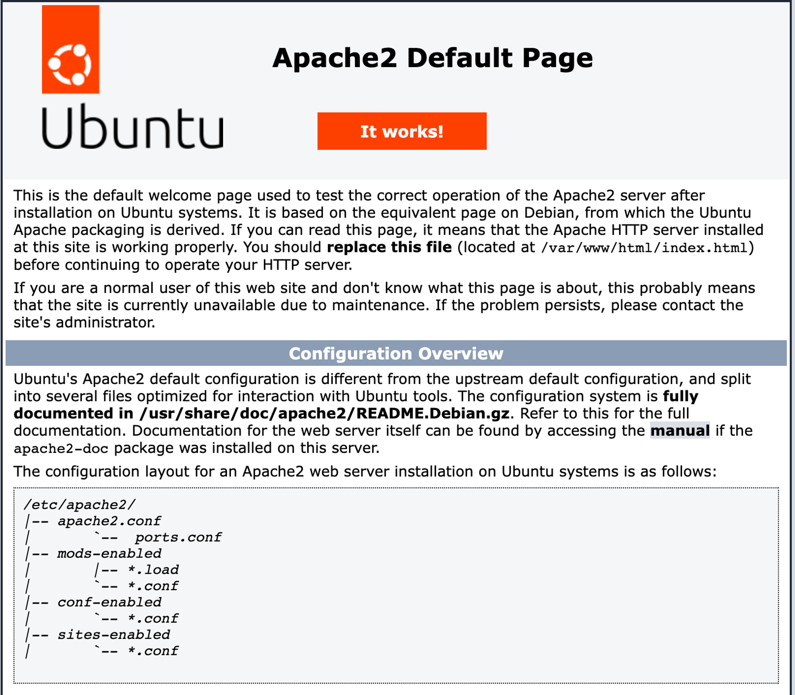
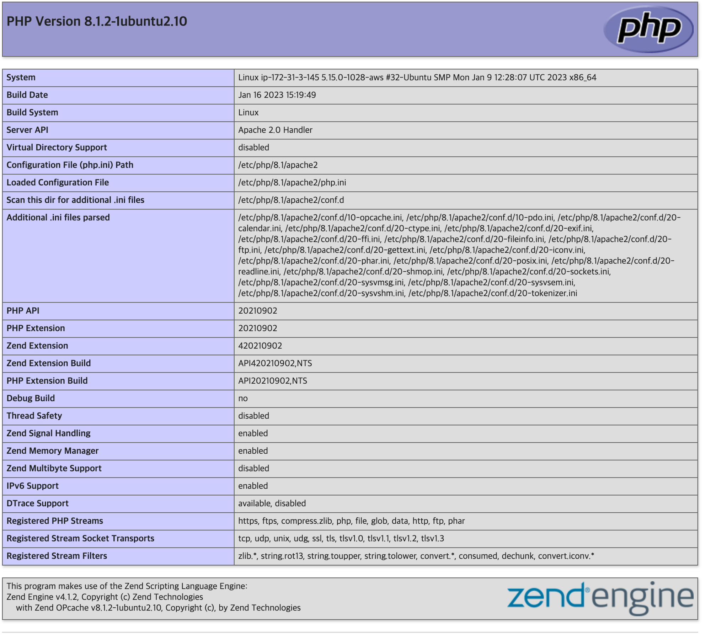

# Ch.4 코드로 개발하는 컨테이너 인프라, Dockerfile

## 4.1.1 IaC와 Dockerfile

- `Dockerfile`: 원하는 개발환경을 코드로 구성하는 방법(Infrastructure as Code, IaC)
- IaC는 왜 필요할까?
    - 커맨드 기반 인프라 구성 → 인적 오류 가능성 높음(매번 명령어 쳐야 하니)
    - 설치 순서, 상호 연관성을 고려해야 하는 문제 해결
- 이러한 수고로움을 하나의 이미지로 만들어두고, 수정사항은 언제든 코드 변경이 용이하다면 개발 업무 목적에만 온전히 집중할 수 있다.
- 프로그래밍형 인프라 개발은 탄력성, 확장성, 반복성을 부여해 동일한 환경 서버를 수십-수백 대까지 운영, 관리해준다.
- Dockerfile: 코드로서 인프라 환경을 프로비저닝 → 애플리케이션에 적용되는 새로운 환경을 사용자가 직접 정의해서 아이디어를 실현할 수 있음

## 4.1.2 최적의 Dockerfile 만들기

- 애플리케이션 파일 시스템 역할을 하는 도커 이미지를 생성하려면 Dockerfile이라는 이미지 빌드용 DSL(Domain Specific Language, 도메인 특화 언어) 파일을 사용한다. 특정 컨테이너를 위한 이미지를 개발할 경우 필요한 모든 설정 내용을 담은 파일이다.
- Dockerfile 기준
    - 경량의 컨테이너 서비스 제공
    - Dockerfile에 담기는 레이어 최소화
    - 하나의 애플리케이션은 하나의 컨테이너에
    - 캐시 기능 활용
    - IaC 환경 개발은 디렉토리 단위로
    - 서버리스 환경으로 개발

# 4.2 Dockerfile 명령어와 이미지 빌드

- 도커는 개발환경의 컨테이너화 표준

## 4.2.1 Dockerfile 명령어

- Dockerfile: 개발환경을 제공하기 위한 여러 가지 명령어들의 집합체(17개 내외)
    - `FROM` : 생성하려는 이미지의 베이스 이미지를 지정
        - 도커 허브에서 제공하는 공식 이미지를 권장
        - `FROM` ubuntu:20.04
    - `RUN`: 설정된 기본 이미지에 패키지 설치, 명령 실행 등을 작성(1개 이상 작성 가능)
        - 다단계 빌드 사용 권장, 각 이미지별로 개별 Dockerfile로 빌드
    - `CMD` : 생성된 이미지를 컨테이너로 실행할 때 실행되는 명령어
        - `ENTRYPOINT` 명령문으로 지정된 커맨드에 디폴트로 넘길 파라미터를 지정할 때 사용.
    - `ENTRYPOINT`: CMD와 마찬가지로 생성된 이미지가 컨테이너로 실행될 때 사용되지만 컨테이너가 실행될 때 명령어 및 인자 값을 전달하여 실행하는 점이 다르다.
        - CMD와 유사하나 인자 값을 사용하는 경우에 유용함
        - `ENTRYPOINT [”npm”, “start”]`
    - `COPY`: 호스트 환경의 파일, 디렉터리를 이미지 안에 복사하는 경우 작성
        - 단순한 복사 작업만 지원하며 빌드 작업 디렉토리 외부 파일은 COPY할 수 없음.
    - `ADD`:호스트 환경의 파일, 디렉토리를 이미지 안에 복사하는 경우뿐만 아니라 URL 주소에서 직접 다운로드해 이미지에 넣을 수도 있고, 압축 파일인 경우에는 경로에 압축 풀어서 추가
    - `ENV`:이미지 안에 각종 환경 변수를 지정하는 경우 작성
    - `EXPOSE`:컨테이너가 호스트 네트워크를 통해 들어오는 트래픽을 리스닝하는 포트와 프로토콜을 지정하기 위해 작성
    - `WORKDIR`:컨테이너상에서 작업할 경로 전환을 위해 작성. WORKDIR을 설정하면 RUN, CMD, ENTRYPOINT, COPY, ADD 명령문은 해당 디렉토리를 기준으로 실행.
- 일반적으로 FROM 명령어부터 작성하지만 그다음 명령부터는 순서가 없음. 하지만 명령 순서가 빌드 캐시 무효화와 연관되므로 변경 빈도수가 적은 명령을 먼저 배치하는 것을 권장한다.

## 4.2.2 이미지 생성을 위한 Dockerfile 빌드

### 이미지 빌드

- docker build 명령으로 Dockerfile로부터 이미지 생성 가능
1. 옵션
    - `-t`: “이미지명:태그”를 지정하는 경우
        - 동시에 여러 저장소 생성하려면 -t 반복 가능
    - `-f`: Dockerfile이 아닌 다른 파일명 사용하는 경우
2. 이미지명:[태그]
    - 생성할 이미지 이름과 태그 지정
    - 일반적으로 태그는 버전 관리 차원으로 고려
3. 경로
    - 디렉터리 단위 개발을 권고. 현재 경로에 Dockerfile이 있다면 “.” 사용.

### 왜 Dockerfile이 필요할까?

- 서버리스 환경을 개발할 수 있는 Dockerfile →반복적이고 수고로운 작업 자동화

> 💡 이번 실습부터는 AWS EC2를 활용해 우분투 환경에서 진행하겠습니다 🙂
> - AWS EC2 접속 방법
> - [도커 설치 on Ubuntu22.04](https://bundw.tistory.com/98)


```bash
ubuntu@ip-...-..-.-...:~$ sudo apt update
...
# apache2 설치
ubuntu@ip-...-..-.-...:~$ sudo apt -y install apache2

# netstat 명령어 사용하기 위해 net-tools 설치
ubuntu@ip-...-..-.-...:~$ sudo apt install net-tools
...
ubuntu@ip-...-..-.-...:~$ sudo netstat -nlp | grep 80
tcp6       0      0 :::80                   :::*                    LISTEN      2713/apache2

# apache2 실행
ubuntu@ip-...-..-.-...:~$ sudo service apache2 start
ubuntu@ip-...-..-.-...:~$ sudo service apache2 service
Usage: apache2 {start|stop|graceful-stop|restart|reload|force-reload}

# ip 주소로 접속

```



```bash
ubuntu@ip-...-..-.-...:/var/www/html$ sudo mv index.html index.html.org
ubuntu@ip-...-..-.-...:/var/www/html$ sudo vi index.html
ubuntu@ip-...-..-.-...:/var/www/html$ curl localhost:80
<h1> Welcome to my webserver! </h1>

...
ubuntu@ip-...-..-.-...:/var/www/html$ sudo vi index.php
...
<?php
    phpinfo();
?>
...

```



⇒ 이 작업을 도커 파일로 하면 어떻게 될까?

<aside>
💡 `sudo chmod 666 /var/run/docker.sock` →

</aside>

```bash
ubuntu@ip-...-..-.-...:~$ docker run -it --name myweb -p 8005:80 ubuntu:14.04 bash
docker: permission denied while trying to connect to the Docker daemon socket at unix:///var/run/docker.sock: Post "http://%2Fvar%2Frun%2Fdocker.sock/v1.24/containers/create?name=myweb": dial unix /var/run/docker.sock: connect: permission denied.
# 권한 변경해줘야 함
ubuntu@ip-...-..-.-...:~$ sudo chmod 666 /var/run/docker.sock
ubuntu@ip-...-..-.-...:~$ docker run -it --name myweb -p 8005:80 ubuntu:14.04 bash
# 컨테이너 진입
root@e7bbb006de5d:/# apt-get update
root@e7bbb006de5d:/# apt-get install -y apache2
root@e3f66c630dd1:/# service apache2 start
... 다른 터미널 창 오픈

ubuntu@ip-...-..-.-...:~$ curl localhost:8005
```


```bash
root@e3f66c630dd1:/# mv /var/www/html/index.html /var/www/html/index.html.org
root@e3f66c630dd1:/# vi /var/www/html/index.html

<h1> Hello, Docker application. </h1>

...
# 두번째 터미널
ubuntu@ip-...-..-.-...:~$ curl localhost:8005
<h1> Hello, Docker application. </h1>

# 다시 첫번째 터미널

root@e3f66c630dd1:/# apt-get -y install php5
root@e3f66c630dd1:/# vi /var/www/html/index.php

...
<?php
    phpinfo();
?>
...

root@e3f66c630dd1:/# service apache2 restart

#두번째 터미널
ubuntu@ip-...-..-.-...:~$ curl localhost:8005/index.php
```


```bash

#첫번째 터미널
ubuntu@ip-...-..-.-...:~$ docker commit myweb myphpapp:1.0
sha256:b6e5aaf3caac377cc228c25170466b509cbeb58b6880d208b0c53da216fe9e4b
ubuntu@ip-...-..-.-...:~$ docker images
REPOSITORY   TAG       IMAGE ID       CREATED         SIZE
myphpapp     1.0       b6e5aaf3caac   3 seconds ago   242MB
ubuntu       14.04     13b66b487594   23 months ago   197MB
ubuntu@ip-...-..-.-...:~$ docker run -itd -p 8006:80 --name=phpapp myphpapp:1.0
ce1b36263d790c5bc896245e9eb4b0c6f81f2f30cb1f91b7962306567ba45984
ubuntu@ip-...-..-.-...:~$ docker exec -it phpapp bash
root@ce1b36263d79:/# service apache2 start

#두번째 터미널
ubuntu@ip-...-..-.-...:~$ curl localhost:8006
<h1> Hello, Docker application. </h1>
```