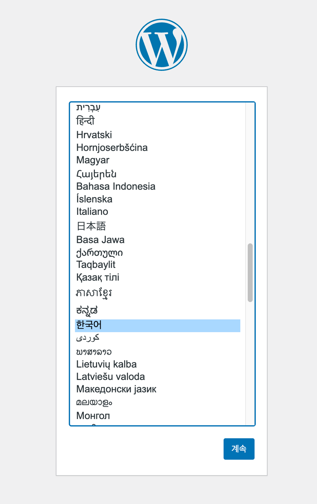
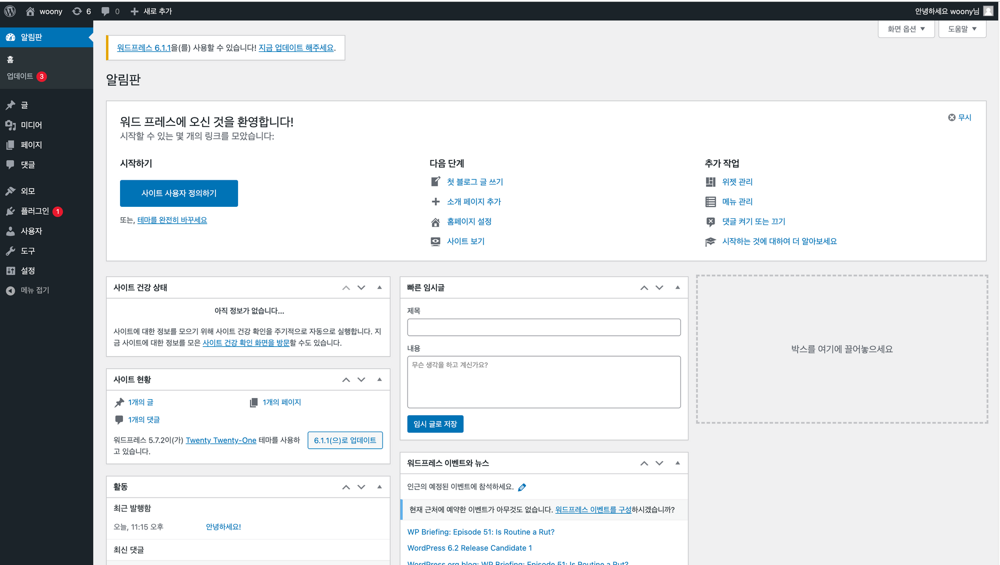
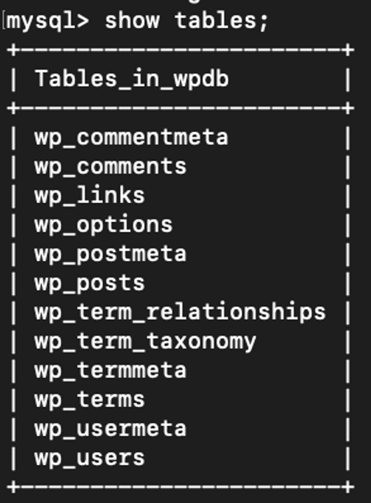
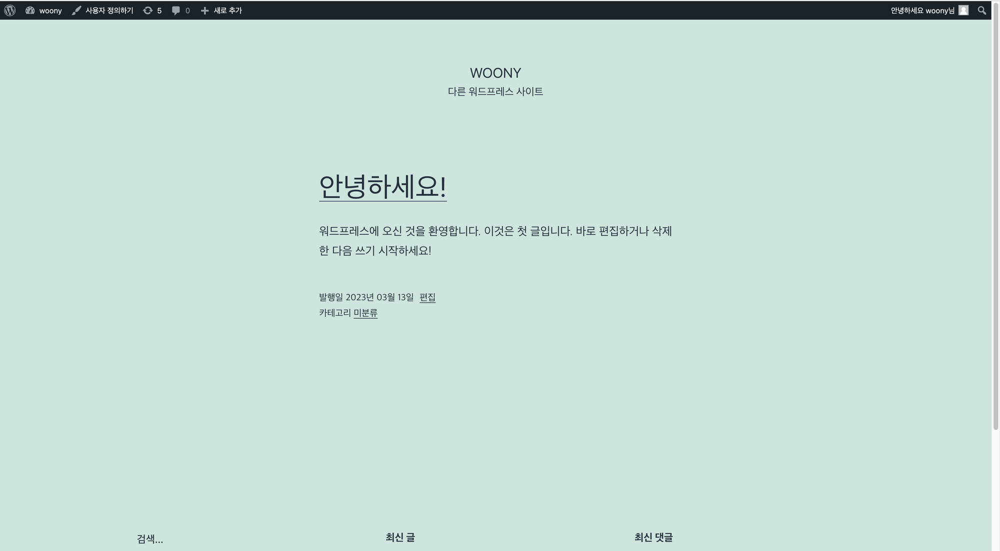

# Ch.5: 도커 컴포즈 도구를 이용한 다중 컨테이너 애플리케이션 서비스 배포

## 5.1 도커 컴포즈

- 도커 컴포즈: 공통성을 갖는 컨테이너 애플리케이션 스택을 YAML 코드로 정의하는 정의서이자 이를 실행하기 위한 다중 컨테이너 실행 도구
- 하나의 웹 애플리케이션을 생성하기 위해 필요한 도구 각각을 도커로 띄운다면?
    - React: 프론트엔드 서버(React, Angular, …)
    - node.js 서버: API 서버(플라스크, Node 생성)
    - MySQL 데이터베이스: 애플리케이션 데이터 저장
- 이 각각을 도커 컴포즈 YAML 코드로 정의하면 한 번에 서비스를 올리고 관리 가능!
    - 도커 컴포즈로 실행된 컨테이너: 독립된 기능을 가짐 & 공통 네트워크로 구성되어 있어 컨테이너 간 통신이 쉬움
    - 도커 컴포즈 ⇒ 공통성 있는 컨테이너들을 포함해 쉽고 빠른 런타임 환경을 제공
- 도커 컴포즈: 테스트, 개발, 운영의 모든 환경에서 구성이 가능한 오케스트레이션 도구

### 5.1.1 도커 컴포즈 설치


> 💡 여기서는 Ubuntu 리눅스 기반으로 도커 컴포즈를 설치

- 설치 명령어

```bash
sudo curl -L https://github.com/docker/compose/releases/download/1.29.2/docker-compose-$(uname -s)-$(uname -m) -o /usr/local/bin/docker-compose
```

- 실행 권한 설정하고 절대 경로 문제로 발생하는 실행 오류를 대비하기 위해 심벌릭 링크 설정

```bash
# 권한 변경
sudo chmod +x /usr/local/bin/docker-compose

#
sudo ln -s /usr/local/bin/docker-compose /usr/bin/docker-compose

sudo chown /usr/local/bin/docker-compose

# 설치된 도커 컴포즈 확인
$ docker-compose --version
```

**간단히 실습**

```bash
# 도커 컴포즈 YAML 코드 작성해보자

# docker-compose.yaml
version: '3.3'
services:
  mydb:
    image: mariadb:10.4.6
    restart: always
    environment:
      - MYSQL_ROOT_PASSWORD=woony
      - MYSQL_DATABASE=appdb
    volumes:
      - ./db-data:/var/lib/mysql
    ports:
      - '3306:3306'
```

```bash
#도커 컴포즈 실행

ubuntu@ip-172-31-3-145:~/5th/mariadb_app$ docker-compose up
```

```bash
# 다른 터미널 열어서 도커 컴포즈 명령어인 ps 명령으로 생성된 컨테이너 정보 조회

ubuntu@ip-172-31-3-145:~/5th/mariadb_app$ docker-compose ps
       Name                    Command             State                    Ports                  
---------------------------------------------------------------------------------------------------
mariadb_app_mydb_1   docker-entrypoint.sh mysqld   Up      0.0.0.0:3306->3306/tcp,:::3306->3306/tcp

#docker 데이터 지속성 확인

```

- MariaDB 접속

```bash
Welcome to the MariaDB monitor.  Commands end with ; or \g.
Your MariaDB connection id is 8
Server version: 10.4.6-MariaDB-1:10.4.6+maria~bionic mariadb.org binary distribution

Copyright (c) 2000, 2018, Oracle, MariaDB Corporation Ab and others.

Type 'help;' or '\h' for help. Type '\c' to clear the current input statement.

MariaDB [(none)]> show databases;
+--------------------+
| Database           |
+--------------------+
| appdb              |
| information_schema |
| mysql              |
| performance_schema |
+--------------------+
4 rows in set (0.001 sec)

MariaDB [(none)]> use appdb;
Database changed
MariaDB [appdb]> create table item (item_id int, item_name varchar(10));
Query OK, 0 rows affected (0.013 sec)

MariaDB [appdb]> insert into item values (20, 'docker-ce');
Query OK, 1 row affected (0.003 sec)

MariaDB [appdb]> select * from item;
+---------+-----------+
| item_id | item_name |
+---------+-----------+
|      20 | docker-ce |
+---------+-----------+
1 row in set (0.000 sec)

MariaDB [appdb]> exit;

# 데이터 확인

root@b91b58597940:/# ls -l /var/lib/mysql/appdb/
total 104
-rw-rw---- 1 mysql mysql    65 Mar  7 13:18 db.opt
-rw-rw---- 1 mysql mysql   476 Mar  7 13:27 item.frm
-rw-rw---- 1 mysql mysql 98304 Mar  7 13:27 item.ibd

# 볼륨을 통해 호스트 경로와 연결된 자료 확인 -> 바깥에 그대로 있더라!
ubuntu@ip-172-31-3-145:~/5th/mariadb_app$ sudo ls -l db-data/appdb/
total 104
-rw-rw---- 1 lxd docker    65 Mar  7 13:18 db.opt
-rw-rw---- 1 lxd docker   476 Mar  7 13:27 item.frm
-rw-rw---- 1 lxd docker 98304 Mar  7 13:27 item.ibd
```

- `docker-compose down` :  서비스 모두 내리고 네트워크 회수

```bash
ubuntu@ip-172-31-3-145:~/5th/mariadb_app$ docker-compose down
Stopping mariadb_app_mydb_1 ... done
Removing mariadb_app_mydb_1 ... done
Removing network mariadb_app_default
```

- 데이터 영속성을 위한 볼륨 기능 확인 → 도커 컴포즈를 백그라운드(-d)로 실행

```bash
ubuntu@ip-172-31-3-145:~/5th/mariadb_app$ docker-compose up -d
Creating network "mariadb_app_default" with the default driver
Creating mariadb_app_mydb_1 ... done
ubuntu@ip-172-31-3-145:~/5th/mariadb_app$ docker-compose ps
       Name                    Command             State                    Ports                  
---------------------------------------------------------------------------------------------------
mariadb_app_mydb_1   docker-entrypoint.sh mysqld   Up      0.0.0.0:3306->3306/tcp,:::3306->3306/tcp

ubuntu@ip-172-31-3-145:~/5th/mariadb_app$ docker exec -it mariadb_app_mydb_1 bash

root@e06e2f3931ec:/# mysql -uroot -p
```

- 내부 데이터 확인 → 그대로 유지!

```bash
MariaDB [(none)]> show databases;
+--------------------+
| Database           |
+--------------------+
| appdb              |
| information_schema |
| mysql              |
| performance_schema |
+--------------------+
4 rows in set (0.000 sec)

MariaDB [(none)]> show tables;
ERROR 1046 (3D000): No database selected
MariaDB [(none)]> show appdb;
ERROR 1064 (42000): You have an error in your SQL syntax; check the manual that corresponds to your MariaDB server version for the right syntax to use near 'appdb' at line 1
MariaDB [(none)]> use appdb;
Reading table information for completion of table and column names
You can turn off this feature to get a quicker startup with -A

Database changed
MariaDB [appdb]> show tables;
+-----------------+
| Tables_in_appdb |
+-----------------+
| item            |
+-----------------+
1 row in set (0.000 sec)

MariaDB [appdb]> select * from item;
+---------+-----------+
| item_id | item_name |
+---------+-----------+
|      20 | docker-ce |
+---------+-----------+
1 row in set (0.001 sec)
```


>💡 눈여겨볼 점: docker-compose up 명령을 수행하면 자체 기본 네트워크가 생성된다.
> 여러 개의 다중 컨테이너 설정인 경우 docker-compose up과 동시에 가장 먼저 네트워크를 디렉터리명_default 이름으로 생성한다.

```bash
# 도커 네트워크 조회
ubuntu@ip-172-31-3-145:~/5th/mariadb_app$ docker network ls
NETWORK ID     NAME                  DRIVER    SCOPE
8383b11eb801   bridge                bridge    local
48faf2927a8f   host                  host      local
188b1ccf3458   mariadb_app_default   bridge    local
576b3bd4e55a   none                  null      local
```

## 5.1.2 도커 컴포즈 YAML 코드 작성

- 쿠버네티스 역시 거의 모든 오브젝트를 YAML 코드로 작성 → 도커 이후 쿠버네티스 공부할 때도 도움
- YAML: 사용자가 쉽게 읽고 쓸 수 있는 텍스트 구조
  - 주의: 들여쓰기를 탭이 아닌 공백으로 정확히 구분해야 함(2칸)

### 1. 버전 정의

- 야믈 코드 첫 줄: 버전 명시

```bash
version: '3.8'
```

- 컴포즈 버전: 도커 엔진 릴리스와 연관

### 2. 서비스 정의

- 도커 컴포즈를 통해 실행할 서비스를 정의
- 도커 컴포즈: 컨테이너 대신 서비스 개념을 사용
  - 상위의 version과 동일 레벨에서 작성

```bash
version: '3.8'
services:
```

- `services` 하위에는 실행될 컨테이너 서비스를 작성 & 하위 레벨에 도커 명령 실행과 유사하게 컨테이너 실행에 필요한 옵션 작성

```bash
version: '3.8'
services:
	myweb:
		image: nginx:latest
	mydb:
		image: mariadb:10.4.6
```

- Dockerfile을 작성해서 실행하는 경우는 미리 빌드하거나 아래와 같이 build 옵션을 사용하면 알아서 이미지 빌드 후 up

```bash
version: '3.8'
services:
	myweb:
		build: .
```

### 3. 네트워크 정의

- 다중 컨테이너들이 사용할 최상위 네트워크 키를 정의하고 이하 하위 서비스 단위로 네트워크 선택할 수 있음.

```bash
version: '3.8'
services:
	...
networks:
	default:
		external:
			name: ~~
```

### 4. 볼륨 정의

- 데이터 지속성 유지하기 위해 최상위 레벨에 볼륨 정의하고 서비스 레벨에서 볼륨명과 서비스 내부 디렉터리를 바인드

```bash
version: '3.8'
services:
	myweb:
		image: mysql:5.7
		volumes:
			- db_data:/var/lib/mysql
```

### 5. 도커 명령어와 도커 컴포즈 야믈 코드 비교

- 도커 컴포즈 내 야믈 코드 옵션은 도커 명령어를 기반

### 구성 실습: docker-compose로 다중 컨테이너 서비스 실행하기

- WordPress
- MySQL

```bash
# 볼륨 생성
ubuntu@ip-172-31-3-145:~$ docker volume create mydb_data
mydb_data
ubuntu@ip-172-31-3-145:~$ docker volume create myweb_data
myweb_data
ubuntu@ip-172-31-3-145:~$ docker volume ls
DRIVER    VOLUME NAME
local     mydb_data
local     myweb_data

ubuntu@ip-172-31-3-145:~$ docker inspect --type volume mydb_data
[
    {
        "CreatedAt": "2023-03-10T14:15:07Z",
        "Driver": "local",
        "Labels": null,
        "Mountpoint": "/var/lib/docker/volumes/mydb_data/_data",
        "Name": "mydb_data",
        "Options": null,
        "Scope": "local"
    }
]

ubuntu@ip-172-31-3-145:~$ docker inspect --type volume myweb_data
[
    {
        "CreatedAt": "2023-03-10T14:15:17Z",
        "Driver": "local",
        "Labels": null,
        "Mountpoint": "/var/lib/docker/volumes/myweb_data/_data",
        "Name": "myweb_data",
        "Options": null,
        "Scope": "local"
    }
]
ubuntu@ip-172-31-3-145:~$ docker network create myapp-net
d84e8d8b345d9fc87d368e390824af2ea44001f762e45d80c7ad2f2e48fb0bb3
ubuntu@ip-172-31-3-145:~$ docker network ls
NETWORK ID     NAME                  DRIVER    SCOPE
8383b11eb801   bridge                bridge    local
48faf2927a8f   host                  host      local
223c2dee96bd   mariadb_app_default   bridge    local
d84e8d8b345d   myapp-net             bridge    local
576b3bd4e55a   none                  null      local

ubuntu@ip-172-31-3-145:~/my_wp$ ls
docker-compose.yml
ubuntu@ip-172-31-3-145:~/my_wp$ vi docker-compose.yml 
ubuntu@ip-172-31-3-145:~/my_wp$ docker-compose up -d
ERROR: The Compose file './docker-compose.yml' is invalid because:
Unsupported config option for services.networks: 'backend-net'
Unsupported config option for services.volumes: 'mydb_data'
ubuntu@ip-172-31-3-145:~/my_wp$ ls
docker-compose.yml
ubuntu@ip-172-31-3-145:~/my_wp$ vi docker-compose.yml 
ubuntu@ip-172-31-3-145:~/my_wp$ docker-compose up -d

ubuntu@ip-172-31-3-145:~/my_wp$ vi docker-compose.yml 
version: "3.9"
services:
# 첫번째 서비스 정의
  mydb:
    image: mysql:8.0
    container_name: mysql_app
    volumes:
      - mydb_data:/var/lib/mysql
    # 수동 제어를 제외한 컨테이너 종료 시 자동 재시작
    restart: always
    # 호스트 운영체제와 컨테이너의 3306 포트를 바인드
    # workbench 같은 클라이언트 도구와 연결하기 위해 필요
    ports:
      - "3306:3306"
    networks:
      - backend-net
    environment:
      MYSQL_ROOT_PASSWORD: password#
      MYSQL_DATABASE: wpdb
      MYSQL_USER: wpuser
      MYSQL_PASSWORD: wppassword
  # 두번째 서비스
  myweb:
    #의존성 설정
    depends_on:
      - mydb
    image: wordpress:5.7
    container_name: wordpress_app
    ports:
      - "8888:80"
    networks:
      - backend-net
      - frontend-net
    volumes:
      - myweb_data:/var/www/html
      - ${PWD}/myweb-log:/var/log \
    restart: always
    environment:
      WORDPRESS_DB_HOST: mydb:3306
      WORDPRESS_DB_USER: wpuser
      WORDPRESS_DB_PASSWORD: wppassword
      WORDPRESS_DB_NAME: wpdb

networks:
  frontend-net: {}
  backend-net: {}

  # 도커 컴포즈 애플리케이션이 사용할 볼륨 생성 -> docker volume create와 동일
volumes:
  mydb_data: {}
  myweb_data: {}
```





- 사이트 생성한 뒤 다시 DB 확인 ⇒ 테이블 생성된 것을 확인할 수 있음!



- myweb: 프론트엔드 역할을 하는 워드프레스
- mydb: MySQL 데이터베이스 → 워드프레스에서 API를 통해 데이터 전송 및 관리

- 도커 컴포즈: 여러 번의 도커를 정의하고 실행하지 않고, 관련 애플리케이션을 YAML 코드 파일로 한 번에 구성하여 **내부 환경 구성과 속성을 실행**할 수 있다.
- 설정값을 캐시하기 때문에 재시작 시 변경이 없다면 캐싱 정보를 그대로 사용해 빠른 서비스 실행 보장 가능

```bash
ubuntu@ip-172-31-14-16:~/ch5$ docker-compose ps
    Name                   Command               State                          Ports                       
------------------------------------------------------------------------------------------------------------
mysql_app       docker-entrypoint.sh mysqld      Up      0.0.0.0:3306->3306/tcp,:::3306->3306/tcp, 33060/tcp
wordpress_app   docker-entrypoint.sh apach ...   Up      0.0.0.0:80->80/tcp,:::80->80/tcp                   
ubuntu@ip-172-31-14-16:~/ch5$ docker-compose down
Stopping wordpress_app ... done
Stopping mysql_app     ... done
Removing wordpress_app ... done
Removing mysql_app     ... done
Removing network ch5_backend-net
Removing network ch5_frontend-net
ubuntu@ip-172-31-14-16:~/ch5$ docker-compose up -d
Creating network "ch5_backend-net" with the default driver
Creating network "ch5_frontend-net" with the default driver
Creating mysql_app ... done
Creating wordpress_app ... done
```

- 껐다 켜도 볼륨 덕분에 정보 그대로 갖고 있는 것을 확인 가능


## 5.1.3 도커 컴포즈 명령어

- 도커 컴포즈 yaml 코드는 다양한 도커 컴포즈 명령어를 통해 애플리케이션의 실행, 관리, 제거까지 가능

### 예제: Flask & Redis 를 이용한 웹 페이지 구축

- 1. Dockerfile 작성

  ```docker
  # 베이스 이미지 작성
  FROM python:3.8-alpine
  
  #업데이트 및 필요한 패키지 설치
  RUN apk update && \
          apk add --no-cache \
          bash
  RUN apk add --update build-base python3-dev py-pip
  
  # 플라스크 환경 변수 생성
  # 플라스크는 기본 애플리케이션으로 app.py 인식
  # FLASK_APP 환경 변수를 통해 애플리케이션 이름 지정
  # FLASK_ENV=development를 지정하지 않으면 운영 환경(production)으로 설치
  
  ENV LIBRARY_PATH=/lib:/usr/lib
  ENV FLASK_APP=py_app
  ENV FLASK_ENV=development
  
  # 컨테이너 9000번 포트 오픈
  EXPOSE 9000
  
  # WORKDIR 명령어로 /py_app 경로로 이동 & 현재 디렉터리의 app 경로에 모든 파일을 /py_app에 복사
  
  WORKDIR /py_app
  COPY ./app/ .
  
  # requirements.txt 목록에 있는 모듈 설치
  RUN pip install -r requirements.txt
  
  # 파이썬 실행 명령으로 py_app.py 코드를 인수로 받아 실행
  # ENTRYPOINT: 인자 변경 불가
  ENTRYPOINT ["python"]
  # CMD: 인자 변경 가능
  CMD ["py_app.py"]
  ```

- 2. 플라스크 작성
  - py_app.py

  ```docker
  import time
  import redis
  from flask import Flask
  
  py_app = Flask(__name__)
  db_cache = redis.Redis(host='redis', port=6379)
  # 특정 주소에 접속하면 바로 다음 줄에 있는 python_flask() 함수를 호출하는 플라스크 데코레이터
  
  def web_hit_cnt():
      return db_cache.incr('hits')
  
  @py_app.route('/')
  def python_flask():
      cnt = web_hit_cnt()
      
      return '''
      <h1 style="text-align:center;">Docker-compose application: Python & Flask & Redis</h1>
          <p style="text-align:center; color:deepskyblue;">Good container service.</p>
          <p style="text-align:center; color:deepskyblue;">Web access count : {} times</p>
          '''.format(cnt)
  
  # 프로그램 시작 시 아래 코드 실행(기본 포트 ->9000)
  if __name__ == '__main__':
      py_app.run(host='0.0.0.0', port=9000, debug=True)
  ```

  - requirements.txt

  ```docker
  Flask
  redis
  ```

  - tree -a

      ```bash
      ubuntu@ip-172-31-14-16:~/ch5/flask_redis$ tree -a
      .
      ├── Dockerfile
      ├── app
      │   ├── py_app.py
      │   └── requirements.txt
      └── docker-compose.yaml
      ```

  - Docker-compose up

      ```bash
      ubuntu@ip-172-31-14-16:~/ch5/flask_redis$ docker-compose up
      Creating network "flask_redis_default" with the default driver
      Pulling redis (redis:6-alpine)...
      6-alpine: Pulling from library/redis
      63b65145d645: Pull complete
      6a83e1b979d3: Pull complete
      33568fda55fd: Pull complete
      fb8c77ed282d: Pull complete
      5b42e9b088d1: Pull complete
      376c85763ec1: Pull complete
      Digest: sha256:1782029533179780f082cdeee09c3cdf1c09977d09fcca260282eda211865f8d
      Status: Downloaded newer image for redis:6-alpine
      Building flask
      [+] Building 31.6s (11/11) FINISHED                                                                                                                                                                                                   
       => [internal] load build definition from Dockerfile                                                                                                                                                                             0.1s
       => => transferring dockerfile: 1.06kB                                                                                                                                                                                           0.0s
       => [internal] load .dockerignore                                                                                                                                                                                                0.1s
       => => transferring context: 2B                                                                                                                                                                                                  0.0s
       => [internal] load metadata for docker.io/library/python:3.8-alpine                                                                                                                                                             2.0s
       => [1/6] FROM docker.io/library/python:3.8-alpine@sha256:8518dd6657131d938f283ea97385b1db6724e35d45ddab6cd1c583796e35566a                                                                                                       2.6s
       => => resolve docker.io/library/python:3.8-alpine@sha256:8518dd6657131d938f283ea97385b1db6724e35d45ddab6cd1c583796e35566a                                                                                                       0.0s
       => => sha256:8518dd6657131d938f283ea97385b1db6724e35d45ddab6cd1c583796e35566a 1.65kB / 1.65kB                                                                                                                                   0.0s
       => => sha256:527e03a5527af111edc8a01745d3d2f6ef236296242d3189fecc8b0561756721 1.37kB / 1.37kB                                                                                                                                   0.0s
       => => sha256:2f38b7ae60ce6b6020c33f80eb1e1b0af561a69eaf7c30eafdcaf29c6e56fc94 7.36kB / 7.36kB                                                                                                                                   0.0s
       => => sha256:781eddb6f34207e2b80d9ac0c81f1edde119e3ed0628aa9d4eeb6f8c01669b14 622.90kB / 622.90kB                                                                                                                               0.2s
       => => sha256:c6b62dd466ca0cfb8717e49b1b0a74370c4592eb8acf357898882e70818486b7 11.30MB / 11.30MB                                                                                                                                 0.4s
       => => sha256:02dd3c1b5d89ca5b952d7ce0cf98b01db4d54f6d2a990f3478fbfa0f7b86050e 227B / 227B                                                                                                                                       0.2s
       => => extracting sha256:781eddb6f34207e2b80d9ac0c81f1edde119e3ed0628aa9d4eeb6f8c01669b14                                                                                                                                        0.6s
       => => sha256:1104bcb47a263c20abe3d38f7c57dd2c6c44d48af5e8e649433eb004a8872614 2.88MB / 2.88MB                                                                                                                                   0.5s
       => => extracting sha256:c6b62dd466ca0cfb8717e49b1b0a74370c4592eb8acf357898882e70818486b7                                                                                                                                        0.9s
       => => extracting sha256:02dd3c1b5d89ca5b952d7ce0cf98b01db4d54f6d2a990f3478fbfa0f7b86050e                                                                                                                                        0.0s
       => => extracting sha256:1104bcb47a263c20abe3d38f7c57dd2c6c44d48af5e8e649433eb004a8872614                                                                                                                                        0.4s
       => [internal] load build context                                                                                                                                                                                                0.0s
       => => transferring context: 953B                                                                                                                                                                                                0.0s
       => [2/6] RUN apk update &&         apk add --no-cache         bash                                                                                                                                                              3.3s
       => [3/6] RUN apk add --update build-base python3-dev py-pip                                                                                                                                                                    11.9s 
       => [4/6] WORKDIR /py_app                                                                                                                                                                                                        0.1s 
       => [5/6] COPY ./app/ .                                                                                                                                                                                                          0.1s 
       => [6/6] RUN pip install -r requirements.txt                                                                                                                                                                                    5.5s 
       => exporting to image                                                                                                                                                                                                           5.7s 
       => => exporting layers                                                                                                                                                                                                          5.7s 
       => => writing image sha256:daa484b6c9e61dac937936fcde696e7d59338d83115fd239c1fd2bda2d9337b1                                                                                                                                     0.0s 
       => => naming to docker.io/library/flask_redis_flask                                                                                                                                                                             0.0s 
      WARNING: Image for service flask was built because it did not already exist. To rebuild this image you must use `docker-compose build` or `docker-compose up --build`.                                                                
      Creating flask_redis_redis_1 ... done
      Creating flask_redis_flask_1 ... done
      ```

  - 사이트 접속 → n times!


### 1. docker-compose `up`


> 💡 up은 컴포즈 yaml 코드에 있는 이미지를 이용해 컨테이너 서비스를 실행한다.

| 옵션 | 설명 |
| --- | --- |
| -d | 백그라운드로 컨테이너 서비스 실행 & 새로 생성된 컨테이너 이름을 화면에 출력 |
| —build | 컨테이너 서비스 시작 전에 이미지 빌드. Dockerfile이나 기타 소스 코드 변동이 있을 때 재빌드하기 위해 사용(좋다!) |
- docker-compose.yaml

```bash
version: '3.8'
services:
  server_web:
    image: httpd:2
  server_db:
    image: redis:6-alpine
```

```bash
ubuntu@ip-172-31-14-16:~/ch5/scale_option$ docker-compose up --scale server_db=2 --scale server_web=2 -d
Creating scale_option_server_web_2 ... done
Creating scale_option_server_db_2  ... done
ubuntu@ip-172-31-14-16:~/ch5/scale_option$ docker-compose ps
          Name                         Command               State    Ports  
-----------------------------------------------------------------------------
scale_option_server_db_1    docker-entrypoint.sh redis ...   Up      6379/tcp
scale_option_server_db_2    docker-entrypoint.sh redis ...   Up      6379/tcp
scale_option_server_web_1   httpd-foreground                 Up      80/tcp  
scale_option_server_web_2   httpd-foreground                 Up      80/tcp
```

```bash
ubuntu@ip-172-31-14-16:~/ch5/scale_option$ docker-compose down
Stopping scale_option_server_db_2  ... done
Stopping scale_option_server_web_2 ... done
Stopping scale_option_server_db_1  ... done
Stopping scale_option_server_web_1 ... done
Removing scale_option_server_db_2  ... done
Removing scale_option_server_web_2 ... done
Removing scale_option_server_db_1  ... done
Removing scale_option_server_web_1 ... done
Removing network scale_option_default
```

### 2. docker-compose `down`

> 💡 up 명령과 반대로, 정의된 컨테이너 서비스, 볼륨, 네트워크 모두 정지시킨 후 삭제

### 3. docker-compose `stop` 서비스명

> 💡 stop: 멀티 컨테이너 서비스 중 특정 컨테이너 중지시킬 때 사용


…(생략)

## 5.1.4 도커 컴포즈 애플리케이션 로드 밸런스 구성

> 💡 3.2절의 <Nginx를 이용한 컨테이너 로드 밸런스 구축>에서 사용했던 도커 명령어 방식의 로드 밸런스를 도커 컴포즈로 재구성해보자.

- `Nginx`
  - Dockerfile

      ```docker
      FROM nginx
      RUN rm /etc/nginx/conf.d/default.conf
      COPY nginx.conf /etc/nginx/conf.d/default.conf
      ```

  - `nginx.conf`

      ```bash
      upstream web-alb {
              server 172.17.0.1:5001;
              server 172.17.0.1:5002;
              server 172.17.0.1:5003;
      }
      
      server {
              location / {
                      proxy_pass http://web-alb;
              }
      }
      ```

- `pyfla_app(Flask)`
  - Dockerfile

      ```docker
      FROM python:3
      COPY ./requirements.txt /requirements.txt
      WORKDIR /
      RUN pip install -r requirements.txt
      COPY . /
      ENTRYPOINT [ "python3" ]
      CMD [ "pyfla_app1.py" ]
      ```

  - pyfla_app.py

      ```python
      from flask import request, Flask
      import json
      
      app1 = Flask(__name__)
      
      @app1.route('/')
      def hello_world():
          return 'Web Application [1]' + '\n'
      
      if __name__ == '__main__':
          app1.run(debug=True, host='0.0.0.0')
      ```

  - requirements.txt

      ```
      Flask==1.1.1
      ```

- `docker-compose`

    ```dockerfile
    version: '3'
    services:
      pyfla_app1:
        build: ./pyfla_app1
        ports:
        - "5001:5000"
      pyfla_app2:
        build: ./pyfla_app2
        ports:
        - "5002:5000"
      pyfla_app3:
        build: ./pyfla_app3
        ports:
        - "5003:5000"
      nginx:
        build: ./nginx_alb
        ports:
        - "8080:80"
        depends_on:
          - pyfla_app1
          - pyfla_app2
          - pyfla_app3
    ```

- `tree -a` 로 구조 확인

    ```bash
    .
    ├── docker-compose.yml
    ├── nginx_alb
    │   ├── Dockerfile
    │   └── nginx.conf
    ├── pyfla_app1
    │   ├── Dockerfile
    │   ├── pyfla_app1.py
    │   └── requirements.txt
    ├── pyfla_app2
    │   ├── Dockerfile
    │   ├── pyfla_app2.py
    │   └── requirements.txt
    └── pyfla_app3
        ├── Dockerfile
        ├── pyfla_app3.py
        └── requirements.txt
    ```