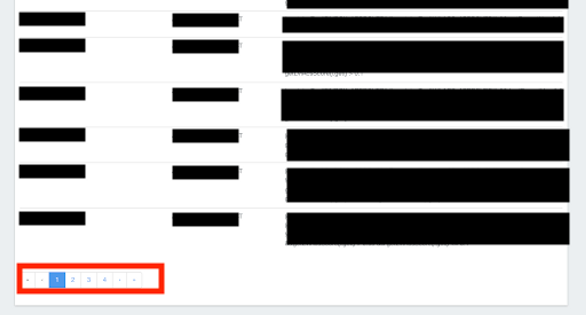

# [SQL] LIKE는 어떻게 동작할까?

## Intro

대출 심사 규칙(rule)을 관리하는 인터널 툴에 검색 기능을 추가하는 작업을 맡았다. 기존 룰 페이지는 pagination만 구현되어 있어 룰을 등록하면 해당 룰을 찾기 위해서는 일일이 페이지를 뒤져가며 찾아야 했다. 하지만 룰의 개수가 점점 많아지면서(현재 prod 기준 300개가 넘는 룰이 존재) 하나하나 찾기가 매우 불편해졌다.

문제는 해당 작업의 비즈니스 임팩트가 매우 큼에도 룰을 컨트롤하는 권한을 갖는 유저가 리드 PM 분 한 분 뿐인지라… 리드님께서 불편함을 감수하면서 계속 작업해 사실상 방치되고 있던 상황.(아래 이미지와 같이 페이지를 일일이 찾아야만 해당 룰에 접근 가능하다.)



이를 위해 검색 기능을 추가했다. 룰을 검색하는데 사용하는 필드는 크게 두 종류다.

1. 룰의 이름(rule_name)
2. 해당 룰이 속한 카테고리(rule_category)

이를 기반으로 두 가지 방식의 검색 기능을 구현했다.

1. 해당 룰이 속한 카테고리 리스트를 먼저 클라이언트에 제공한 뒤, 클라이언트가 특정 룰 카테고리를 클릭 시 해당 카테고리에 속한 모든 룰을 검색하는 방식
2. 룰 이름을 입력하면 해당 룰 이름을 포함하는 모든 룰을 검색하는 방식

이때 2번 - 룰 이름 기반 검색 기능의 경우, 룰 이름 전체가 아닌 부분 키워드만으로도 검색할 수 있도록 구현해야 했다. 현재 해당 서버는 JPA를 사용하고 있기에, JPA의 기능을 활용해 구현했다.

## JPA에서 키워드 기반 검색 기능 구현

JPA에서는 시그니쳐를 읽어 SQL 쿼리로 변환해주기에 실제 구현 코드는 매우 간단하다. JPA에서 필드 내 특정 키워드 포함하는 값을 get하려면 `Containing` 문법을 사용하면 된다.

```java
Page<Rule> findRuleByRuleNameContaining(String ruleName, Pageable pageable);
```

여기서 궁금증이 생겼다. JPA가 워낙 다 처리해주다보니 실제로 어떤 SQL 쿼리가 실행되는지 궁금했다. 찾아본 결과, SQL의 `LIKE` 문법을 사용하더라.

```sql
SELECT * FROM rules WHERE rule_category = '' AND rule_name LIKE '%keyword%';
```

여기서 궁금증 하나 더. MySQL 내에서 LIKE 쿼리는 어떻게 동작하는 걸까?

## MySQL에서 LIKE 쿼리 구현 원리

보통 MySQL에서 LIKE 쿼리를 날릴 때 `B-Tree` 인덱스를 사용한다고 알고 있다. 이는 엄밀히 말하면 다른데, 키워드가 속한 컬럼에 인덱스가 걸려있다면 B-Tree를 통해서, 그렇지 않다면 Turbo Boyer-Moore 알고리즘을 통해서 찾는다고 한다. [MySQL docs](https://dev.mysql.com/doc/refman/8.0/en/index-btree-hash.html)를 살펴보면 아래와 같다. 

> A B-tree index can be used for column comparisons in expressions that use the =, >, >=, <, <=, or BETWEEN operators. The index also can be used for LIKE comparisons if the argument to LIKE is a constant string that does not start with a wildcard character.
> 
> If you use ... LIKE '%string%' and string is longer than three characters, MySQL uses the Turbo Boyer-Moore algorithm to initialize the pattern for the string and then uses this pattern to perform the search more quickly.