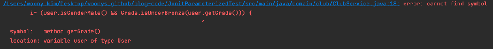

# @ParameterizedTest: 반복적인 테스트를 한 번에 돌릴 수는 없을까?🤔

## Introduction

버그 수정 티켓을 발급받았다. 이메일 검증 로직 관련 버그였는데, 마이크로서비스 간에 서로 다른 이메일 validator를 써서 일어난 문제였다.

문제의 원인을 파악한 뒤, 동일한 validator를 쓰도록 변경하고 나서 테스트 코드를 작성했다. 그런데 넣어줘야 할 이메일 예시만 다를 뿐, 나머지는 전부 동일한 로직의 코드를 매번 작성하려니 여간 찜찜할 수가 없었다. 반복적인 테스트를 한 번에 돌릴 방법이 없을지 고민했다. 마침 코드 리뷰에서 `@ParameterizedTest`를 쓰는 게 어떻겠냐는 리뷰를 받았다.

이번 시간에는 `@ParameterizedTest`의 정체와 이를 사용해 어떻게 반복적인 테스트를 자동화할 수 있을지 예제를 살펴보도록 하자.

(모든 코드는 github에 올려뒀다.)

## 환경설정

이번 예제 프로젝트는 아래와 같은 설정으로 작업했다. 스프링부트는 따로 쓰지 않고 순수 자바 코드 및 테스트 관련 의존성을 추가해 작업했다.

- Java 11(Corretto-11)
- Gradle
- Junit5
  - Junit-jupiter-api:5.8.1
  - Junit-jupiter-engine:5.8.1
  - Junit-jupiter-params:5.8.1 (이번 예제에서 사용할 @ParameterizedTest의 의존성을 포함하는 패키지다.)
- Lombok


이때 잠깐 짚고 넘어가야 할 게 있다. 본 예제에서는 스프링부트를 따로 쓰지 않았기에 테스트 코드 역시 순수 자바 코드로 동작한다.
우리는 롬복을 사용하였기에 annotationProcessor와 gradle의 testImplementation에 역시 롬복을 반드시 추가해줘야 한다. 그래야 테스트 코드를 동작할 때 엔티티 내 getter, setter 등을 호출할 텐데 이게 제대로 동작한다.

```java
//build.gradle

dependencies {
        ...
        annotationProcessor 'org.projectlombok:lombok:1.18.22'
        testImplementation'org.projectlombok:lombok:1.18.22' // 테스트에도 반드시 롬복 추가해줘야 함! 요거 안돼서 테스트 안 돌아갔네..
        ...
}
```


여기서 각각 의존성에 롬복을 추가하지 않으면 아래와 같이 `error: cannot find symbol` 에러를 맞닥뜨리게 된다.



