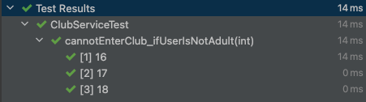

# @ParameterizedTest: 반복적인 테스트를 한 번에 돌릴 수는 없을까?🤔

## Introduction

버그 수정 관련 티켓을 발급받았다. 이메일 검증 로직 관련 버그였는데, 마이크로서비스 간에 서로 다른 이메일 validator를 써서 일어난 문제였다.

문제의 원인을 파악한 뒤, 동일한 validator를 쓰도록 변경하고 나서 테스트 코드를 작성했다. 그런데 테스트 코드마다 넣어줘야 할 이메일 값만 다를 뿐, 나머지는 전부 동일한 로직의 코드를 매번 작성하려니 여간 찜찜할 수가 없었다. 반복적인 테스트를 한 번에 돌릴 방법이 없을지 고민했다. 마침 코드 리뷰에서 `@ParameterizedTest`를 쓰는 게 어떻겠냐는 코멘트를 받았다.

이번 시간에는 `@ParameterizedTest`의 정체와 이를 사용해 어떻게 반복적인 테스트를 자동화할 수 있을지 예제를 살펴보도록 하자.

(모든 코드는 github에 올려뒀다.)

## 환경설정

이번 예제 프로젝트는 아래와 같은 설정으로 작업했다. 스프링부트는 따로 쓰지 않고 순수 자바 코드 및 테스트 관련 의존성을 추가해 작업했다.

- Java 11(Corretto-11)
- Gradle
- Junit5
  - Junit-jupiter-api:5.8.1
  - Junit-jupiter-engine:5.8.1
  - Junit-jupiter-params:5.8.1 (이번 예제에서 사용할 @ParameterizedTest의 의존성을 포함하는 패키지다.)
- Lombok

이때, 잠깐 짚고 넘어가야 할 게 있다. 본 예제에서는 스프링부트를 따로 쓰지 않았기에 테스트 코드 역시 순수 자바 코드로 동작한다.
우리는 롬복을 사용하였기에 annotationProcessor와 gradle의 testImplementation에 역시 롬복을 반드시 추가해줘야 한다. 그래야 테스트 코드를 동작할 때 엔티티 내 getter, setter 등을 호출할 텐데 이게 제대로 동작한다.

```java
//build.gradle

dependencies {
        ...
        annotationProcessor 'org.projectlombok:lombok:1.18.22'
        testImplementation'org.projectlombok:lombok:1.18.22' // 테스트에도 반드시 롬복 추가해줘야 함! 요거 안돼서 테스트 안 돌아갔네..
        ...
}
```


여기서 각각 의존성에 롬복을 추가하지 않으면 아래와 같이 `error: cannot find symbol` 에러를 맞닥뜨리게 된다.


위의 에러를 맞닥뜨리지 않게 조심하고, @ParameterizedTest에 대해 설명하기 전에 예시부터 보도록 하자.

## 예제: WOONY 클럽

해당 예제를 어떤 식으로 만들면 좋을지 고심하다가 뜬금없이 클럽이 떠올랐다. 우리는 지금부터 메타버스 클럽을 만들 예정이다.

이 클럽에는 아래와 같은 비즈니스 요구사항이 있다.

- 클럽
  - 클럽은 라운지와 룸으로 구성되어 있다.
  - 클럽에는 특정 조건을 만족한 사람만 입장 가능하다.
    - 클럽은 성인 이상만 입장 가능하다.
    - 만약 고객이 남자일 때, 해당 남자 등급이 브론즈 이하면 유저는 입장할 수 없다.(뺀찌)
  - 클럽 룸은 VIP 등급의 남성 혹은 골드 등급 이상의 여성만 입장 가능하다.
- 고객
  - 유저는 이름, 나이, 성별, 등급을 갖는다.
  - 유저는 클럽에 입장할 때 성인 여부를 체크받는다.
  - 유저는 클럽에 입장할 때 등급을 체크받는다.
- 등급
  - 등급은 NO_ANSWER, BRONZE, SILVER, GOLD, VIP 총 5개가 있으며, 순서가 뒤일수록 등급이 높다.

이에 대해 도메인 엔티티는 아래와 같이 만들었다. 편의를 위해 Getter, Setter 어노테이션을 모두 달았다.

모든 코드는 깃허브에 올려뒀으니 여기서 살펴보기로 하고, 곧바로 테스트로 넘어가보자.

## ClubServiceTest : 20살 이하는 다 걸러라

20세(만 18세) 이상만 입장 가능한 클럽에 16, 17, 18세의 민짜들이 와서 들여보내달라 한다고 해보자. 테스트 코드는 아래와 같다.

```java
public void cannotEnterClub_ifUserIsAge16() {
        //given
        int age = 16;
        user.setGender(Gender.MALE);
        user.setAge(age);
        user.setGrade(Grade.SILVER);

        //when
        boolean result = clubService.isEnterClub(user);

        //then
        assertEquals(false, result);
```

문제는 age 값이 17, 18인 것을 제외하면 전부 동일한 코드인데 각 케이스 별로 일일이 테스트 메서드를 추가해야된다는 점이다. 딱 봐도 비효율적이다.

이때 우리가 쓸 수 있는 게 바로 JUnit의 `@ParameterizedTest`이다. 먼저 적용한 코드를 바로 보자.

```java
@ParameterizedTest
@ValueSource(ints = {16, 17, 18})
public void cannotEnterClub_ifUserIsNotAdult(int age) {
        //given
        user.setGender(Gender.MALE);
        user.setAge(age);
        user.setGrade(Grade.SILVER);

        //when
        boolean result = clubService.isEnterClub(user);

        //then
        assertEquals(false, result);
        }
```

해당 테스트는 인자로 int 타입을 넣는 케이스에 해당한다. 위와 같이 테스트 메소드 위에 `@ParameterizedTest` 어노테이션을 추가한 뒤, 넣어주고자 하는 Value에 대한 Source를 @ValueSource()에 추가한다. 이때, 우리가 넣으려는 값은 int 타입이니 ints = {}에 값을 넣어주면 된다.
아래에서 디테일하게 설명하겠지만, `@ValueSource`는 리터럴 값을 인자 source로 넣어주는 어노테이션이다.

이어서 테스트 메소드에 age를 인자로 추가한다. 위에서 지정한 `@ValueSource`가 각 케이스마다 age로 하나씩 입력되는 방식이다. 

테스트를 돌려보자.



위와 같이 각 값(16, 17, 18)에 대해 테스트가 모두 돌아가는 것을 확인할 수 있다.

대충 어떻게 돌아가는지 확인했으니, @ParameterizedTest에 대해 자세히 알아보도록 하자.

## Parameterized test 이해하기

자세한 설명은 공식 Document를 따라갈 재간이 없으니 [공식 문서](https://junit.org/junit5/docs/current/user-guide/#writing-tests-parameterized-tests)를 직접 보는 게 가장 빠를 것이다. 여기서는 간단하게 정리만 하고 넘어간다.

Parameterized test는 동일한 테스트에 서로 다른 인자만 넣어 연속으로 검증할 때 사용하는, JUnit에서 제공하는 테스트 방식을 말한다. @ParameterizedTest 어노테이션을 테스트 메서드 위에 추가해 사용할 수 있으며, 이를 사용할 때는 인자에 넣어줄 적어도 하나 이상의 source를 선언해야 한다. 그러면 테스트 메소드가 실행될 때마다 source에 선언된 value를 처음부터 하나씩 consume한 뒤 검증한다.

### Setup
위에서 의존성에 대해 명시했듯, Parameterized test를 사용하기 위해서는 `junit-jupiter-params`에 대한 의존성을 gradle에 추가해줘야 한다.

### Sources of Arguments

인자로 넣을 source에는 여러 가지 타입이 있을 텐데, 각 타입에 해당하는 source마다 제공해주는 어노테이션이 다르다.

**@ValueSource**

@ValueSource는 가장 간단한 source 형태로 아래와 같은 타입의 리터럴 값을 인자로 넣을 수 있게 한다. 

- short 
- byte 
- int 
- long 
- float 
- double 
- char 
- boolean 
- java.lang.String 
- java.lang.Class

해당 리터럴에 대한 배열을 생성한 뒤, 테스트마다 단일 인자를 제공하면 테스트 메서드에서 source를 consume해가는 방식이다.

**Null & Empty Source: @NullSource, @EmptySource, @NullAndEmptySource**

만약 테스트에 null 혹은 empty 케이스에 대해 인자를 넣고 싶다면 위의 어노테이션을 사용하면 된다.

**@EnumSource**

`@EnumSource`는 Enum 타입에 들어있는 상수를 편하게 테스트하기 위해 사용하는 어노테이션이다. 이건 테스트 코드와 함께 살펴보자.

위의 비즈니스 요구사항 중 브론즈 이하 등급의 남자는 클럽에 들어갈 수 없다는 사항이 있었다. 이를 위해 등급을 Grade라는 Enum 타입으로 구현했다.

```java
public enum Grade {
  NO_ANSWER, BRONZE, SILVER, GOLD, VIP;

  public static boolean isUnderBronze(Grade grade) {
    return grade == NO_ANSWER || grade == BRONZE;
  }

  public static boolean isAboveGold(Grade grade) {
    return grade == GOLD || grade == VIP;
  }
}
```

이때, 우리는 브론즈 이하인 NO_ANSWER, BRONZE 이 두 등급을 테스트 하나로 여러 번 검증하고 싶다.
이 경우, 아래와 같이 @EnumSource를 구현할 수 있다.

```java
    @ParameterizedTest
    @EnumSource(value = Grade.class, names = {"NO_ANSWER", "BRONZE"})
    public void cannotEnterClub_ifUserIsUnderBronze(Grade grade) {
        //given
        user.setGender(Gender.MALE);
        user.setAge(20);
        user.setGrade(grade);

        //when
        boolean result = clubService.isEnterClub(user);

        //then
        assertEquals(false, result);
    }
```

괄호 안의 value에는 해당 Enum 클래스를 지정한다. 이는 생략할 수 있으며, 생략하면 테스트 메소드에 들어가는 첫번째 파라미터 타입을 Enum 타입으로 지정한다.

이때, Enum 내의 모든 값을 다 테스트하고 싶다면 value만 적고 끝내도 되지만 위와 같이 특정 값에 한해서 테스트하고 싶을 때는 names = {} 에 해당 값을 적어준다.

만약 반대로 Enum 내 특정 값만 제외하고 싶을 때는 `mode = EXCLUDE`를 사용하면 된다.

```java
@EnumSource(mode = 'EXCLUDE', names = {"NO_ANSWER", "BRONZE"})
```

이밖에도 @MethodSource 등 여러 source를 인자로 넣어주는 어노테이션이 존재하나 이번에 다루고자 하는 범위를 약간 벗어났다고 판단했기에 여기서 마무리하겠다. 보다 자세히 알고 싶다면 공식 문서를 참고하자.


