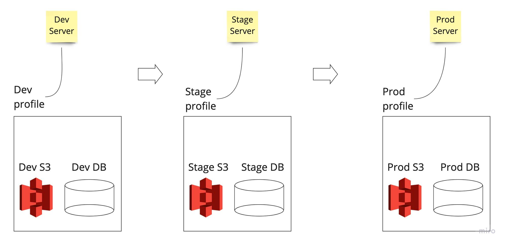
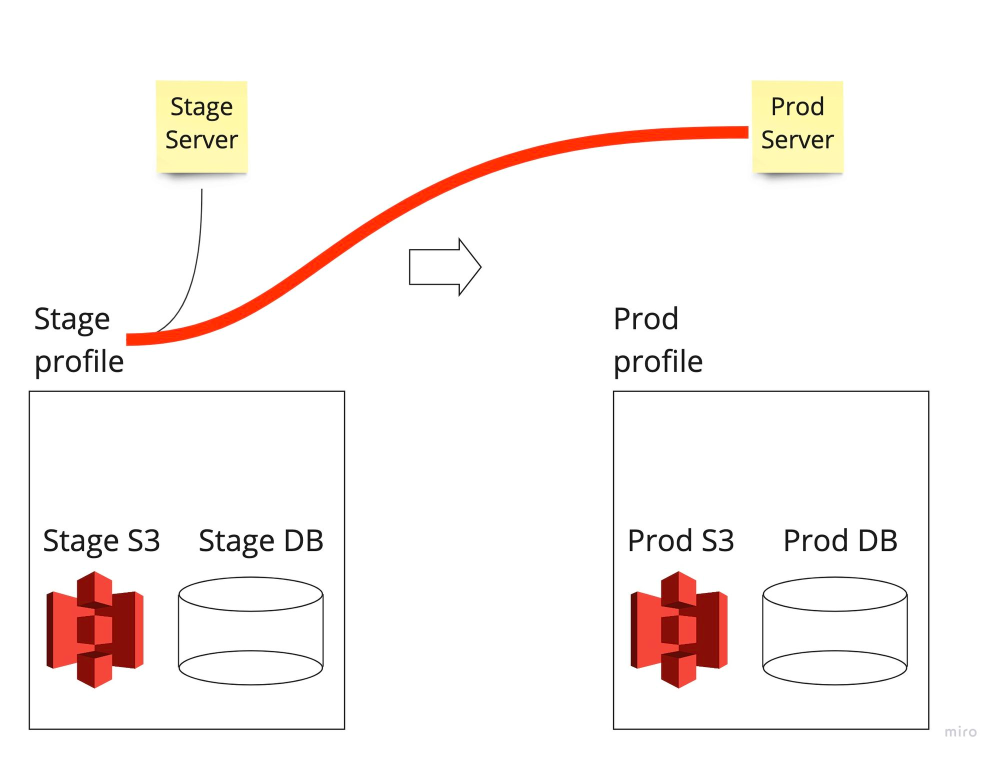
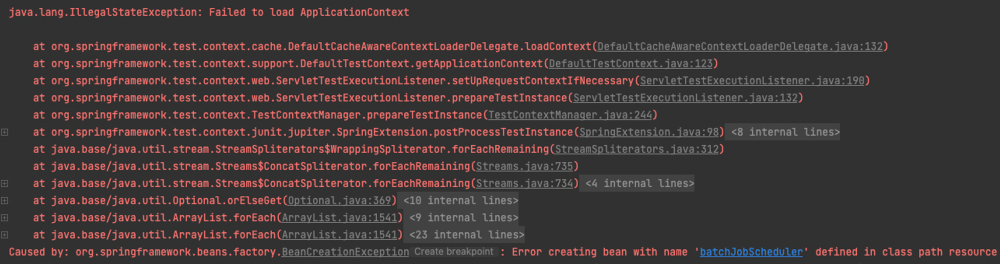
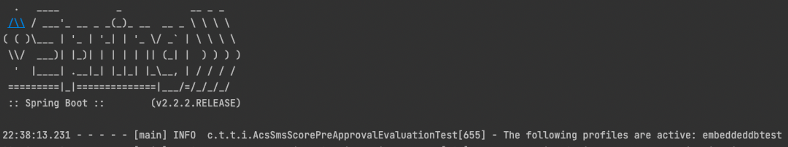
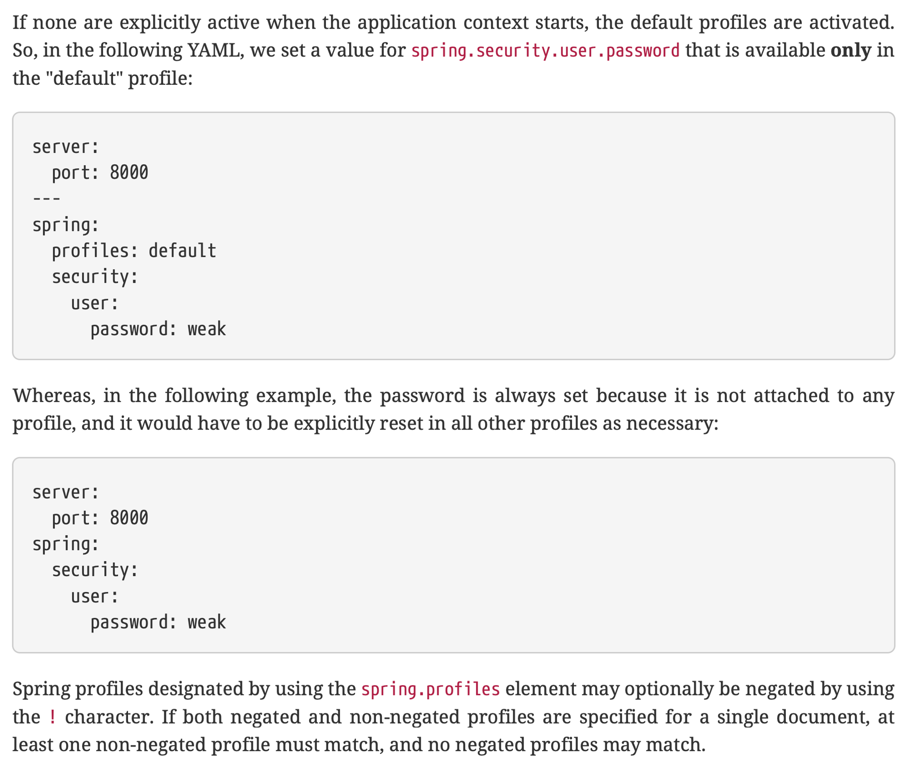

# [Spring profiles](https://www.baeldung.com/spring-profiles) & properties

## Introduction

현재 사내 대출 관리 시스템을 담당하는 서버에서는 매일 특정 시간마다 대출자에게 reminder 메시지를 보내는 작업을 배치(Batch)를 돌려 수행한다. 그런데 해당 배치 작업 시간과 배포 시간대가 겹쳐, 서버 불안정으로 인해 간혹 배치 작업이 종료되는 상황이 일어나는 것을 발견했다. 이때 왜 수시 배포가 아닌 정기 배포냐면, 글로벌 핀테크 도메인인 우리 서비스의 특성상 해당 국가의 법적 이슈로 인해 수시로 배포가 불가능한 상황이다..(심지어 배포도 개발자, 즉 코드를 짠 사람이 배포하면 안된다..까다롭기 그지 없다)

이로 인한 비즈니스 임팩트가 상당한지라 (리마인더 메시지를 보내지 않게 됐을 때 대출 상환에 문제가 있을 수밖에 없으니) 당장 할 수 있는 조치로 배치 작업 시간대를 배포 시간대를 피해 발송하도록 설정했다. 문제는 이때부터 발생한다. 현재 해당 서버의 외부 설정값은 모두 .properties를 이용해 관리하고 있다. 하지만 .properties를 이용해 관리하는 것보다 .yml을 이용하는 것이 더 편하기 때문에 지금처럼 설정값을 바꿀 일이 있을 때마다 .properties에 있는 값을 전부 .yml로 바꾸는 작업을 하고 있다. 이 작업 역시 예외는 아니었다.

여기서 잠깐, 왜 properties보다 .yml이 편할까? 검색 몇 번만 해도 알 내용이지만 간단히 짚고 넘어가자. yml을 사용하면 계층 구조로 설정값을 표현할 수 있다. 중복되는 prefix를 계속 적어줘야 하는 .properties와 달리 아래와 같이 겹치는 내용을 한 번에 쓸 수 있어 알아보기도 편리하다.

```xml
# Properties

spring.datasource.hikari.driver-class-name=org.mariadb.jdbc.Driver
spring.datasource.hikari.jdbc-url=jdbc:mariadb://localhost:3306/testdb
spring.datasource.hikari.username=root
spring.datasource.hikari.password=root

spring.datasource.jpa.properties.hibernate.dialect=org.hibernate.dialect.MySQL5InnoDBDialect
spring.datasource.jpa.properties.hibernate.format_sql=true

spring.datasource.jpa.show-sql=true
spring.datasource.jpa.generate-ddl=true
```

```yaml
# YAML

spring:
  datasource:
    hikari:
      driver-class-name: org.mariadb.jdbc.Driver
      jdbc-url: jdbc:mariadb://localhost:3306/testdb
      username: root
      password: root
    jpa:
      properties:
        hibernate:
          dialect: org.hibernate.dialect.MySQL5InnoDBDialect
          format_sql: true
      show-sql: true
      generate-ddl: true
```

문제는 단순히 .properties에 있는 내용을 고대로 .yml로 옮기기만 하면 끝날 줄 알았던 내 예상과 달리 Integration Test가 전부 터져나갔다는 것..무엇이 문제였는지 알아보기 위해 Spring Profiles부터 차근차근 공부해보도록 하자.

## Profile이란 무엇일까?

서버 개발을 하기 위해서 거쳐야 할 단계를 생각해보자.

- Local: 컴퓨터에서 개발을 하려면 각 개발자 PC에 개발 및 테스트 환경이 셋업되어 있어야 한다. 이를 우리는 local 개발 환경이라 한다.
- Dev: 나 혼자 개발 마친다고 다가 아니다. 내가 만든 기능이 다른 팀원들과 함께 작업하는 공간에서도 잘 작동하는지 체크해야 한다. dev 서버는 서버 팀에서 만든 모든 코드를 합쳐서 올리는 환경이다. 로컬에서 개발을 마치면 dev 서버에 해당 기능을 배포해 다른 기능과 충돌이 없는지 확인한다. 이때, dev 서버는 기능 개발에만 주력하기 때문에 서버 환경 자체가 뒤에 나올 prod(상용)서버와 규모의 차이가 있다. prod에서는 동일한 서버를 여러 대 구축한 뒤 로드밸런싱을 적용하는 등 스케일 아웃 작업을 하는 반면 dev는 기껏해야 한두 대 정도 & 기능 구현이 가능한 정도로 작게 구축하는 것이 일반적이다.
  우리 팀의 dev 서버 역시 어떤 서버냐에 따라 약간씩 다르지만 많으면 네다섯개 정도로 해놓고(한 dev 서버를 네다섯 개로 연결해 스케일 아웃한 게 아니라 환경은 똑같지만 각각 한 대씩 분리된 dev 환경 → 여러 사람이 동시에 dev 배포 및 테스트를 위해서) dev용 데이터 약간만 넣어놓은 상황.
- Stage: 기능 구현만 가능하게 해놓고 실제 데이터나 서버 규모는 훨씬 작은 dev와 달리, stage 환경에서는 prod와 거의 동일하게끔(db 세팅 역시 마찬가지) 구성해놓는다. 운영 환경에 최종 배포하기 전에 한 번 더 검증하기 위한 공간. 다른 회사에서는 QA/STAGE가 분리 되어 있는데 우리 회사는 QA 엔지니어 분들께서 stage에서 테스트를 마친다.
- Prod: 실제 서비스 운영 환경이다.

이렇듯, 하나의 기능이 개발되어 최종 서비스 단까지 나가려면 local → dev → (QA) → stage → prod 라는 각기 다른 개발환경을 거치게 되는데, 각 환경마다 필요한 객체 주입부터 여러 가지 설정이 달라진다. 따라서 어느 환경에 배포하느냐에 따라 아래 이미지와 같이 설정에 필요한 값을 그때그때 바꿔서 주입해줘야 한다. 아래 이미지를 보자. 개발 서버(Dev)에서 쓰기 위해 연결해놨던 MySQL DB의 서버 주소, S3 주소를 포함한 다양한 설정(인트로에서 언급한 property에 해당)과 실제 서비스(Prod) 상에 쓰이는 S3, DB 주소 등의 설정값은 다를 수밖에 없다.



문제는 이를 사람이 한다면 귀찮기도 할 뿐더러, 혹여나 prod에 나가야 할 서버에 다른 설정값을 주입해버리는 불상사가 일어날 수도 있다는 점이다.



그러면 자연스럽게 이런 질문이 등장한다.

> **“서로 다른 개발 환경에 대해 필요한 값 역시 각기 다르게 주입하는 걸 자동화할 수 없을까?”**
>

Spring profile은 이러한 고민에서 나온 결과물이다.

**Spring profile은 배포 환경(Dev, Stage, Prod, …)에 따라 자동으로 스프링 프레임워크 내 설정값에 대한 bean 주입을 각기 다르게 설정할 수 있도록 도와주는 역할**을 한다. 위에서는 단순히 db 혹은 S3 url과 같이 외부 설정값인 property를 예시로 들었지만 스프링 컨테이너에 등록된 객체인 bean을 대상으로 전부 가능하다. 애초에 여기서 말하는 profile이 의미하는 바가 Bean의 묶음이다. 그러니 dev 환경에서는 이 Bean 모음(profile)을 쓰고, prod 환경에서는 저 Bean 모음을 쓰겠다 이런 맥락.

정리하면

- **각기 다른 환경에 대해 주입할 Bean의 묶음**이 profile이고
- **profile 안에 들어갈 외부 설정값의 모음**이 property이다.
- 그리고 이는 위에서 언급했던 것처럼 .properties 혹은 .yml 형태의 파일로 구현한다.

이렇게 공부만 하고 끝났으면 좋으련만..**시련은 그렇게 쉽게 지나가지 않았다.**

## Trouble Shooting: 분명히 설정값을 주입했는데 왜 integration test가 터지는 거지?

배치를 돌릴 시간대인 cron 값을 YAML 형태의 profile로 변경하기 위해서는 아래와 같은 작업이 필요하다.

- 실제 외부 설정값이 담긴 YAML (.yml) 파일을 생성한 뒤 해당값을 설정하고 (`batchjob.yml`)

    ```java
    // 보안상 실제 cron 값 및 profile 환경은 익명화함.
    spring.profiles:  dev, local, localhost, stage, prod
    
    schedule:
      batch-job:
        loan1:
          cron: 0 X X * * ?
        loan2:
          cron: 0 X X * * ?
        loan3:
          cron: 0 X X * * ?
        loan4:
          cron: 0 X X * * ?
        loan5:
          cron: 0 X X * * ?
        loan6:
          cron: 0 X X * * ?
        loan7:
          cron: 0 X X * * ?
        loan8:
          cron: 0 X X * * ?
    ```

- 해당 yml 파일을 profile에 주입하기 위한 Loader 객체를 생성하기 위해 `YamlResourceLoader` 상속받아 구현한다. (해당 static 클래스는 batchJob 관련 configuration에 추가했다.)

    ```java
    public static class BatchJobResourceLoader extends YamlResourceLoader {
            public BatchJobResourceLoader() {super("batchjob.yml");}
        }
    ```


왜 이런 식으로 할까? 앞서 profile이 각 배포 환경에 따라 외부 설정값을 각기 다르게 주입할 수 있도록 설정하는 역할이라고 말했다. 그런데 위의 예시와 같이 batchJob은 dev / stage / prod 모두 동일한 값을 주입하고 DB는 dev, stage, prod 각기 다른 db를 연결해야 하고 등등 저마다 다 다른 properties가 필요할텐데, 이를 파일 하나에 다 때려넣으면 너무 복잡하지 않겠나? 따라서 각 설정별로 다른 yml 파일을 생성하고 그 yml마다 YamlResource를 로딩하는 객체를 생성하여 모듈화하듯 구현하면 저마다 다른 설정에 대해 보다 쉽게 관리가 가능해질 것이다.

무튼 이렇게 마무리를 하고 Integration 테스트를 돌렸더니..아래와 같이 에러가 터지는 게 아닌가?



로그를 확인해보니 아래와 같이 exception이 터졌더랬다. 설명을 보니 loan1에 들어가야 할 설정값이 주입이 되지 않았다는 것. 그런데 이상하다.. 우리는 분명 위에서 설정했는데?

```java
Exception encountered during context initialization - cancelling refresh attempt: 

org.springframework.beans.factory.BeanCreationException: Error creating bean with name 'batchJobScheduler' defined in class path resource [.../config/BatchJobConfiguration.class]: 

Initialization of bean failed; nested exception is java.lang.IllegalStateException: 

Encountered invalid @Scheduled method 'loan1': 

Could not resolve placeholder 'schedule.batch-job.applyLoanOverdueCharges.cron' in value "${schedule.batch-job.loan1.cron}"
```

이를 해결하기 위해 별 이상한 짓거리를 다했다. @Value와 같은 설정값 주입 어노테이션을 달아주지 않아서 주입이 안된 것인가 하면서 별의별 어노테이션을 달지 않나..원인은 아주 심플했다. 아래 캡쳐를 보자. Integration test를 실행했을 때 나오는 로그이다.



설명을 보면 해당 profile은 embeddedtest로 설정한다고 나타나 있다. 그런데 우리가 작성한 profile을 보자. 어디에도 embeddedtest가 나와있지 않다. 그렇다. 해당 integration test의 profile은 embeddedtest로 active되는데, 정작 우리 profile에는 해당 환경에서 활성화되지 않기 때문에 설정값이 주입되지 않았던 것이다.

```java
// 보안상 실제 cron 값 및 profile 환경은 익명화함.
spring.profiles:  dev, local, localhost, stage, prod

schedule:
  batch-job:
    loan1:
      cron: 0 X X * * ?
    loan2:
      cron: 0 X X * * ?
    loan3:
      cron: 0 X X * * ?
    loan4:
      cron: 0 X X * * ?
    loan5:
      cron: 0 X X * * ?
    loan6:
      cron: 0 X X * * ?
    loan7:
      cron: 0 X X * * ?
    loan8:
      cron: 0 X X * * ?
```

아하! 그러면 위의 profile에 embeddedtest만 적으면 되겠구나! 했지만, 역시 그리 만만하지 않았다. 해당 PR에 대해 아래와 같은 리뷰가 달렸다. 해당 profile을 굳이 여기저기 나눠서 다르게 설정할 필요가 없으니, 그냥 통으로 디폴트 설정하는 게 어떻겠냐는 것. (사실 해당 코멘트를 맨 처음 봤을 때는 무슨 뜻인지 1도 이해하지 못했다.)


아니, 해당 profile을 모든 환경에 동일하게 적용하려면(default) 어떻게 해야되지? [이 역시 답은 공식 문서에 있었다.(항상 공식 문서를 탐독하도록 하자!)](https://docs.spring.io/spring-boot/docs/2.2.2.RELEASE/reference/pdf/spring-boot-reference.pdf) 아래 캡쳐를 보자. 스프링부트 doc에 있는 profile 관련 내용이다. 설명에도 나와있듯, default 프로파일로 설정하려면 그 어떤 환경에 대해서도 명시적으로 적지 않으면 된다. 즉, 위의 spring.profiles:  dev, local, localhost, stage, prod 를 지우면 되는 것. 아주 간단했다.

