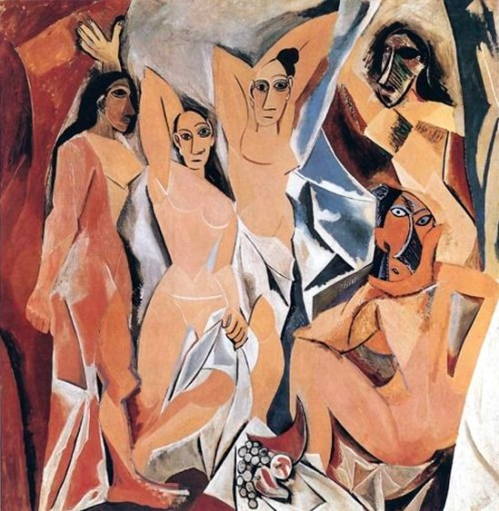

# 그래서 왜 객체를 지향해야 한다고? 한 장으로 끝내는 객체지향 총정리[객체지향의 사실과 오해 정리 및 서평]

## Introduction

현재 우리 회사에서 사용하는 프로그래밍 언어는 자바이다. 입사하고 처음 자바를 공부하면서, 그 전까지는 말로만 듣던 객체지향 프로그래밍에 대해서 역시 접하기 시작했다. 

5월 즈음부터였나. <이것이 자바다>라는 책으로 자바 공부를 시작했는데 변수와 타입, 연산자, 반복문 등 기초 문법을 떼고 나니 본격적으로 클래스, 상속, 다형성, 인터페이스 등 온갖 객체지향 관련 용어가 쏟아지더라. 물론 각 용어가 어떤 의미인지 설명과 예시가 잘 되어 있어서 이해하는데 큰 어려움은 없었다. 하지만 지금 떠올려보면 그때의 공부는 그림책 속 사과 이미지를 보고서 "이것은 사과고, 빨갛고, 먹으면 달고 아삭한 식감이 난다"라는 사과의 특징을 문자로 받아들이는 것에 지나지 않았다.

그도 그럴 것이, 자바는 그 본질 자체가 객체지향 언어인데 반해 그저 책의 설명만으로는 왜 객체를 지향하는지에 대해서 본질을 이해할 수 없었기 때문이다. 물론 설명한다. "객체지향 프로그래밍 방식은 유지보수에 수월하고 재사용성이 높다"고. 근데 왜? 왜 유지보수에 수월하지? 왜 재사용성이 높지? 에 대한 이유 역시 "유지보수에 수월하니까, 재사용성이 높으니까"였다. 그도 그럴 것이, 그렇지 않은 상황을 맞닥뜨린 적이 한 번도 없었으니까 말이다.

그리고 11월, 어느덧 회사에 들어온지 6개월 정도 지났을 즈음이었다. 그간 이래저래 많은 코드를 접했다. 초반에는 비교적 최근에 만들어진 프로젝트 위에서 작업하다보니 JPA를 사용하고, 도메인 모델 패턴이 잘 적용되어 있는 등 좋은 코드를 만날 일이 더 많았다. 

문제는 작업하는 도메인을 옮기면서부터였다. 15년도에 첫 커밋이 있는 고객 관리 시스템의 유지보수 작업을 맡아 처음 코드를 열어봤을 때 그 막막함은 이루 말할 수가 없었다. 쿼리 하나에 200여 줄은 가뿐히 넘는 동적 쿼리 코드는 아무 것도 아니었다. 온갖 getter와 setter로 더럽혀진 도메인 객체, 그 안의 필드값을 여기저기서 맘대로 꺼내고 바꾸느라 어디서 변경이 일어났는지 한참 찾지를 않나, 서비스 레이어에 모든 비즈니스 로직이 때려박혀 있는 복잡한 코드를 보고서야 왜 트랜잭션 스크립트 패턴이 좋지 않은가 몸으로 직접 배우는 등. Spring Data JPA의 추상성에 감탄하다 MyBatis를 만나고는 SQL을 직접 다루는 것에 편하기도 한 반면, 종속적인 코드가 무엇인지도 눈으로 직접 목도할 수 있었고. 

그러고는 이 책을 봤다. 자바 책에서 글로 배우고 익히던 때의 "객체지향"이라는 단어와, 실무 상에서 온갖 레거시 코드를 몸빵쳐내고 난 후의 "객체지향"이라는 단어에서 와닿는 의미는 천지차이일 수밖에 없었다.

본격적으로 책의 내용에 대해 언급하기 앞서, 개인적인 소견으로 이 책은 되도록이면 실무 코드(그것도 레거시면 레거시일수록 오히려 좋다)를 접해본 사람이 읽는 것을 추천한다. 물론 그냥 읽어도 좋은 책이다. 하지만 이 책은 "아, 이래서 이렇게 짜야되는 거였구나!"하고 무릎을 때리면서 행간에 코드를 떠올릴 수 있을 때 훨씬 와닿지 않을까 싶다. 타산지석이라고, 좋은 코드만 봐서는 이 책의 진정한 묘미를 알기 힘들 것이다.

## 왜 객체지향은 객체를 지향하는 것일까?

책의 서두를 보면 카페 속 손님 - 캐셔 - 바리스타의 예시를 보여주며 역할과 책임, 그리고 협력이 객체지향의 본질이라고 서술한다. 간단히 요약하면 아래와 같다.

- 카페 세상 속 객체는 손님, 캐셔, 바리스타라는 역할을 맡는다. 
- 이들은 서로 간의 협력을 통해 카페라는 하나의 비즈니스가 원활하게 돌아가도록 일을 수행한다. 
- 이때, 이 각 객체는 역할에 맞는 특정한 책임을 진다. 현실 세상과 달리 객체 세상 속 객체들은 모두가 자율적으로 행동을 통해 자신의 상태를 바꾼다. 어느 누구도 다른 객체의 상태를 직접 변경할 수 없으며, 메시지를 전달해 상대가 자신의 상태를 직접 바꾸도록 한다.

이렇게 "적절한 책임을 수행하는 역할 간의 유연하고 견고한 협력 관계를 구축하는 것이 객체지향의 핵심"이며 이를 통해 "단순히 실세계를 소프트웨어 안에 담는 것이 아니라 고객과 사용자를 만족시킬 수 있는 신세계를 창조하는 것이 객체지향의 목표"라고 한다. 

근데 왜? 왜 이렇게 하는 게 좋은 걸까? 사실 위의 객체지향에 대한 설명은 무엇이다라는 what이 있을 뿐, 근본적으로 왜 이렇게 만드는 게 훌륭한 프로그램을 설계하는 것과 연관성이 있는 지에 대한 why가 없다. 위에서도 언급했듯 객체지향적이지 않은 코드를 보면 보다 명확히 이해되겠지만, 책의 내용만 가지고서 객체지향의 본질에 대해 되짚어보자.

사실 책을 겉으로 훑기만 하면 what에 대한 내용만 머릿속에 남는다. 앨리스의 수많은 예시부터 시작해, 여러 개념을 접하다보면 객체지향이 "무엇"이라는 게 느낌이 빡 온다. 

> 이런 게 캡슐화구나. 그래서 서비스 객체에 온갖 비즈니스 로직을 때려넣지 말라는 거였구나. 도메인 엔티티가 단순히 데이터를 꺼내주는 역할만 하는 게 아니라 자기 자신이 하나의 자율적인 객체로서
> 자신의 상태값을 노출하지 않고 바깥의 메시지에 능동적으로 움직이는 게 더 객체지향적이니까.

> 클래스와 객체는 3차원 - 4차원의 관계와 같구나. 객체는 능동적으로 움직이는 동적인 놈이라면(시간 축이 들어간 런타임 시점) 클래스는 동적인 객체 세상을 스냅샷으로 찍어낸 정적인 시점이구나.
> 이렇게 하는 이유는 실시간으로 움직이는 동적인 객체 세상을 그대로 설계하기에는 복잡도가 올라가니까 이를 정적인 시점에 담아냄으로써 복잡성을 줄이기 위함이구나.

그런데 책을 다 읽고 나서도 why를 모르겠더라. 피상적으로야 남들 다 얘기하는 것처럼 말할 수 있다.

"객체지향 패러다임은 사람이 현실 세계를 이해하는 방식과 유사한 방식으로 소프트웨어를 설계하기 위한 방식이며, 유지보수가 쉽고 재사용성이 높아서" 좋다.

그런데 이 문장을 온전히 이해한 것이라 할 수 있을까? 위의 사과 예시처럼 글 몇 줄로 사과를 이해한 것이 아닐까? 그래서 다시 한 번 찬찬히 읽으며 "왜 이렇게 하는 게 필요한지"를 캐치하려고 했다.

## 객체지향이 말하는 진짜 "추상화": 피카소의 세계

책에서 말하길 사람들이 객체지향에 대해 갖는 대표적인 개념 중 하나는 "현실 세계의 모방"이라고 한다. 현실 세계를 소프트웨어 세상에 그대로 가져와 모방한 것이 바로 객체지향이라고.

저자는 이 관점이 "오해"라고 분명히 명시한다. 그 근본적인 차이 중 하나로 "현실 세계에서는 수동적인 존재가 소프트웨어 세상에서는 능동적인 객체로 변모하는" 의인화를 꼽는다. 위에서 언급했듯, 소프트웨어 세상에서는 모든 객체가 자신의 상태값을 직접 관리하기 위해 능동적으로 행동한다. 현실 세계에서는 수화기를 들기 전까지는 혼자 아무 것도 할 수 없는 전화기가 소프트웨어 세상에서는 자기가 직접 전화를 거는 것처럼.

확실히 모순이다. 현실 세계를 모방해 소프트웨어를 설계할 것이었으면, 이렇게 하면 안 되는 게 맞다. 현실 세계와 동일하게 작동해야 사람이 더 이해하기 쉬울 것 아닌가? 왜 소프트웨어 세상의 전화기는 현실 세계의 전화기와 동일하게 작동하지 않을까?

객체지향 패러다임은 현실 세계를 그대로 본따 만든 것도, 현실 세계를 단순화한 것도 아니다. 현실 세계를 밑바탕으로 만들었지만, 그 밑바탕에 한 가지 양념을 쳐 아예 새로운 세계를 만드는 관점이다. 그 양념이 바로 "추상화"다.

어라, 이상하다. 복잡한 걸 도려내고 단순화하는 게 추상화 아닌가? 그러면 현실 세계를 단순화한 것과 추상화한 것은 무엇이 다른가? 책에서는 추상화를 다음과 같이 정의한다.

> 어떤 양상, 세부 사항, 구조를 좀 더 명확하게 이해하기 위해 특정 절차나 물체를 의도적으로 생략하거나 감춤으로써 복잡도를 극복하는 방법이다.
> 복잡성을 다루기 위해서 추상화는 두 차원에서 이뤄진다.
> 첫 번째 차원은 구체적인 사물들 간의 공통점은 취하고 차이점은 버리는 일반화를 통해 단순하게 만드는 것이다.
> 두 번째 차원은 중요한 부분을 강조하기 위해 불필요한 세부 사항을 제거함으로써 단순하게 만드는 것이다.
> 모든 경우에 추상화의 목적은 **복잡성을 이해하기 쉬운 수준으로 단순화하는 것이라는 점을 기억하라.**

이전에도 배운 바 있듯, 컴퓨터 공학의 A to Z는 추상화다. 이때, 단순하게 만드는 게 핵심이 아니다. 복잡성을 이해하기 쉬운 수준으로 만드는 것이 추상화의 핵심이다. 그러면 소프트웨어 세상 속 전화기가 왜 지 스스로 전화를 거는 능동적인 존재로 변모했는지 이해가 된다. 그게 복잡성을 낮추는 방법이니까.

각 객체가 지닌 디테일한 상태값을 다른 객체가 다 알아버리면 그만큼 서로 간의 결합도가 높아진다. 우리는 이것을 "안다"라고 표현하는데, 다른 객체의 내부를 너무 깊숙히까지 알아버리면 만약 특정 값이 변경되거나 할 때 그에 연관된 코드 역시 전부 고쳐야 하는 상황이 발생한다. 이때 결합도를 낮추면 낮출수록 그만큼 엮여있는 코드가 적을테니 유지보수가 쉬워지는 거고.

이러한 관점에서 추상화라는 개념을 그저 전체 중 일부만 도려낸다라고 생각하면 안 된다. 그 전체를 알기 쉽게 하기 위해 때로는 일부를 도려내기도, 때로는 약간 뒤틀기도 하는 것이 바로 추상화이다. 

피카소의 그림을 생각해보자. 아래는 대표작 중 하나인 <아비뇽의 처녀들>이다. 

피카소의 화풍인 큐비즘은 3차원인 존재가 지닌 여러 각도에서의 모습을 2차원인 한 화폭에 담아내는 추상 양식이다. 그런데 누구나 한 번쯤 그런 생각을 했을 것이다. 그림이 어딘가 이상하다는 것을. 그렇다. 피카소는 3차원 존재를 2차원에 담아내는 과정에서 인간을 단순하게 그릴 뿐만 아니라 때로는 우리가 아는 인간과 다르게 그림으로써 새로운 세계를 창조해낸 것이다.

결국 객체지향 패러다임은 피카소의 그림, 세계관과 같이 "소프트웨어 설계의 복잡성을 낮추기 위해 현실 세계를 바탕으로 새로운 세계를 만들어가는 관점"이라고 정의할 수 있겠다. 객체지향과 피카소라니, 이 비유를 들고 나니 그간 답답했던 why가 한 큐에 풀리는 기분이 들었다.

