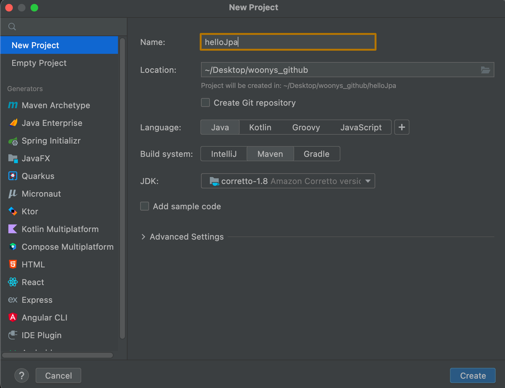
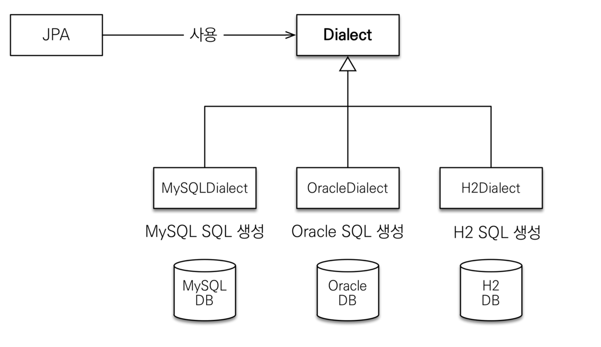

본격적으로 JPA 실습에 들어가보자. 해당 예제는 Github(링크)에 올려뒀다. (아래는 김영한님 강의인 **[자바 ORM 표준 JPA 프로그래밍 - 기본편](https://www.inflearn.com/course/ORM-JPA-Basic/dashboard)에서 공부한 내용을 정리한 것입니다.)**

## H2 데이터베이스 설치 & 실행

해당 예제를 작업하기 위해서는 H2 데이터베이스가 필요하다. H2는 실습용으로 쓰기 위한 인메모리 DB이다. [링크(클릭)](http://www.h2database.com/html/main.html)를 누르면 해당 페이지로 이동할 수 있다. 우리는 1.4.199 버전을 사용할 것이니 해당 버전을 다운받도록 하자.

## 프로젝트 생성

이어서 프로젝트를 생성한다. IntelliJ 상단 바에서 File → New → Project를 클릭하면 아래와 같은 창이 뜬다.



우리 프로젝트 스펙은 위와 같이 설정하도록 하자.

- 자바 8 이상
- Maven(강의에서 Maven을 이용했기에 여기서도 똑같이 적용한다.)
- 이름은 알아서 짓자.

### 라이브러리 추가 - pom.xml

메이븐으로 새 프로젝트를 생성하면 프로젝트 디렉토리 내에 pom.xml 파일이 생성된 것을 확인할 수 있다. 의존성 추가를 위해 pom.xml에 아래의 코드를 추가한다. 각각 hibernate와 h2 데이터베이스에 대한 라이브러리 의존성을 추가하는 코드이다.

```xml
<dependencies>
		<!-- JPA 하이버네이트 -->
		<dependency>
				<groupId>org.hibernate</groupId>
				<artifactId>hibernate-entitymanager</artifactId>
				<version>5.3.10.Final</version>
		</dependency>
		<!-- H2 데이터베이스 -->
		<dependency>
				<groupId>com.h2database</groupId>
				<artifactId>h2</artifactId>
				<version>1.4.199</version>
		</dependency>
</dependencies>
```

### JPA 설정하기 - persistence.xml

이어서 JPA 설정 파일인 persistence.xml을 추가한다. 해당 파일을 인식할 수 있도록 /META-INF/persistence.xml 에 위치시키자.


xml 내용은 아래와 같다.

```xml
<?xml version="1.0" encoding="UTF-8"?>
<persistence version="2.2"
             xmlns="http://xmlns.jcp.org/xml/ns/persistence" xmlns:xsi="http://www.w3.org/2001/XMLSchema-instance"
             xsi:schemaLocation="http://xmlns.jcp.org/xml/ns/persistence http://xmlns.jcp.org/xml/ns/persistence/persistence_2_2.xsd">
  <persistence-unit name="hello">
    <properties>
      <!-- 필수 속성 -->
      <property name="javax.persistence.jdbc.driver" value="org.h2.Driver"/>
      <property name="javax.persistence.jdbc.user" value="sa"/>
      <property name="javax.persistence.jdbc.password" value=""/>
      <property name="javax.persistence.jdbc.url" value="jdbc:h2:~/Desktop/woonys_github/blog-code/hellojpa"/>
      <property name="hibernate.dialect" value="org.hibernate.dialect.H2Dialect"/>
      <!-- 옵션 -->
      <property name="hibernate.show_sql" value="true"/>
      <property name="hibernate.format_sql" value="true"/>
      <property name="hibernate.use_sql_comments" value="true"/>
<!--      <property name="hibernate.hbm2ddl.auto" value="create" />-->
    </properties>
  </persistence-unit>
</persistence>
```

여기서 <property> 항목을 보면 어떤 건 javax.persistence로, 다른 건 hibernate.로 시작하는 것을 볼 수 있는데, 무슨 차이일까?

- javax.persistence는 JPA 표준을 가리킨다. 따라서 JPA 표준 속성임을 뜻한다.
- hibernate는 JPA 표준 인터페이스를 구현하는 구현체 중 하나이다. 즉, hibernate로 시작하는 건 hibernate 전용 속성임을 일컫는다.

즉, JDBC 드라이버, 유저 아이디 및 패스워드 등은 JPA에서 관리하는 필수 속성이며, 디테일한 SQL 구현 관련 속성은 hibernate에서 가져오는 것임을 알 수 있다.

### 데이터베이스 방언

계속 언급하는 내용이지만, JPA는 자바 표준 ORM 인터페이스이며, 이를 구현하는 구현체는 저마다 다르다. JPA는 구현체 뿐만 아니라 특정 데이터베이스에도 역시 종속되지 않는데, 따라서 어떤 DB와도 연결할 수 있다는 장점이 있다. 그런데 같은 관계형 DB더라도 SQL 표준 문법 이외에 각각의 DB마다 제공하는 SQL 문법, 함수가 조금씩 다르다. 이렇게 각 DB에 대한 SQL 문을 방언(Dialect)라고 한다. 그래서 JPA는 어떤 DB든 그에 해당하는 SQL문을 인식해야 한다. JPA의 구현체 하이버네이트는 각 DB 별로 서로 다른 SQL 방언을 읽어들일 수 있게 세팅되어 있다. 위의 persistence.xml 파일에 보면 `<property name="hibernate.dialect" value="org.hibernate.dialect.H2Dialect"/>` 부분이 있는데, 바로 H2의 방언을 인식하기 위해 추가한 속성이다.



## 애플리케이션 개발

### JPA 구동 방식


- `META-INF/persistence.xml`로부터 설정 정보를 조회한다.
    - 여기서 `META-INF/persistence.xml`에 입력한 `persistence-unit`의 이름과 뒤의 EntityManagerFactory의 이름 “`hello`”가 동일해야 한다. 그래야 설정 정보와 EMF가 매핑된다.

    ```java
    <?xml version="1.0" encoding="UTF-8"?>
    <persistence version="2.2"
                 xmlns="http://xmlns.jcp.org/xml/ns/persistence" xmlns:xsi="http://www.w3.org/2001/XMLSchema-instance"
                 xsi:schemaLocation="http://xmlns.jcp.org/xml/ns/persistence http://xmlns.jcp.org/xml/ns/persistence/persistence_2_2.xsd">
      <persistence-unit name="hello"> -> 여기 hello와 동일해야 한다!
        ...
    ```

- Persistence(JPA에서 제공하는 Persistence 객체)에서 EntityManagerFactory를 생성한다.

    ```java
    EntityManagerFactory emf = Persistence.createEntityManagerFactory("hello");
    ```

- 엔티티 매니저 팩토리에서 엔티티 매니저를 생성한다.

    ```java
     EntityManger entityManager = emf.createEntityManager();
    ```


### 객체와 테이블 생성하고 매핑하기

이어서 객체를 생성한다. 해당 객체를 JPA가 관리하게 하려면

- `@Entity` 어노테이션을 달아줘야 한다. @Entity는 JPA가 관리할 객체임을 명시하는 어노테이션이다.
- `@Id` 어노테이션을 id에 해당하는 필드에 달아준다. 데이터베이스의 PK와 매핑시키기 위해서이다. 따라서 반드시 있어야 하는 어노테이션이다.

```java
package hellojpa;

import javax.persistence.Entity;
import javax.persistence.Id;

@Entity
public class Member {
    public Member() {

    }
    public Member(Long id, String name) {
        this.id = id;
        this.name = name;
    }

    @Id
    private Long id;
    private String name;

    public Long getId() {
        return id;
    }

    public void setId(Long id) {
        this.id = id;
    }

    public String getName() {
        return name;
    }

    public void setName(String name) {
        this.name = name;
    }
}
```

### 실습 - 회원 등록/수정/삭제/조회

- 회원 등록
    - 주의: JPA에서 일어나는 모든 작업은 트랜잭션 안에서 수행해야 한다!

```java
public class JpaMain {
    public static void main(String[] args) {
        // 엔티티 매니저 팩토리는 웹 서버가 올라오는 시점에 DB당 하나만 생성
        EntityManagerFactory emf = Persistence.createEntityManagerFactory("hello");
        // 엔티티 매니저는 고객 요청이 올 때마다 새로 만들어진다.
        EntityManager em = emf.createEntityManager();

				EntityTransaction tx = em.getTransaction();
				tx.begin(); // 트랜잭션 시작
        try {
		        Member member = new Member(200L, "member200");
		        em.persist(member); // 객체를 영속성 컨텍스트에 올린다.
		
						tx.commit(); // 커밋 시점에 flush 자동으로 날아간다 -> 저장
				} catch (Exception e) {
						tx.rollback();
				} finally {
						em.close();
		        emf.close();
    }
}
```

- 회원 조회

```java
public class JpaMain {
    public static void main(String[] args) {
       
        EntityManagerFactory emf = Persistence.createEntityManagerFactory("hello");
        
        EntityManager em = emf.createEntityManager();

				EntityTransaction tx = em.getTransaction();
				tx.begin(); // 트랜잭션 시작
        try {
						// 조회
		        Member findMember = em.find(Member.class, 200L);
						System.out.println("findMember.id = " + findMember.getId());
            System.out.println("findMember.name = " + findMember.getName());
		
						tx.commit();
				} catch (Exception e) {
						tx.rollback();
				} finally {
						em.close();
		        emf.close();
    }
}
```

- **회원 수정(중요!)**: setter로 수정만 하면 따로 persist하지 않고도 트랜잭션 커밋 시점에 알아서 변경 쿼리를 날린다.

```java
public class JpaMain {
    public static void main(String[] args) {
        
        EntityManagerFactory emf = Persistence.createEntityManagerFactory("hello");
        
        EntityManager em = emf.createEntityManager();

				EntityTransaction tx = em.getTransaction();
				tx.begin();
        try {
						// 수정
		        Member findMember = em.find(Member.class, 200L);
						findMember.setName("helloA"); -> 이대로 끝. persist 안해도 된다. JPA가 알아서 변경 감지 후 커밋 시점에 업데이트 쿼리를 날린다.
		
						tx.commit();
				} catch (Exception e) {
						tx.rollback();
				} finally {
						em.close();
		        emf.close();
    }
}
```

- 회원 삭제 → `em.remove()`로 삭제

```java
public class JpaMain {
    public static void main(String[] args) {
        
        EntityManagerFactory emf = Persistence.createEntityManagerFactory("hello");
        
        EntityManager em = emf.createEntityManager();

				EntityTransaction tx = em.getTransaction();
				tx.begin();
        try {
						// 수정
		        Member findMember = em.find(Member.class, 200L);
					  em.remove(findmember); // remove 메소드만으로 삭제 가능
		
						tx.commit();
				} catch (Exception e) {
						tx.rollback();
				} finally {
						em.close();
		        emf.close();
    }
}
```

### 주의점

- 엔티티 매니저 팩토리는 애플리케이션당 하나만 생성해서 애플리케이션 전체에서 공유한다.
- 엔티티 매니저는 쓰레드 간에 공유하지 않으며, 한 트랜잭션이 끝나면 바로 버려진다.
- JPA의 모든 데이터 변경은 트랜잭션 안에서 실행된다.

### JPQL

- JPA를 사용하면 엔티티 객체를 중심으로 개발한다.
- 이때, 단순 조회 말고 검색하는 쿼리는 어떻게 날리지?
    - ex) 나이가 18살 이상인 회원을 모두 검색하려면?
- 이럴 때 사용하는 게 JPQL: 객체지향 쿼리
- 검색을 할 때도 테이블이 아닌 엔티티 객체를 대상으로 검색한다.
- 모든 DB 데이터를 객체로 변환해서 검색하는 것은 불가능에 가깝다.
- 따라서 애플리케이션이 필요한 데이터만 DB에서 불러오려면 결국 검색 조건이 포함된 SQL이 필요한데, JPQL은 SQL을 추상화한 JPQL이라는 객체 지향 쿼리 언어를 제공한다.
- JPQL은 SQL과 비슷한 문법을 가진다(SELECT, FROM, WHERE, GROUP BY, HAVING, JOIN 지원)
- 가장 큰 메리트: JPQL은 테이블이 아닌 엔티티 객체를 대상으로 쿼리를 날린다는 점이다. 객체지향적으로 쿼리를 날릴 수 있다는 이점이 있음.

```java
public class JpaMain {
    public static void main(String[] args) {
        // 엔티티 매니저 팩토리는 웹 서버가 올라오는 시점에 DB당 하나만 생성
        EntityManagerFactory emf = Persistence.createEntityManagerFactory("hello");
        // 엔티티 매니저는 고객 요청이 올 때마다 새로 만들어진다.
        EntityManager em = emf.createEntityManager();

        EntityTransaction tx = em.getTransaction();
        tx.begin(); // 그냥 변경하면 안됨 -> JPA에서 수정 작업은 반드시 트랜잭션 안에서.
        // code
        try {
            // 영속

						List<Member> result = em.createQuery("select m from Memver as m", Member.class)
																							.setFirstResult(1) // 페이지네이션
																							.setMaxResult(10)
																							.getResultList();

						for (Member member : result) {
								System.out.println("member.name is" + member.getName());
						}
            tx.commit();
        } catch (Exception e) {
            tx.rollback();
        } finally {
            em.close();
        }
        emf.close();
    }
```