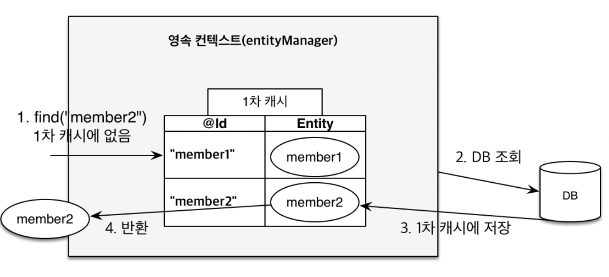

이번에는 JPA의 내부 동작에 대한 이론에 대해서 공부해보도록 하자. JPA를 이해하려면 영속성 컨텍스트에 대한 이해가 반드시 필요하다.

JPA에서 가장 중요한 2가지를 꼽으라면 아래 둘을 꼽는다.

1. 객체와 관계형 데이터베이스 매핑하기(Object Relational Mapping, ORM)
2. **영속성 컨텍스트**

이번에는 영속성 컨텍스트에 대해 얘기해보자.

## 엔티티 매니저 팩토리 & 엔티티 매니저

영속성 컨텍스트를 이해하려면 먼저 엔티티 매니저 팩토리와 엔티티 매니저에 대해 이해해야 한다.

- **엔티티 매니저 팩토리(Entity Manager Factory)**: 웹 어플리케이션에 하나만 존재하며, 고객의 요청이 들어올 때마다 엔티티 매니저를 생성하는 역할을 한다.
- 엔티티 매니저(**Entity Manager**): 내부적으로 데이터베이스 커넥션을 사용해 DB와 소통한다.


엥, 정작 영속성 컨텍스트에 대한 설명은 나오지 않았는데? 바로 가보자.

## 영속성 컨텍스트

영속성 컨텍스트(Persistence Context)란 `엔티티를 영구 저장하는 환경`이라는 의미를 갖는다. 코드로는 아래와 같이 엔티티 매니저의 메소드 `persist()`를 호출함으로써 엔티티를 영속성 컨텍스트에 영속화할 수 있다.

```java
EntityManager.persist(entity);
```

그런데 뭔가 이상하다. 영속화한다는 것의 의미가 정확히 무엇인지 나오지 않았다. 보통 `영속화한다`고 하면 메모리는 임시적으로 저장하는 곳이고 디스크가 영속적으로 저장하는 곳이니 `디스크에 저장하는 것을 영속화한다는 건가?` 라고 생각할 수 있다. 그런데 그렇지 않다. DB에 저장한다는 게 아니라 영속성 컨텍스트라고 하는 애플리케이션 내 논리적 공간에 영속화시키는 것을 뜻한다.

따라서 위의 persist() 메소드를 호출하면 해당 엔티티는 영속성 컨텍스트에 등록되는 것이지, DB에 저장되지 않는다. 실제로 DB에 저장되는 시점은 트랜잭션이 커밋되는 시점에서다. 여기서 `영속` 이라는 단어에 헷갈리면 안된다. 영속성 컨텍스트는 일종의 서버 내에서 `DB에 대한 캐시` 역할을 하는 놈이며 영속화될 수 있는 엔티티를 관리하는 논리 공간이지 여기에 등록됐다고 데이터가 영속화(=DB에 저장)되는 게 아니라는 것. 만약 트랜잭션 커밋 시점에 문제가 생겨 롤백하게 되면 엔티티가 영속성 컨텍스트에 등록되었다고 하더라도 DB에 저장되지 않을 것이다.

## 엔티티의 생명주기

그러면 엔티티는 영속성 컨텍스트에 등록되기 전후로 어떤 생명주기를 거치는 것일까? 아래 이미지로 요약할 수 있다.


- 비영속 상태(New)
    - 객체를 새로 생성했을 때, 이 객체를 따로 등록하지 않는 이상 해당 객체는 비영속 상태에 해당한다.

    ```java
    Member member = new Member();
    member.setId("member1);
    member.setUsername("회원1");
    ```

  

- 영속 상태(Managed)
    - 비영속 상태의 객체를 엔티티 매니저에 등록했을 때의 상태에 해당한다.
    - 구현 방식은 엔티티 매니저의 메소드 `persist()`에 해당 엔티티를 인자로 넣어 호출한다.

    ```java
    Member member = new Member();
    member.setId("member1);
    member.setUsername("회원1");
    
    EntityManager em = emf.createEntityManager();
    em.getTransaction().begin(); // 트랜잭션 시작
    
    // 객체를 저장한 상태(영속)
    em.persist(member);
    ```
  - 이때 주의점: 위에서도 얘기했듯, 엔티티를 영속 상태에 등록한다고 DB에 저장되는 게 아니다. 아래 코드를 보자.

  ```java
  ...
  Member member = new Member();
  member.setId("member1);
  member.setUsername("회원1");
  
  EntityManager em = emf.createEntityManager();
  em.getTransaction().begin(); // 트랜잭션 시작
  
  // 객체를 저장한 상태(영속)
  System.out.println("===Before===");
  em.persist(member);
  System.out.println("===After===");
  tx.commit();
  ```

  위의 코드를 실행하면 아래와 같이 출력된다.
  
  ```java
  ===Before===
  ===After===
  Insert ...(Insert 쿼리)
  ```
  보다시피 insert 쿼리가 em.persist() 시점에 나가는 게 아니라 트랜잭션이 커밋되는 시점에 나간다.
  
- 준영속 상태
  - 이미 영속성 컨텍스트에 등록된(=영속 상태) 엔티티를 컨텍스트에서 분리했을 때의 상태를 말한다. 분리하게 될 경우, 해당 엔티티는 더이상 영속성 컨텍스트에서 관리되지 않는다.
  - 구현 방식은 `em.detach()` 메소드를 호출함으로써 이뤄진다.
- 삭제
  - 엔티티를 삭제한 상태를 말한다. 이 경우 DB에서도 해당 엔티티가 삭제된다. `em.remove()` 메소드를 호출하면 해당 엔티티가 삭제된다.

## 영속성 컨텍스트의 이점

DB에 대한 캐시를 서버에 둔다는 개념은 알겠는데 이게 정확히 어떤 이점이 있는지에 대해 짚고 넘어가야 할 필요가 있다.

### 1차 캐시

영속성 컨텍스트가 1차 캐시 역할을 한다. 그러면 어떻게 되는 거지? 아래와 같이 엔티티를 생성하고 해당 엔티티를 영속화했다고 해보자.
```java
// 엔티티 생성 (비영속)
Member member = new Member();
member.serId("member1");
member.setUsername("회원1");

// 엔티티를 영속성 컨텍스트에 등록(영속) -> 1차 캐시에 저장된다.
em.persist(member);

//1차 캐시에서 조회
Member findMember = em.find(Member.class, "member1");
```
원래 해당 엔티티를 조회하려면 DB에서 데이터를 가져와야 한다. 그런데 JPA의 영속성 컨텍스트는 그 자체로 캐시 역할을 한다. 즉, 영속성 컨텍스트에 영속화시키면 그때부터 캐시에 저장되며, 엔티티를 조회하면 가장 먼저 영속성 컨텍스트부터 들러서 해당 엔티티가 있는지를 찾는다. 있다면 굳이 DB에 접근할 것 없이 바로 캐시에서 엔티티를 가져온다. 따라서 네트워크 리소스가 줄어든다는 장점이 있다.


만약 영속성 컨텍스트에 등록되지 않은 엔티티를 조회하면 어떻게 될까? 
```java
Member findMember2 = em.find(Member.class, "member2");
```

당연히 캐시에 없으니 DB에서 조회할 것이다. 이때는 쿼리가 날아간다.

결과적으로 특정 엔티티를 조회할 때 영속성 컨텍스트(1차 캐시)에 등록되어 있다면 DB에 접근하지 않고 영속 컨텍스트로부터 엔티티를 반환받는다. 그렇지 않다면 DB에서 해당 데이터를 조회한 뒤, 1차 캐시에 저장한다.



하지만 큰 반전..사실 이게 큰 도움은 되지 않는다고 한다. 왜냐, 앞서 배웠던 엔티티 매니저 팩토리와 엔티티 매니저 도식을 보자.


엔티티 매니저 팩토리는 서버 애플리케이션의 런타임 동안 계속 살아있는 반면, 엔티티 매니저는 한 사용자의 요청이 있을 때마다 새로 생성되고 요청이 끝나면 소멸된다. 위에서 다뤘던 1차 캐시 개념은 한 트랜잭션 단위 안에서만 유효하다. 따라서 한 트랜잭션 내에서 여러번 동일한 엔티티를 호출할 경우에나 1차 캐시에 대한 효과가 있는 것이지, 서로 다른 사용자 요청에 대해 캐시 개념이 적용되지는 않는다는 것.

서버 애플리케이션 전체에서 다루는 캐시는 2차 캐시라고 따로 있긴 한데(이건 나중에 다룰 듯) 위의 1차 캐시 개념은 한 트랜잭션 내에서만 유효하다는 것을 기억하자. 따라서 큰 성능의 이점은 있지는 않더라..는 것.
실제 코드로 확인해보자. 아래와 같이 코드를 짠 뒤, 실행한다.

```java
        try {
            // 영속

            Member member = new Member();
            member.setUserName("member1");

            System.out.println("===Before===");
            em.persist(member);
            System.out.println("===After===");

            Member findMember = em.find(Member.class, member.getId());
            Member findMember2 = em.find(Member.class, 102L);

            System.out.println("findMember.id = " + findMember.getId());
            System.out.println("findMember.username = " + findMember.getusername());
            tx.commit();
        } catch (Exception e) {
            tx.rollback();
        } finally {
            em.close();
        }
```

보다시피 member 객체를 영속화하고 해당 객체를 조회할 때까지도 insert 쿼리는 물론이요 select 쿼리도 전혀 나가지 않는다. 전부 다 애플리케이션 내 캐시에 저장하고 조회하기 때문. 맨 마지막에 트랜잭션이 커밋되고 나서야 Insert 쿼리가 날아간다.


이번에는 두 개의 member 객체를 조회하되 하나는 영속 상태를, 하나는 생전 처음 보는 애를 조회해보자.
```java
try {
            // 영속

            Member member = new Member();
            member.setUserName("member1");

            System.out.println("===Before===");
            em.persist(member);
            System.out.println("===After===");

            Member findMember = em.find(Member.class, member.getId());
            Member findMember2 = em.find(Member.class, 102L);
            
            tx.commit();
        } catch (Exception e) {
            tx.rollback();
        } finally {
            em.close();
        }
```
결과는 아래와 같다. select 쿼리가 하나만 호출되는 것을 볼 수 있는데, 이는 영속 상태가 아닌 findMember2 객체를 조회하는 쿼리에 해당한다. 그러고 나서 아까와 동일하게 트랜잭션 커밋 시점에 영속 상태의 member를 DB와 동기화하는 작업이 이뤄진다.


### 동일성(Identity) 보장

[지난 글](https://woonys.tistory.com/entry/JPA%EC%99%80-%EB%AA%A8%EB%8D%98-%EC%9E%90%EB%B0%94-%EB%8D%B0%EC%9D%B4%ED%84%B0-%EC%A0%80%EC%9E%A5-%EA%B8%B0%EC%88%A0-%EC%9E%90%EB%B0%94-ORM-%ED%91%9C%EC%A4%80-JPA-%ED%94%84%EB%A1%9C%EA%B7%B8%EB%9E%98%EB%B0%8D-%EA%B8%B0%EB%B3%B8%ED%8E%B8-%EA%B0%95%EC%9D%98-1)에서 얘기했듯, JPA를 사용하면 엔티티의 동일성을 보장해준다고 했다. 이를 구현하는 방식이 바로 영속성 컨텍스트에 있다. 아래 코드를 보자. 동일한 엔티티를 호출하는 두 객체가 같은지 아닌지를 비교하는 코드이다.

```java
try {
            // 영속

            Member member = new Member();
            member.setUserName("member1");
            
            em.persist(member);


            Member findMember1 = em.find(Member.class, member.getId());
            Member findMember2 = em.find(Member.class, member.getId());
            System.out.println("result = " + (findMember1 == findMember2));
            tx.commit();
        } catch (Exception e) {
            tx.rollback();
        } finally {
            em.close();
        }
```
결과는 아래와 같이 true인 것을 볼 수 있다.


이처럼 "1차 캐시로 반복 가능한 읽기(REPEATABLE READ) 등급의 트랜잭션 격리 수준을 DB가 아닌 애플리케이션 차원에서 제공한다"고 나와있는데, 여기서 트랜잭션 격리 수준은 [이전 글](https://woonys.tistory.com/entry/Transactional%EC%9D%80-%EB%A7%8C%EB%8A%A5%EC%9D%B4-%EC%95%84%EB%8B%99%EB%8B%88%EB%8B%A4-2-%ED%8A%B8%EB%9E%9C%EC%9E%AD%EC%85%98%EC%9D%98-%EA%B2%A9%EB%A6%AC%EC%84%B1%EA%B3%BC-lock)에서도 짧게 다룬 바 있긴 하나 자세하게는 다음에 다루도록 하자. 

### 트랜잭션을 지원하는 쓰기 지연

쓰기 지연은 이전에도 봤던 것처럼 persist() 메소드를 호출했을 때 바로 DB에 쿼리를 날리지 않는다. 계속해서 영속 컨텍스트에 엔티티를 모아뒀다가 트랜잭션 커밋하는 순간, 한 번에 Insert 쿼리를 방출한다. 일종의 버퍼와 같은 개념.


위 그림에서도 볼 수 있듯, 단순히 엔티티를 1차 캐시에 저장만 하는 게 아니라 해당 엔티티를 저장하는 SQL 문을 미리 생성하고 이를 쓰기 지연 SQL 저장소에 저장하는 게 쓰기 지연의 특징이다. 

SQL문을 엔티티와 같이 차곡차곡 쌓아뒀다가 트랜잭션 커밋 시점에 한 번에 DB로 쿼리를 날리는 개념. 이미 우리는 위에서 코드를 통해 트랜잭션 커밋 시점에 Insert 쿼리가 날아가는 것을 확인했다. 이를 도식화하면 아래 이미지와 같다. `transaction.commit()`을 호출하면 먼저 SQL 쿼리가 DB로 날아가는데 이를 flush라고 한다. 이어서 저장이 끝나면 commit이 이뤄진다. 


이때, 쿼리는 JPA를 쓰기만 한다고 늘 모아서 쿼리를 한 방에 날리는 것은 아니고 hibernate 환경설정에서 JDBC Batch size를 설정해야 한다. 아래와 같이 batch size 설정을 추가하면 해당 사이즈에 맞게 쿼리를 모았다가 한 번에 내보낸다.

```xml
// persistence.xml
...
<property name="hibernate.jdbc.batch_size" value="10" />
...
```

### 변경 감지(Dirty Checking)

변경 감지는 영속성 컨텍스트에서 관리하고 있는 엔티티에 변경이 일어났을 때 JPA가 이를 인지하고 알아서 변경 쿼리를 날려주는 기능을 말한다. 예제 코드를 보자.

```java
try {
            // 영속

            Member member = em.find(Member.class, 150L);
            member.setUserName("ZZZZZ"); // 엔티티 내 필드값 변경
            
            // em.persist(member); -> persist 호출해야 할까?
            
            tx.commit();
        } catch (Exception e) {
            tx.rollback();
        } finally {
            em.close();
        }
```

여기서 가장 헷갈리는 부분이 하나 있다. 바로 "JPA가 변경을 감지하게 하려면 `persist()`를 호출해야 하나요?"이다. 결론부터 말하면 `persist()`는 호출하지 않아도 된다. `persist()`는 비영속 상태의 엔티티를 영속 상태로 등록하는 메소드이다. 이미 영속 상태에 등록된 엔티티는 JPA가 알아서 관리하기 때문에 `persist()`는 호출할 필요가 없다. 오히려 전혀 의미없는 코드를 쓰는 행위다. 이미 등록한 엔티티인데 다시 등록하려 하니까.

그러면 JPA가 내부에서 어떻게 동작하는지 살펴보자.


위 이미지는 트랜잭션 커밋 시점이다. 커밋 시점에 가장 먼저 flush() 메소드를 호출한다. 이어서 현재 엔티티와 스냅샷을 비교한다. 여기서 스냅샷은 영속 상태로 등록한 최초 시점의 엔티티를 저장해놓은 정보이다. 즉, 영속 상태로 등록한 시점의 과거 엔티티 정보와 현재 엔티티 사이에 무엇이 달라졌는지를 체크하는 것. 비교해서 멤버가 바뀌었다? 그러면 UPDATE 문을 생성해 쓰기 지연 저장소에 저장해둔다. 이어서 DB에 쿼리를 날려 변경 정보를 저장하는 식.

위에서 미처 얘기하지 못한 개념이 하나 있다. 플러시는 대체 뭐지?

### 플러시(Flush)

플러시란 영속성 컨텍스트의 변경 내용을 데이터베이스에 반영하는 행위를 말한다. 즉, 위에서 트랜잭션 커밋 시점에 가장 먼저 flush() 메소드를 호출한다 했는데, 이는 엔티티 변경 정보를 DB에 반영하라는 메소드를 뜻한다.

플러시가 일어나는 과정을 보자. 아래 세 단계를 통해 영속성 컨텍스트의 내용을 데이터베이스와 동기화한다.

- JPA가 엔티티에 변경이 일어났음을 감지한다(Dirty Checking).
- 수정된 엔티티에 대한 UPDATE 쿼리를 쓰기 지연 SQL 저장소에 등록한다.
- 쓰기 지연 SQL 저장소의 쿼리를 데이터베이스에 전송한다. 이는 수정뿐만 아니라 등록, 삭제 쿼리 역시 마찬가지다.

이때 주의해야 할 점: 플러시가 일어났다고 트랜잭션이 커밋되는 게 아니다. 플러시가 끝나고 트랜잭션 커밋이 호출되어야 커밋이 이뤄지는 것.

영속성 컨텍스트를 플러시하는 방법에는 크게 세 가지가 있다.

- em.flush() - 플러시를 직접 호출 -> 직접 호출하는 케이스는 거의 없다고 보면 된다.
- 트랜잭션 커밋 - 플러시가 자동 호출 -> 이 경우가 가장 많음.
- JPQL 쿼리 실행 - 플러시 자동 호출 -> JPQL 쿼리를 날리면 이 역시 플러시가 자동 호출된다.

참고로 하나 더 알아둬야 할 점으로는, `플러시는 영속성 컨텍스트를 비우지 않는다`는 것이다. flush라는 어감이 뭔가 영속성 컨텍스트 내용을 DB로 옮기면서 비우는 것 같은 느낌을 주는데, 실상은 ctrl+C / ctrl+V이지 ctrl+X가 아닌 것(맥북 써서 ctrl이 어색하네..)

영속성 컨텍스트의 변경 내용을 DB와 동기화하는 것이지, 영속성 컨텍스트는 비우고 DB에만 남기는 게 아니라는 걸 명심하자.


### 지연 로딩(Lazy Loading)

